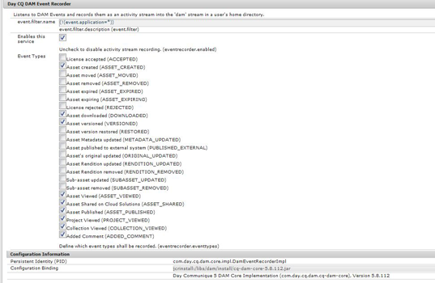

# [!DNL Adobe Experience Manager Assets] Introductiepagina {#aem-assets-home-page-experience}

Pas de startpagina van [!DNL Adobe Experience Manager Assets] aan voor een uitgebreide ervaring met welkomstschermen, waaronder een momentopname van recente activiteiten rond elementen.

De startpagina van [!DNL Assets] biedt een uitgebreide en persoonlijke welkomstscherm met een momentopname van recente activiteiten, zoals elementen die onlangs zijn weergegeven of geüpload.

De startpagina van [!DNL Assets] is standaard uitgeschakeld. Voer de volgende stappen uit om het in te schakelen:

1. Open [!DNL Experience Manager] Configuration Manager `https://[aem_server]:[port]/system/console/configMgr` .
1. Open de service **[!UICONTROL Day CQ DAM Event Recorder]** .
1. Selecteer de **[!UICONTROL Enable this service]** om opname van activiteiten in te schakelen.

   

1. Selecteer in de lijst **[!UICONTROL Event Types]** de gebeurtenissen die moeten worden opgenomen en sla de wijzigingen op.

   >[!CAUTION]
   >
   >Als u de weergaveopties voor het element, de bekeken projecten en de weergegeven verzamelingen inschakelt, wordt het aantal opgenomen gebeurtenissen aanzienlijk verhoogd.

1. Open de service **[!UICONTROL DAM Asset Home Page Feature Flag]** via Configuratiebeheer `https://[aem_server]:[port]/system/console/configMgr` .
1. Selecteer de optie `isEnabled.name` om de functie Startpagina van [!DNL Assets] in te schakelen. Sla de wijzigingen op.

   

1. Open het dialoogvenster **[!UICONTROL User Preferences]** en selecteer **[!UICONTROL Enable Assets Home Page]** . Sla de wijzigingen op.

   

Nadat u de startpagina van [!DNL Assets] hebt ingeschakeld, navigeert u naar de gebruikersinterface van [!DNL Assets] via de navigatiepagina of opent u deze rechtstreeks via de URL `https://[aem_server]:[port]/aem/assetshome.html/content/dam` .

Klik op **[!UICONTROL Click here to configure your experience link]** om uw gebruikersnaam, achtergrondafbeelding en profielafbeelding toe te voegen.

De startpagina van [!DNL Assets] bevat de volgende secties:

* Welkomstsectie
* Widget-sectie

**Welkome Sectie**

Als uw profiel bestaat, wordt in de welkomstsectie een welkomstbericht weergegeven dat aan u is gericht. Bovendien worden uw profielfoto en een welkomstafbeelding weergegeven (indien al geconfigureerd).

Als uw profiel onvolledig is, geeft de welkomstsectie een algemeen welkomstbericht en een tijdelijke aanduiding voor uw profielafbeelding weer.

**Sectie Widget**

Deze sectie verschijnt onder de welkomstsectie en toont buiten-de-dooswidgets onder de volgende secties:

* Activiteit
* Recent
* Discover

**Activiteit**: Onder deze sectie, toont de **[!UICONTROL My Activity]** widget recente activiteiten die door de het programma geopende gebruiker met activa (met inbegrip van activa zonder vertoningen) worden uitgevoerd, bijvoorbeeld, activa uploadt, downloadt, activa creatie, uitgeeft, commentaren, aantekeningen, en aandelen.

**Recente**: **[!UICONTROL Recently Viewed]** widget onder deze sectie toont onlangs betreden entiteiten door de het programma geopende gebruiker, met inbegrip van omslagen, inzamelingen, en projecten.

**ontdekt**: **[!UICONTROL New]** widget onder deze sectie toont de activa en de vertoningen onlangs aan de [!DNL Assets] plaatsing werden geupload.

Als u het wissen van gegevens over gebruikersactiviteiten wilt inschakelen, schakelt u **[!UICONTROL DAM Event Purge Service]** in Configuratiebeheer in. Nadat u deze dienst toelaat, worden de activiteiten van de het programma geopende gebruiker die een gespecificeerd aantal overschrijden geschrapt door het systeem.

Het welkomstscherm biedt eenvoudige navigatiehulpmiddelen, zoals pictogrammen op de werkbalk, voor toegang tot mappen, verzamelingen en catalogi.

>[!NOTE]
>
>Als u de services [!UICONTROL Day CQ DAM Event Recorder] en [!UICONTROL DAM Event Purge] inschakelt, worden meer schrijfbewerkingen naar JCR uitgevoerd en wordt het zoeken naar indexering versneld, waardoor de belasting op de server [!DNL Experience Manager] aanzienlijk toeneemt. De extra belasting op de [!DNL Experience Manager] -server kan van invloed zijn op de prestaties.

>[!CAUTION]
>
>Het vastleggen, filteren en leegmaken van gebruikersactiviteiten die vereist zijn voor de [!DNL Assets] -startpagina, legt de prestaties zwaar op de proef. Daarom moeten beheerders de startpagina effectief configureren voor doelgebruikers.
>
>Adobe raadt beheerders en gebruikers die bulkbewerkingen uitvoeren aan de functie Startpagina van bedrijfsmiddelen niet te gebruiken om te voorkomen dat de gebruikersactiviteiten toenemen. Bovendien kunnen beheerders opnameactiviteiten voor specifieke gebruikers uitsluiten door [!UICONTROL Day CQ DAM Event Recorder] in [!UICONTROL Configuration Manager] te configureren.
>
>Als u deze functie gebruikt, raadt Adobe u aan de laadfrequentie te laten bepalen op basis van het laden van de server.
