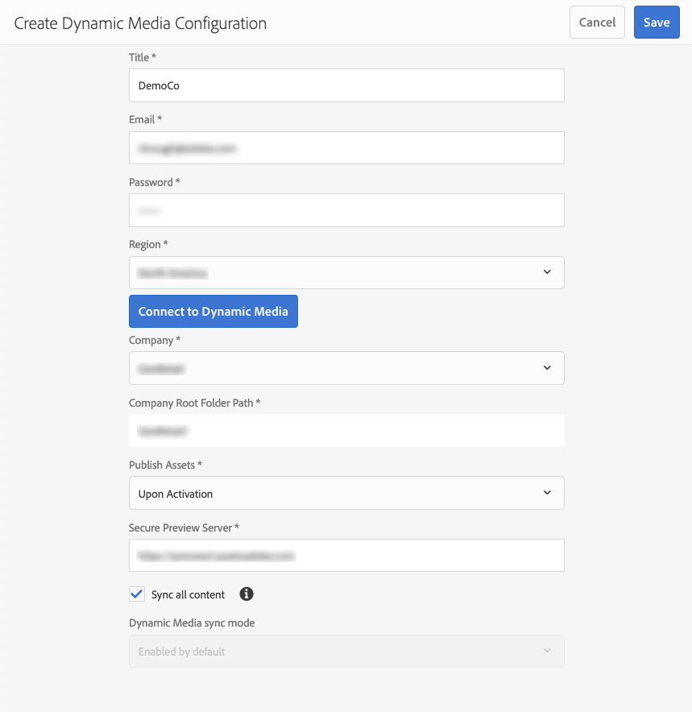

# Dynamische media configureren - modus Scene7{#configuring-dynamic-media-scene-mode}

Als u Adobe Experience Manager-instellingen gebruikt voor verschillende omgevingen, zoals ontwikkeling, staging en productie, configureert u Dynamic Media Cloud Services voor elk van deze omgevingen.

## Het diagram van de architectuur van Dynamische Media - wijze Scene7 {#architecture-diagram-of-dynamic-media-scene-mode}

Het volgende architectuurdiagram beschrijft hoe Dynamische Media - wijze Scene7 werkt.

Met de nieuwe architectuur is Experience Manager verantwoordelijk voor de primaire bronelementen en -synchronisaties met Dynamic Media voor de verwerking en publicatie van bedrijfsmiddelen:

1. Wanneer het primaire bronelement naar Experience Manager wordt geüpload, wordt het naar Dynamic Media gerepliceerd. Op dat moment worden met Dynamic Media alle processen voor het genereren van elementen, zoals videocodering en dynamische varianten van een afbeelding, verwerkt.
(In Dynamische Media - wijze Scene7, is de standaard uploadt dossiergrootte 2 GB of minder. Om uploaddossiergrootte van 2 GB tot 15 GB toe te laten, zie [ (Facultatief) Dynamische Media vormen - wijze Scene7 voor upload van activa groter dan 2 GB ](#optional-config-dms7-assets-larger-than-2gb).)
1. Nadat de vertoningen worden geproduceerd, kan Experience Manager veilig tot de verre Dynamische vertoningen van Media toegang hebben en voorproef (geen binaire getallen worden teruggestuurd naar de instantie van Experience Manager).
1. Nadat de inhoud klaar is om te worden gepubliceerd en goedgekeurd, brengt het de Dynamische dienst van Media in werking om inhoud uit te duwen aan leveringsservers en geheim voorgeheugeninhoud bij CDN (het Netwerk van de Levering van de Inhoud) in het voorgeheugen onder te brengen.


>[!IMPORTANT]
>
>Voor de volgende lijst met functies moet u de CDN uit de doos gebruiken die is gebundeld met Adobe Experience Manager - Dynamic Media. Een andere aangepaste CDN wordt niet ondersteund met deze functies.
>
>* [Smart Imaging](/help/assets/imaging-faq.md)
>* [ de ongeldigverklaring van het Geheime voorgeheugen ](/help/assets/invalidate-cdn-cache-dynamic-media.md)
>* [ Hotlink bescherming ](/help/assets/hotlink-protection.md)
>* [ HTTP/2 levering van inhoud ](/help/assets/http2.md)
>* URL omleiden op CDN-niveau
>* Akamai ChinaCDN (voor optimale levering in China)

## Dynamische media in Scene7-modus inschakelen {#enabling-dynamic-media-in-scene-mode}

[ Dynamische Media ](https://business.adobe.com/products/experience-manager/assets/dynamic-media.html) wordt onbruikbaar gemaakt door gebrek. Als u gebruik wilt maken van de dynamische mediafuncties, moet u deze inschakelen.

>[!WARNING]
>
>De dynamische Media - wijze Scene7 is voor de *slechts instantie van de Auteur van Experience Manager*. Als dusdanig, moet u `runmode=dynamicmedia_scene7` op de instantie van de Auteur van Experience Manager vormen, *niet* de Experience Manager publiceren instantie.

Als u Dynamic Media wilt inschakelen, start u Experience Manager op met de `dynamicmedia_scene7` -uitvoeringsmodus vanaf de opdrachtregel door het volgende in te voeren in een terminalvenster (de voorbeeldpoort is 4502):

```shell {.line-numbers}
java -Xms4096m -Xmx4096m -Doak.queryLimitInMemory=500000 -Doak.queryLimitReads=500000 -jar cq-quickstart-6.5.0.jar -gui -r author,dynamicmedia_scene7 -p 4502
```

## (Optioneel) Dynamische voorinstellingen en configuraties van media migreren van 6,3 naar 6,5 Nul downtime {#optional-migrating-dynamic-media-presets-and-configurations-from-to-zero-downtime}

Als u Experience Manager Dynamic Media upgradet van 6.3 naar 6.4 of 6.5, hebt u nu ook de mogelijkheid om downtime-implementaties te beperken. Als u al uw voorinstellingen en configuraties wilt migreren van `/etc` naar `/conf` in CRXDE Lite, moet u de volgende krullopdracht uitvoeren.

>[!NOTE]
>
>Als u uw Experience Manager-instantie uitvoert in de compatibiliteitsmodus - u hebt dus het compatibiliteitspakket geïnstalleerd - hoeft u deze opdrachten niet uit te voeren.

Voor alle upgrades, met of zonder het compatibiliteitspakket, kunt u de standaard, out-of-box kijker vooraf instelt kopiëren die oorspronkelijk met Dynamische Media door het volgende Linux® krullbevel in werking te stellen kwam:

`curl -u admin:admin -X POST https://<server_address>:<server_port>/libs/settings/dam/dm/presets/viewer.pushviewerpresets.json`

Als u aangepaste viewervoorinstellingen en -configuraties die u van `/etc` hebt gemaakt, wilt migreren naar `/conf` , voert u de volgende Linux® curl-opdracht uit:

`curl -u admin:admin -X POST https://<server_address>:<server_port>/libs/settings/dam/dm/presets.migratedmcontent.json`

## Installeren van functiepak 18912 voor migratie van grote bedrijfsmiddelen {#installing-feature-pack-for-bulk-asset-migration}

De installatie van eigenschappak 18912 is facultatief **.

Met Feature Pack 18912 kunt u opgenomen elementen bulksgewijs via FTP importeren of elementen migreren van Dynamic Media - Hybride modus of Dynamic Media Classic naar Dynamic Media - Scene7-modus op Experience Manager. Het is beschikbaar bij [ Adobe Professional Services ](https://business.adobe.com/customers/consulting-services/main.html).

Zie [ eigenschappak 18912 voor bulkactiva migratie ](/help/assets/bulk-ingest-migrate.md) voor meer informatie installeren.

## Dynamische mediaconfiguratie maken in Cloud Services {#configuring-dynamic-media-cloud-services}

<!-- **Before you configure Dynamic Media** - After you receive your provisioning email with Dynamic Media credentials, you must open the [Dynamic Media Classic desktop application](https://experienceleague.adobe.com/docs/dynamic-media-classic/using/getting-started/signing-out.html#getting-started), then sign in to your account to change your password. The password provided in the provisioning email is system-generated and intended to be a temporary password only. It is important that you update the password so that Dynamic Media Cloud Service is set up with the correct credentials.

   

**To create a Dynamic Media Configuration in Cloud Services:** -->

1. Selecteer in de Experience Manager Auteur-modus het Experience Manager-logo voor toegang tot de algemene navigatieconsole en selecteer het pictogram Extra. Ga vervolgens naar **[!UICONTROL Cloud Services]** > **[!UICONTROL Dynamic Media Configuration]** .
1. Selecteer in het linkerdeelvenster van de pagina Dynamic Media Configuration Browser **[!UICONTROL global]** (selecteer niet het mappictogram links van **[!UICONTROL global]** ) en selecteer vervolgens **[!UICONTROL Create]** .
1. Voer op de pagina **[!UICONTROL Create Dynamic Media Configuration]** een titel in, het e-mailadres van de Dynamic Media-account, het wachtwoord en selecteer vervolgens het gebied. Deze informatie wordt door Adobe aan u verstrekt in de levering e-mail. Neem contact op met Customer Support van Adobe als je het e-mailbericht niet hebt ontvangen.

   Selecteer **[!UICONTROL Connect to Dynamic Media]** .

1. Voer in het veld **[!UICONTROL New Password]** in het dialoogvenster **[!UICONTROL Change Password]** een nieuw wachtwoord in dat uit 8-25 tekens bestaat. Het wachtwoord moet ten minste een van de volgende elementen bevatten:

   * Hoofdletter
   * Kleine letter
   * Getal
   * Speciaal teken: `# $ & . - _ : { }`

   Het veld **[!UICONTROL Current Password]** wordt opzettelijk voorgevuld en verborgen voor interactie.

   Indien nodig kunt u de spelling controleren van een wachtwoord dat u hebt getypt of dat u opnieuw hebt getypt door het oogpictogram voor het wachtwoord te selecteren om het wachtwoord weer te geven. Selecteer opnieuw het pictogram om het wachtwoord te verbergen.

1. Typ in het veld **[!UICONTROL Repeat Password]** het nieuwe wachtwoord opnieuw en selecteer vervolgens **[!UICONTROL Done]** .

   Het nieuwe wachtwoord wordt opgeslagen wanneer u **[!UICONTROL Save]** in de rechterbovenhoek van de pagina **[!UICONTROL Create Dynamic Media Configuration]** selecteert.

   Als u **[!UICONTROL Cancel]** in het dialoogvenster **[!UICONTROL Change Password]** hebt geselecteerd, moet u nog steeds een nieuw wachtwoord invoeren wanneer u de nieuwe dynamische mediaconfiguratie opslaat.

   Zie ook [ Verandering het wachtwoord in Dynamische Media ](#change-dm-password).

1. Wanneer de verbinding is gelukt, stelt u het volgende in. Koppen met een sterretje (*) zijn vereist:

   * **[!UICONTROL Company]** - de naam van de Dynamic Media-account.
     >[!IMPORTANT]
     >
     >Slechts één Dynamic Media Configuration in Cloud Services wordt ondersteund op een exemplaar van Experience Manager. Voeg niet meer dan één configuratie toe. De veelvoudige Dynamische Configuraties van Media op een instantie van Experience Manager wordt _niet_ gesteund of geadviseerd door Adobe.

     <!-- CQDOC-19579 and CQDOC-19612 -->

     Zie ook [ Dynamische het bedrijfalias rekening van Media vormen ](/help/assets/dm-alias-account.md).

   * **[!UICONTROL Company Root Folder Path]**

   * **[!UICONTROL Publishing Assets]** - U kunt uit de volgende drie opties kiezen:
      * **[!UICONTROL Immediately]** betekent dat wanneer elementen worden geüpload, het systeem de elementen opgeeft en direct de URL/Embed-URL verschaft. Er is geen tussenkomst van de gebruiker nodig om elementen te publiceren.
      * **[!UICONTROL Upon Activation]** betekent dat u het element eerst expliciet moet publiceren voordat er een URL-/insluitkoppeling wordt opgegeven.<br><!-- CQDOC-17478, Added March 9, 2021--> Vanaf Experience Manager 6.5.8 weerspiegelt de instantie van de Publicatie van Experience Manager nauwkeurige waarden van de meta-gegevens van Media, zoals `dam:scene7Domain` en `dam:scene7FileStatus` in **[!UICONTROL Upon Activation]** publiceer slechts wijze. Installeer Service Pack 8 en start vervolgens Experience Manager opnieuw om deze functionaliteit in te schakelen. Ga naar Sling Config Manager. Zoek de configuratie voor `Scene7ActivationJobConsumer Component` of maak nieuwe). Selecteer het selectievakje **[!UICONTROL Replicate Metadata after Dynamic Media publishing]** en selecteer vervolgens **[!UICONTROL Save]** .

        

      * **[!UICONTROL Selective Publish]** Met deze optie kunt u bepalen welke mappen worden gepubliceerd in dynamische media. Hiermee kunt u functies gebruiken, zoals SmartCrop of dynamische uitvoeringen, of bepalen welke mappen alleen in Experience Manager worden gepubliceerd voor voorvertoningen. Die zelfde activa worden *niet* gepubliceerd in Dynamische Media voor levering in het openbare domein.<br> u kunt deze optie hier in **[!UICONTROL Dynamic Media Cloud Configuration]** plaatsen of, als u verkiest, kunt u verkiezen om deze optie op het omslagniveau, in een omslag te plaatsen **[!UICONTROL Properties]**.<br> zie [ Werk met Selectief publiceren in Dynamische Media ](/help/assets/selective-publishing.md).<br> als u later deze configuratie verandert, of u het later op het omslagniveau verandert, beïnvloeden die veranderingen slechts nieuwe activa die u van dat punt door:sturen uploadt. De publicatiestatus van bestaande elementen in de map blijft ongewijzigd totdat u deze handmatig wijzigt vanuit **[!UICONTROL Quick Publish]** of het dialoogvenster **[!UICONTROL Manage Publication]** .

   * **[!UICONTROL Secure Preview Server]** - Hiermee kunt u het URL-pad naar de voorvertoningsserver voor veilige vertoningen opgeven. Met andere woorden, nadat uitvoeringen zijn gegenereerd, kan Experience Manager veilig toegang krijgen tot de externe dynamische media-uitvoeringen en deze voorvertonen (er worden geen binaire bestanden teruggestuurd naar de Experience Manager-instantie).
Tenzij u een speciale regeling hebt om de server van uw eigen bedrijf of een speciale server te gebruiken, adviseert Adobe dat u dit het plaatsen zoals gespecificeerd verlaat.

   * **[!UICONTROL Sync all content]** - <!-- NEW OPTION, CQDOC-15371, Added March 4, 2020--> Geselecteerd door gebrek. Schakel deze optie uit als u elementen selectief wilt opnemen in of uitsluiten van de synchronisatie met dynamische media. Als u deze optie uitschakelt, kunt u kiezen uit de volgende twee dynamische media-synchronisatiemodi:

   * **[!UICONTROL Dynamic Media sync mode]**
      * **[!UICONTROL Enabled by default]** - De configuratie wordt standaard toegepast op alle mappen, tenzij u een map markeert die specifiek is bedoeld voor uitsluiting. <!-- you can then deselect the folders that you do not want the configuration applied to.-->
      * **[!UICONTROL Disabled by default]** - De configuratie wordt pas op een map toegepast als u een geselecteerde map expliciet markeert voor synchronisatie met dynamische media.
Als u een geselecteerde map wilt markeren voor synchronisatie met Dynamic Media, selecteert u eerst een elementmap en vervolgens op de werkbalk de optie **[!UICONTROL Properties]** . Kies op het tabblad **[!UICONTROL Details]** in de vervolgkeuzelijst **[!UICONTROL Dynamic Media sync mode]** een van de volgende drie opties. Selecteer **[!UICONTROL Save]** als u klaar bent. *Herinner me: deze drie opties zijn niet beschikbaar als u **[!UICONTROL Sync all content]**vroeger selecteerde.* zie ook [ Werk met Selectief publiceren op het omslagniveau in Dynamische Media ](/help/assets/selective-publishing.md).
         * **[!UICONTROL Inherited]** - Geen expliciete synchronisatiewaarde voor de map. In plaats daarvan neemt de map de synchronisatiewaarde over van een van de bovenliggende mappen of de standaardmodus in de cloudconfiguratie. De gedetailleerde status voor overgeërfde toont dit als knopinfo.
         * **[!UICONTROL Enable for subfolders]** - Neem alles op in deze substructuur voor synchronisatie met dynamische media. De mapspecifieke instellingen overschrijven de standaardmodus in de cloudconfiguratie.
         * **[!UICONTROL Disabled for subfolders]** - Sluit alles in deze substructuur uit van synchroniseren naar dynamische media.

   >[!NOTE]
   >
   >Er is geen steun voor versioning op Dynamische Media - wijze Scene7. Ook is de vertraagde activering slechts van toepassing als **[!UICONTROL Publish Assets]** op de pagina Configuratie van dynamische media bewerken is ingesteld op **[!UICONTROL Upon Activation]**, en dit alleen tot de eerste keer dat de asset wordt geactiveerd.
   >
   >Nadat een middel wordt geactiveerd, worden om het even welke updates onmiddellijk gepubliceerd live aan S7 Levering.

1. Selecteer **[!UICONTROL Save]** .
1. Experience Manager Author gebruikt een op token gebaseerde validatie en daarom geeft Experience Manager Author standaard een voorvertoning weer van dynamische media-inhoud om dynamische media-inhoud veilig voor te vertonen voordat deze wordt gepubliceerd. Nochtans, kunt u &quot;lijst van gewenste personen&quot;meer IPs om gebruikers toegang tot veilig voorproefinhoud te verlenen. Aan opstelling deze actie in Experience Manager, zie [ Dynamische Media vormen publiceren Opstelling voor de Server van het Beeld - het lusje van de Veiligheid ](/help/assets/dm-publish-settings.md#security-tab).

Als u uw configuratie, zoals het toelaten van ACL (de Lijst van het Toegangsbeheer) toestemmingen verder wilt aanpassen, kunt u naar keuze om het even welke taken voltooien onder [ (Facultatief) Vorm Geavanceerde Montages in Dynamische Media - wijze Scene7 ](#optional-configuring-advanced-settings-in-dynamic-media-scene-mode).

<!-- 1. To securely preview Dynamic Media content before it gets published, Experience Manager uses token-based validation and hence Experience Manager Author previews Dynamic Media content by default. However, you can *allowlist* more IPs to provide users access to securely preview content. To set up this action in Experience Manager, see [Configure Dynamic Media Publish Setup for Image Server - Security tab](/help/assets/dm-publish-settings.md#security-tab).     * In Experience Manager Author mode, select the Experience Manager logo to access the global navigation console.
    * In the left rail, select the **[!UICONTROL Tools]** icon, then go to **[!UICONTROL Assets]** > **[!UICONTROL Dynamic Media Publish Setup]**.
    * On the Dynamic Media Image Server page, in the **[!UICONTROL Publish Context]** drop-down list, select **[!UICONTROL Test Image Serving]**.
    * Select the **[!UICONTROL Security]** tab.
    * For the **[!UICONTROL Client address]**, select **[!UICONTROL Add]**.
    * Enter the IP address of the Experience Manager Author instance (not Dispatcher IP).
    * In the upper-right corner of the page, select **[!UICONTROL Save]**. -->

U wordt nu gebeëindigd met de basisconfiguratie; u bent klaar om Dynamische Media te gebruiken - wijze Scene7.

### Het wachtwoord wijzigen in Dynamische media {#change-dm-password}

Het verstrijken van het wachtwoord in Dynamische Media wordt geplaatst aan 100 jaar vanaf de huidige systeemdatum.

Het wachtwoord moet ten minste een van de volgende elementen bevatten:

* Hoofdletter
* Kleine letter
* Getal
* Speciaal teken: `# $ & . - _ : { }`

Indien nodig kunt u de spelling controleren van een wachtwoord dat u hebt getypt of dat u opnieuw hebt getypt door het oogpictogram voor het wachtwoord te selecteren om het wachtwoord weer te geven. Selecteer opnieuw het pictogram om het wachtwoord te verbergen.

Het gewijzigde wachtwoord wordt opgeslagen wanneer u **[!UICONTROL Save]** in de rechterbovenhoek van de pagina **[!UICONTROL Edit Dynamic Media Configuration]** selecteert.

**om het wachtwoord in Dynamische Media te veranderen:**

1. Selecteer in de Experience Manager Auteur-modus het Experience Manager-logo voor toegang tot de algemene navigatieconsole.
1. Selecteer links van de console het pictogram Extra en ga naar **[!UICONTROL Cloud Services]>[!UICONTROL Dynamic Media Configuration]** .
1. Selecteer **[!UICONTROL global]** op de pagina Dynamic Media Configuration Browser in het linkerdeelvenster. Selecteer het mappictogram links van **[!UICONTROL global]** niet. Selecteer vervolgens **[!UICONTROL Edit]** .
1. Selecteer op de pagina **[!UICONTROL Edit Dynamic Media Configuration]** direct onder het veld **[!UICONTROL Password]** de optie **[!UICONTROL Change Password]** .
1. Ga als volgt te werk in het dialoogvenster **[!UICONTROL Change Password]** :

   * Voer in het veld **[!UICONTROL New Password]** een nieuw wachtwoord in.

     Het veld **[!UICONTROL Current Password]** wordt opzettelijk voorgevuld en verborgen voor interactie.

   * Typ in het veld **[!UICONTROL Repeat Password]** het nieuwe wachtwoord opnieuw en selecteer vervolgens **[!UICONTROL Done]** .

1. Selecteer **[!UICONTROL Save]** in de rechterbovenhoek van de pagina **[!UICONTROL Edit Dynamic Media Configuration]** en selecteer vervolgens **[!UICONTROL OK]** .

## (Optioneel) Geavanceerde instellingen configureren in dynamische media - modus Scene7 {#optional-configuring-advanced-settings-in-dynamic-media-scene-mode}

Als u de configuratie en de opstelling van Dynamische Media verder wilt aanpassen - wijze Scene7, of zijn prestaties optimaliseren, kunt u één of meer van de volgende *facultatieve* taken voltooien:

* [(Facultatief) laat ACL toestemmingen op Dynamische Media toe - wijze Scene7](#optional-enable-acl)

* [(Optioneel) Dynamische media configureren - Scene7-modus voor het uploaden van middelen groter dan 2 GB](#optional-config-dms7-assets-larger-than-2gb)

* [(Facultatief) Opstelling en configuratie van Dynamische Media - Scene7 wijzemontages](#optional-setup-and-configuration-of-dynamic-media-scene7-mode-settings)

* [(Optioneel) Pas de prestaties van dynamische media aan - de modus Scene7](#optional-tuning-the-performance-of-dynamic-media-scene-mode)

* [(Optioneel) Filter elementen voor replicatie](#optional-filtering-assets-for-replication)

### (Optioneel) Toegangsbeheerlijstmachtigingen inschakelen in dynamische media - modus Scene7 {#optional-enable-acl}

Wanneer u Dynamische Media - wijze Scene7 op AEM in werking stelt, door:sturen het momenteel `/is/image` verzoeken om het Beeld van de Voorproef te beveiligen die zonder ACL (de Lijst van het Toegangsbeheer) toestemmingen op PlatformServerServlet te controleren. U kunt, echter, ** ACL toestemmingen toelaten. Hiermee stuurt u de geautoriseerde `/is/image` -aanvragen door. Als een gebruiker niet gemachtigd is om toegang te krijgen tot het middel, wordt de fout &quot;403 - Verboden&quot; weergegeven.

**om ACL toestemmingen op Dynamische Media toe te laten - wijze Scene7:**

1. Navigeer vanuit Experience Manager naar **[!UICONTROL Tools]** > **[!UICONTROL Operations]** > **[!UICONTROL Web Console]** .

   

1. Er wordt een nieuw browsertabblad geopend voor de pagina **[!UICONTROL Adobe Experience Manager Web Console Configuration]** .

   

1. Voor de pagina, scrol aan de naam *Adobe CQ Scene7 PlatformServer*.

1. Rechts van de naam selecteert u het potloodpictogram (**[!UICONTROL Edit the configuration values]**).

1. Voor de **com.adobe.cq.dam.s7imaging.impl.ps.PlatformServerServlet.name** pagina, selecteer de controledoos voor de volgende twee montages:

   * `com.adobe.cq.dam.s7imaging.impl.ps.PlatformServerServlet.cache.enable.name` - Als deze instelling is ingeschakeld, wordt de toestemming voor het opslaan gedurende 120 seconden (standaard twee minuten) in cache geplaatst.
   * `com.adobe.cq.dam.s7imaging.impl.ps.PlatformServerServlet.validate.userAccess.name` - Als deze instelling is ingeschakeld, wordt de toegang van een gebruiker gevalideerd terwijl deze elementen voorvertoont via Dynamic Media Image Server.

   

1. Selecteer **[!UICONTROL Save]** in de rechterbenedenhoek van de pagina.

### (Optioneel) Dynamische media configureren - Scene7-modus voor het uploaden van middelen groter dan 2 GB {#optional-config-dms7-assets-larger-than-2gb}

In Dynamische Media - wijze Scene7, is de standaard grootte van het element uploadt dossier 2 GB of minder. U kunt echter desgewenst uploaden van middelen groter dan 2 GB en tot 15 GB configureren.

Houd rekening met de volgende voorwaarden en punten als u deze functie wilt gebruiken:

* U moet Experience Manager 6.5 met Service Pack 6.5.4.0 of later op Dynamische Media - wijze Scene7 in werking stellen.
* Deze grote upload eigenschap wordt slechts gesteund voor [*Managed Services* ](https://business.adobe.com/products/experience-manager/managed-services.html) klanten.
* Zorg ervoor dat uw Experience Manager-instantie is geconfigureerd met Amazon S3 of Microsoft® Azure Blob-opslag.

  >[!NOTE]
  >
  >Configureer de opslag van Azure Blob met een toegangstoets en een geheime sleutel omdat deze grote uploadfunctie niet wordt ondersteund met AzureSas in de opslagconfiguratie van Blob.

* De download van de Toegang van Oak [ de Directe Binaire ](https://jackrabbit.apache.org/oak/docs/features/direct-binary-access.html) wordt toegelaten (het 2} Directe Binaire upload van de Toegang van Oak *wordt niet vereist).*

  Om het Directe Binaire downloaden van de Toegang toe te laten, plaats bezit `presignedHttpDownloadURIExpirySeconds > 0` in de datastore configuratie. De waarde moet lang genoeg zijn om grotere binaire bestanden te downloaden en het opnieuw te proberen.

* Assets groter dan 15 GB wordt niet geüpload. (De formaatlimiet wordt in stap 8 hieronder vastgesteld.)
* Wanneer de **[!UICONTROL Dynamic Media Reprocess]** -middelenworkflow wordt geactiveerd voor een map, worden alle grote elementen die al gesynchroniseerd zijn met het Dynamic Media-bedrijf, opnieuw verwerkt. Als grote elementen echter nog niet in de map zijn gesynchroniseerd, wordt het element niet geüpload. Als u bestaande grote elementen wilt synchroniseren in Dynamic Media, kunt u de workflow met **[!UICONTROL Dynamic Media Reprocess]** elementen dus uitvoeren op afzonderlijke elementen.

**om Dynamische Media te vormen - wijze Scene7 voor upload van activa groter dan 2 GB:**

1. Selecteer in Experience Manager het Experience Manager-logo voor toegang tot de algemene navigatieconsole en navigeer naar **[!UICONTROL Tools]** > **[!UICONTROL General]** > **[!UICONTROL CRXDE Lite]** .

1. Voer een van de volgende handelingen uit in het CRXDE Lite-venster:

   * Navigeer in de linkerrails naar het volgende pad:

     `/libs/dam/gui/content/assets/jcr:content/actions/secondary/create/items/fileupload`

   * Kopieer en plak het bovenstaande pad naar het CRXDE Lite-padveld onder de werkbalk en druk vervolgens op `Enter` .

1. Klik in de linkertrack met de rechtermuisknop `fileupload` en selecteer vervolgens in het pop-upmenu **[!UICONTROL Overlay Node]** .

   

1. Schakel in het dialoogvenster Overlay-knooppunt het selectievakje **[!UICONTROL Match Node Types]** in om de optie in te schakelen (inschakelen) en selecteer vervolgens **[!UICONTROL OK]** .

   

1. Voer in het CRXDE Lite-venster een van de volgende handelingen uit:

   * Navigeer in het linkerspoor naar het volgende overlayknooppuntpad:

     `/apps/dam/gui/content/assets/jcr:content/actions/secondary/create/items/fileupload`

   * Kopieer en plak het bovenstaande pad naar het CRXDE Lite-padveld onder de werkbalk en druk vervolgens op `Enter` .

1. Zoek op het tabblad **[!UICONTROL Properties]** onder de kolom **[!UICONTROL Name]** naar `sizeLimit` .
1. Rechts van de naam `sizeLimit` dubbelklikt u onder de kolom **[!UICONTROL Value]** op het waardeveld.
1. Voer de juiste waarde in bytes in zodat u de maximale uploadgrootte kunt instellen. Als u bijvoorbeeld de limiet voor het uploaden van elementen wilt verhogen tot 10 GB, typt u `10737418240` in het veld Waarde.
U kunt een waarde tot 15 GB (`2013265920` bytes) ingaan. In dit geval worden geüploade elementen die groter zijn dan 15 GB niet geüpload.

   

1. Selecteer **[!UICONTROL Save All]** in de linkerbovenhoek van het CRXDE Lite-venster.

   *plaats nu de onderbreking voor de Externe Bediener van de Baan van het Proces van Adobe Granite door het volgende te doen:*

1. Selecteer in Experience Manager het Experience Manager-logo voor toegang tot de algemene navigatieconsole.
1. Voer een van de volgende handelingen uit:

   * Navigeer naar het volgende URL-pad:

     `localhost:4502/system/console/configMgr/com.adobe.granite.workflow.core.job.ExternalProcessJobHandler`

   * Kopieer en plak het bovenstaande pad naar het URL-veld van uw browser. Vervang `localhost:4502` door uw eigen Experience Manager-exemplaar.

1. In het dialoogvenster **[!UICONTROL Adobe Granite Workflow External Process Job Handler]** stelt u in het veld **[!UICONTROL Max Timeout]** de waarde in op `18000` seconden (vijf uur). De standaardwaarde is 10800 seconden (drie uur).

   

1. Selecteer **[!UICONTROL Save]** in de rechterbenedenhoek van het dialoogvenster.

   *plaats nu de onderbreking voor de Directe Binaire stap van het Uploadproces Scene7 door het volgende te doen:*

1. Selecteer in Experience Manager het Experience Manager-logo voor toegang tot de algemene navigatieconsole.
1. Navigeer naar **[!UICONTROL Tools]** > **[!UICONTROL Workflow]** > **[!UICONTROL Models]** .
1. Selecteer **[!UICONTROL Dynamic Media Encode Video]** op de pagina Workflowmodellen.
1. Selecteer **[!UICONTROL Edit]** op de werkbalk.
1. Dubbelklik op de processtap **[!UICONTROL Scene7 Direct Binary Upload]** op de werkstroompagina.
1. Voer in het dialoogvenster **[!UICONTROL Step Properties]** onder het tabblad **[!UICONTROL Common]** onder de kop **[!UICONTROL Advanced Settings]** in het veld **[!UICONTROL Timeout]** een waarde van `18000` seconden (5 uur) in. De standaardwaarde is `3600` seconden (één uur).
1. Selecteer **[!UICONTROL OK]** .
1. Selecteer **[!UICONTROL Sync]** .
1. Herhaal stap 14-21 voor het **[!UICONTROL DAM Update Asset]** -workflowmodel en het **[!UICONTROL Dynamic Media Reprocess]** -workflowmodel.

### (Facultatief) Opstelling en configuratie van Dynamische Media - Scene7 wijzemontages {#optional-setup-and-configuration-of-dynamic-media-scene7-mode-settings}

<!-- When you are in run mode `dynamicmedia_scene7`, use the Dynamic Media Classic user interface to change your Dynamic Media settings. -->

* [Dynamische publicatie-instellingen voor media configureren voor afbeeldingsserver](/help/assets/dm-publish-settings.md)
* [Algemene instellingen voor dynamische media configureren](/help/assets/dm-general-settings.md)
* [Kleurbeheer configureren](#configuring-color-management)
* [MIME-typen bewerken voor ondersteunde indelingen](#editing-mime-types-for-supported-formats)
* [MIME-typen toevoegen voor niet-ondersteunde indelingen](#adding-mime-types-for-unsupported-formats)
* [ creeer partijreeks vooraf instelt aan auto-produceerde de Reeksen van het Beeld en Reeksen van de Rotatie ](#creating-batch-set-presets-to-auto-generate-image-sets-and-spin-sets) (gedaan in het gebruikersinterface van Dynamic Media Classic)

#### Dynamische publicatie-instellingen voor media configureren voor afbeeldingsserver {#publishing-setup-for-image-server}

Op de pagina Dynamische media publiceren stelt u standaardinstellingen in die bepalen hoe elementen van Adobe Dynamic Media-servers worden geleverd aan websites of toepassingen.

Zie [ Dynamische Media vormen publiceren Opstelling voor de Server van het Beeld ](/help/assets/dm-publish-settings.md).

#### Algemene instellingen voor dynamische media configureren {#configuring-application-general-settings}

Configureer de URL voor dynamische media **[!UICONTROL Publish Server Name]** en de URL voor **[!UICONTROL Origin Server Name]** . U kunt ook **[!UICONTROL Upload to Application]** instellingen opgeven en **[!UICONTROL Default Upload Options]** allemaal op basis van uw specifieke gebruiksscenario.

Zie [ Dynamische Montages van Media Algemene ](/help/assets/dm-general-settings.md) vormen.

#### Kleurbeheer configureren {#configuring-color-management}

Met Dynamisch mediakleurbeheer kunt u correcte elementen kleuren. Met kleurcorrectie behouden ingesloten elementen hun kleurruimte (RGB, CMYK, Grijs) en ingesloten kleurprofiel. Wanneer u een dynamische uitvoering aanvraagt, wordt de afbeeldingskleur met CMYK-, RGB- of grijsuitvoer gecorrigeerd naar de doelkleurruimte.

Zie [ Beeld vormen vooraf instelt ](/help/assets/managing-image-presets.md).

>[!NOTE]
>
>Standaard geeft het systeem 15 uitvoeringen weer wanneer u voorinstellingen voor **[!UICONTROL Renditions]** en 15 viewers selecteert wanneer u **[!UICONTROL Viewers]** selecteert in de Gedetailleerde weergave van het element. U kunt deze limiet verhogen. Zie [ verhogen het aantal beeld vooraf instelt dat de vertoning ](/help/assets/managing-image-presets.md#increasing-or-decreasing-the-number-of-image-presets-that-display) of [ het aantal kijker verhoogt vooraf instelt dat vertoning ](/help/assets/managing-viewer-presets.md#increasing-the-number-of-viewer-presets-that-display).

#### MIME-typen bewerken voor ondersteunde indelingen {#editing-mime-types-for-supported-formats}

U kunt definiëren welke elementtypen door Dynamic Media worden verwerkt en geavanceerde parameters voor elementverwerking aanpassen. U kunt bijvoorbeeld parameters voor elementverwerking opgeven om het volgende te doen:

* Een Adobe PDF converteren naar een eCatalog-element.
* Converteer een Adobe Photoshop-document (.PSD) naar een bannersjabloonelement voor personalisatie.
* Rasteren een Adobe Illustrator-bestand (.AI) of een PostScript®-bestand met Adobe Photoshop Encapsulated (.EPS).
* [ de videoprofielen ](/help/assets/video-profiles.md) en [ Beeldende profielen ](/help/assets/image-profiles.md) kunnen worden gebruikt om verwerking van video&#39;s en beelden te bepalen, respectievelijk.

Zie [ Uploading Assets ](/help/assets/manage-assets.md#uploading-assets).

**om MIME types voor gesteunde formaten uit te geven:**

1. Selecteer in Experience Manager het Experience Manager-logo voor toegang tot de algemene navigatieconsole en navigeer naar **[!UICONTROL Tools]** > **[!UICONTROL General]** > **[!UICONTROL CRXDE Lite]** .
1. Navigeer in de linkerspoorstaaf naar het volgende:

   `/conf/global/settings/cloudconfigs/dmscene7/jcr:content/mimeTypes`

   

1. Selecteer een mime-type onder de map mimeTypes.
1. Aan de rechterkant van de CRXDE Lite-pagina, in het onderste gedeelte:

   * Dubbelklik op het veld **[!UICONTROL enabled]** . Standaard zijn alle elementtypen ingeschakeld (ingesteld op **[!UICONTROL true]**), wat betekent dat de elementen worden gesynchroniseerd met Dynamic Media voor verwerking. Als u wilt uitsluiten dat dit elementtype mime wordt verwerkt, wijzigt u deze instelling in **[!UICONTROL false]** .

   * Dubbelselecteer **[!UICONTROL jobParam]** om het bijbehorende tekstveld te openen. Zie [ Gesteunde Types van MIME ](/help/assets/assets-formats.md#supported-mime-types) voor een lijst van toegelaten waarden van de verwerkingsparameter die u voor een bepaald mime type kunt gebruiken.

1. Voer een van de volgende handelingen uit:

   * Herhaal stap 3-4 om meer MIME-typen te bewerken.
   * Selecteer **[!UICONTROL Save All]** op de menubalk van de CRXDE Lite-pagina.

1. Selecteer in de linkerbovenhoek van de pagina de optie **[!UICONTROL CRXDE Lite]** om terug te keren naar Experience Manager.

#### MIME-typen toevoegen voor niet-ondersteunde indelingen {#adding-mime-types-for-unsupported-formats}

U kunt aangepaste MIME-typen toevoegen voor niet-ondersteunde indelingen in Experience Manager Assets. Zorg ervoor dat elk nieuw knooppunt dat u in CRXDE Lite toevoegt, niet door Experience Manager wordt verwijderd door het MIME-type vóór `image_` te verplaatsen. Zorg er ook voor dat de ingeschakelde waarde is ingesteld op **[!UICONTROL false]** .

**MIME types voor niet gestaafde formaten toe te voegen:**

1. Navigeer vanuit Experience Manager naar **[!UICONTROL Tools]** > **[!UICONTROL Operations]** > **[!UICONTROL Web Console]** .

   

1. Er wordt een nieuw browsertabblad geopend voor de pagina **[!UICONTROL Adobe Experience Manager Web Console Configuration]** .

   

1. Schuif op de pagina omlaag naar de naam *Adobe CQ Scene7 Asset MIME type Service*, zoals u in de volgende schermafbeelding ziet. Selecteer rechts van de naam het pictogram **[!UICONTROL Edit the configuration values]** (potlood).

   

1. Voor de **pagina van het MIME type van Activa van Adobe CQ Scene7 van de Dienst**, selecteer om het even welk plusteken pictogram &lt;+>. De plaats in de lijst waar u het plusteken selecteert om het nieuwe mime type toe te voegen is triviaal.

   

1. Typ `DWG=image/vnd.dwg` in het lege tekstveld dat u zojuist hebt toegevoegd.

   Het voorbeeld `DWG=image/vnd.dwg` is alleen bedoeld voor demonstratiedoeleinden. Het MIME-type dat u hier toevoegt, kan elke andere niet-ondersteunde indeling hebben.

   

1. Selecteer **[!UICONTROL Save]** rechtsonder op de pagina.

   Op dit punt kunt u het browsertabblad sluiten waarop de pagina Configuratie Adobe Experience Manager-webconsole is geopend.

1. Ga terug naar het browsertabblad met uw open Experience Manager-console.
1. Navigeer vanuit Experience Manager naar **[!UICONTROL Tools]** > **[!UICONTROL General]** > **[!UICONTROL CRXDE Lite]** .

   

1. Navigeer in de linkerspoorstaaf naar het volgende:

   `conf/global/settings/cloudconfigs/dmscene7/jcr:content/mimeTypes`

1. Sleep het mime-type `image_vnd.dwg` en zet dit direct boven `image_` in de boomstructuur neer, zoals in de volgende schermafbeelding wordt getoond.

   

1. Zorg dat het mime-type `image_vnd.dwg` nog steeds is geselecteerd en gebruik de tab **[!UICONTROL Properties]** in de rij **[!UICONTROL enabled]** onder de kolomkop **[!UICONTROL Value]** de waarde om de vervolgkeuzelijst **[!UICONTROL Value]** te openen.
1. Typ `false` in het veld (of selecteer **[!UICONTROL false]** in de vervolgkeuzelijst).

   

1. Selecteer **[!UICONTROL Save All]** in de linkerbovenhoek van de CRXDE Lite-pagina.

#### Batchset-voorinstellingen maken om automatisch afbeeldingssets en centrifuges te genereren {#creating-batch-set-presets-to-auto-generate-image-sets-and-spin-sets}

Met voorinstellingen voor batchsets kunt u het maken van afbeeldingssets of centrifuges automatiseren terwijl elementen naar dynamische media worden geüpload.

Bepaal eerst de naamgevingsconventie voor de manier waarop elementen in een set worden gegroepeerd. Maak vervolgens een voorinstelling voor een batchset die een unieke, zelfstandige set instructies is. In deze code moet worden gedefinieerd hoe de set wordt samengesteld met afbeeldingen die overeenkomen met de gedefinieerde naamgevingsconventies in het vooraf ingestelde recept.

Wanneer u bestanden uploadt, maakt Dynamic Media automatisch een set met alle bestanden die overeenkomen met de gedefinieerde naamgevingsconventie in de actieve voorinstellingen.

##### Standaardnaamgeving configureren

Een standaardnaamgevingsconventie maken die wordt gebruikt in een willekeurig recept voor een voorinstelling voor batchverwerking. De standaardnaamgevingsconventie die is geselecteerd in de definitie van de voorinstelling voor batch-sets is waarschijnlijk alles wat uw bedrijf nodig heeft om sets te genereren in batch. Er wordt een voorinstelling voor een batchset gemaakt waarin de standaardnaamgevingsconventie wordt gebruikt die u definieert. U kunt zo veel voorinstellingen Batch-set maken met alternatieve, aangepaste naamconventies die nodig zijn voor een bepaalde set inhoud als er een uitzondering is op de standaardnaamgeving die door het bedrijf is gedefinieerd.

Als u een standaardnaamgevingsconventie wilt instellen, is het niet nodig vooraf ingestelde batchvoorinstellingen te gebruiken, maar de standaardnaamgevingsconventie kunt u het beste gebruiken. Hiermee kunt u zoveel elementen van uw naamgevingsconventie definiëren als u in een set wilt groeperen, zodat u het maken van batchsets kunt stroomlijnen.

Als alternatief kunt u **[!UICONTROL View Code]** gebruiken zonder formuliervelden. In deze weergave maakt u uw definities van de naamgevingsconventie volledig met behulp van reguliere expressies.

Er zijn twee elementen beschikbaar voor definitie, Identieke en Basisnaam. Met deze velden kunt u alle elementen van een naamgevingsconventie definiëren en het gedeelte van de conventie identificeren dat wordt gebruikt voor de naamgeving van de set waarin deze elementen zich bevinden. De individuele noemende overeenkomst van een bedrijf gebruikt vaak één of meerdere lijnen van definitie voor elk van deze elementen. U kunt zo vele lijnen voor uw unieke definitie gebruiken en hen groeperen in verschillende elementen, zoals voor HoofdBeeld, het element van de Kleur, het element van de Afwisselende Mening, en het element van het Monster.

**om gebrek te vormen noemend:**

1. Open de [ Desktoptoepassing van Dynamic Media Classic ](https://experienceleague.adobe.com/docs/dynamic-media-classic/using/getting-started/signing-out.html#getting-started), dan login aan uw rekening.

   Adobe heeft uw aanmeldingsgegevens en aanmeldingsgegevens opgegeven op het moment van de levering. Neem contact op met Customer Support van Adobe als je deze gegevens niet hebt.

1. Ga op de navigatiebalk boven aan de pagina naar **[!UICONTROL Setup]** > **[!UICONTROL Application Setup]** > **[!UICONTROL Batch Set Presets]** > **[!UICONTROL Default Naming]** .
1. Selecteer **[!UICONTROL View Form]** of **[!UICONTROL View Code]** om op te geven hoe u informatie over elke asset wilt weergeven en invoeren.

   U kunt het selectievakje **[!UICONTROL View Code]** inschakelen om de waarde van de reguliere expressie naast de formulierselecties weer te geven. U kunt deze waarden invoeren of wijzigen om de elementen van de naamgevingsconventie te definiëren, als de formulierweergave u beperkt om welke reden dan ook. Als uw waarden niet kunnen worden geparseerd in de formulierweergave, worden de formuliervelden inactief.

   >[!NOTE]
   >
   >Door-geactiveerde formuliervelden wordt niet gevalideerd dat de reguliere expressies juist zijn. U ziet de resultaten van de reguliere expressie die u maakt voor elk element na de resultaatregel. De volledige reguliere expressie wordt onder aan de pagina weergegeven.

1. Vouw indien nodig elk element uit en voer de naamgevingsconventies in die u wilt gebruiken.
1. Voer zo nodig een van de volgende handelingen uit:

   * Selecteer **[!UICONTROL Add]** om een andere naamgevingsconventie voor een element toe te voegen.
   * Selecteer **[!UICONTROL Remove]** om een naamgevingsconventie voor een element te verwijderen.

1. Voer een van de volgende handelingen uit:

   * Selecteer **[!UICONTROL Save As]** en typ een naam voor de voorinstelling.
   * Selecteer **[!UICONTROL Save]** als u een bestaande voorinstelling bewerkt.

##### Een voorinstelling voor een batchset maken

Dynamische media gebruikt vooraf ingestelde batch-sets om elementen te ordenen in sets afbeeldingen (alternatieve afbeeldingen, kleuropties, 360 centrifuges) die kunnen worden weergegeven in viewers. De voorinstellingen voor batchsets worden automatisch naast de processen voor het uploaden van elementen in Dynamic Media uitgevoerd.

U kunt uw voorinstellingen voor batchsets maken, bewerken en beheren. Er zijn twee vormen vooraf ingestelde definities van batch-sets: een voor een standaard naamgevingsconventie die u kunt instellen en een voor conventies voor aangepaste naamgeving die u zelf maakt.

U kunt de methode voor formuliervelden gebruiken om een voorinstelling voor een batchset te definiëren of de methode voor code, waarmee u reguliere expressies kunt gebruiken. Net als bij Standaardnaam kunt u de optie Code weergeven kiezen terwijl u de definitie in de formulierweergave definieert en reguliere expressies gebruiken om uw definities samen te stellen. U kunt ook de optie voor het uitsluitend gebruiken van de ene weergave of de andere uitschakelen.

**om een Vooraf ingestelde Partij tot stand te brengen:**

1. Open de [ Desktoptoepassing van Dynamic Media Classic ](https://experienceleague.adobe.com/docs/dynamic-media-classic/using/getting-started/signing-out.html#getting-started), dan login aan uw rekening.

   Adobe heeft uw aanmeldingsgegevens en aanmeldingsgegevens opgegeven op het moment van de levering. Neem contact op met Customer Support van Adobe als je deze gegevens niet hebt.

1. Ga op de navigatiebalk boven aan de pagina naar **[!UICONTROL Setup]** > **[!UICONTROL Application Setup]** > **[!UICONTROL Batch Set Presets]** > **[!UICONTROL Batch Set Preset]** .

   **[!UICONTROL View Form]** , zoals ingesteld in de rechterbovenhoek van de pagina Details, is de standaardweergave.

1. Selecteer in het deelvenster Lijst met voorinstellingen de optie **[!UICONTROL Add]** om de definitievelden te activeren in het deelvenster Details aan de rechterkant van het scherm.
1. Typ in het veld Naam voorinstelling in het deelvenster Details een naam voor de voorinstelling.
1. Selecteer een type voorinstelling in het keuzemenu Type batch.
1. Voer een van de volgende handelingen uit:

   * Als u een standaardnaamgevingsconventie gebruikt die u eerder hebt ingesteld onder **[!UICONTROL Application Setup]** > **[!UICONTROL Batch Set Presets]** > **[!UICONTROL Default Naming]** , vouwt u **[!UICONTROL Asset Naming Conventions]** uit en selecteert u vervolgens in de vervolgkeuzelijst Bestandsnaamgeving de optie **[!UICONTROL Default]** .

   * Als u een nieuwe naamgevingsconventie wilt definiëren terwijl u de voorinstelling instelt, vouwt u **[!UICONTROL Asset Naming Conventions]** uit en selecteert u vervolgens in de vervolgkeuzelijst Bestandsnaamgeving de optie **[!UICONTROL Custom]** .

1. Definieer bij Volgorde de volgorde waarin de afbeeldingen worden weergegeven nadat de set is gegroepeerd in Dynamische media.

   Uw elementen worden standaard alfanumeriek geordend. U kunt echter een door komma&#39;s gescheiden lijst met reguliere expressies gebruiken om de volgorde te definiëren.

1. Geef bij Naamgeving instellen en Creatieconcept het achtervoegsel of het voorvoegsel op van de basisnaam die u in de Naamgevingsconventie voor middelen hebt gedefinieerd. Definieer ook waar de set wordt gemaakt in de mappenstructuur Dynamische media.

   Als u grote aantallen sets definieert, moet u de sets gescheiden houden van de mappen die de elementen zelf bevatten. Maak bijvoorbeeld een map met afbeeldingssets en plaats hier gegenereerde sets.

1. Selecteer **[!UICONTROL Save]** in het deelvenster Details.
1. Selecteer **[!UICONTROL Active]** naast de naam van de nieuwe voorinstelling.

   Als u de voorinstelling activeert, weet u zeker dat de voorinstelling van de batch-set wordt toegepast wanneer u elementen uploadt naar Dynamic Media.

##### Een voorinstelling voor een batch-set maken voor het automatisch genereren van een 2D-centrifugeset

U kunt het Type Batch-set **[!UICONTROL Multi-Axis Spin Set]** gebruiken om een recept te maken dat het genereren van 2D-centrifuges automatiseert. Bij het groeperen van afbeeldingen worden de reguliere expressies Rij en Kolom gebruikt, zodat de afbeeldingselementen op de juiste wijze worden uitgelijnd op de corresponderende locatie in de multidimensionale array. Er is geen minimum- of maximumaantal rijen of kolommen dat u in een centrifugeerset moet hebben.

Stel dat u bijvoorbeeld een spin-set met meerdere assen met de naam `spin-2dspin` wilt maken. U hebt een set afbeeldingen met een set centrifuges die drie rijen bevatten, met 12 afbeeldingen per rij. De afbeeldingen krijgen de volgende naam:

```xml {.line-numbers}
spin-01-01
 spin-01-02
 …
 spin-01-12
 spin-02-01
 …
 spin-03-12
```

Met deze informatie kunt u het recept voor Type batch-set als volgt maken:


De groepering voor het gedeelde element naamdeel van de centrifugeset wordt toegevoegd aan het veld **[!UICONTROL Match]** (zoals gemarkeerd). Het variabele gedeelte van de elementnaam dat de rij en kolom bevat, wordt toegevoegd aan respectievelijk de velden **[!UICONTROL Row]** en **[!UICONTROL Column]** .

Wanneer de centrifugeerset wordt geüpload en gepubliceerd, activeert u de naam van het 2D-recept voor de centrifugeset dat onder **[!UICONTROL Batch Set Presets]** in het dialoogvenster **[!UICONTROL Upload Job Options]** wordt weergegeven.

**om een Reeks van de Partij tot stand te brengen vooraf instelt voor de auto-generatie van een 2D Reeks van de Spin:**

1. Open de [ Desktoptoepassing van Dynamic Media Classic ](https://experienceleague.adobe.com/docs/dynamic-media-classic/using/getting-started/signing-out.html#getting-started), dan login aan uw rekening.

   Adobe heeft uw aanmeldingsgegevens en aanmeldingsgegevens opgegeven op het moment van de levering. Neem contact op met Customer Support van Adobe als je deze gegevens niet hebt.

1. Ga op de navigatiebalk boven aan de pagina naar **[!UICONTROL Setup]** > **[!UICONTROL Application Setup]** > **[!UICONTROL Batch Set Presets]** > **[!UICONTROL Batch Set Preset]** .

   **[!UICONTROL View Form]** , zoals ingesteld in de rechterbovenhoek van de pagina Details, is de standaardweergave.

1. Selecteer in het deelvenster Lijst met voorinstellingen de optie **[!UICONTROL Add]** om de definitievelden te activeren in het deelvenster Details aan de rechterkant van het scherm.
1. Typ in het veld Naam voorinstelling in het deelvenster Details een naam voor de voorinstelling.
1. Selecteer in het vervolgkeuzemenu Batchsettype de optie **[!UICONTROL Asset Set]**.
1. Selecteer **[!UICONTROL Multi-Axis Spin Set]** in de vervolgkeuzelijst Subtype.
1. Vouw **[!UICONTROL Asset Naming Conventions]** uit en selecteer vervolgens in de vervolgkeuzelijst Bestandsnaamgeving de optie **[!UICONTROL Custom]** .
1. Gebruik de kenmerken **[!UICONTROL Match]** en (optioneel) **[!UICONTROL Base Name]** om een reguliere expressie te definiëren voor de naamgeving van afbeeldingsassets waaruit de groepering bestaat.

   De reguliere expressie Letterlijke overeenkomst kan er bijvoorbeeld als volgt uitzien:

   `(w+)-w+-w+`

1. Vouw **[!UICONTROL Row Column Position]** uit en definieer vervolgens de naamnotatie voor de positie van het afbeeldingselement binnen de 2D-array met spellingsets.

   Gebruik het haakje om de rij- of kolompositie in de bestandsnaam in te sluiten.

   Voor uw reguliere rijexpressie kan deze er bijvoorbeeld als volgt uitzien:

   `\w+-R([0-9]+)-\w+`

   of

   `\w+-(\d+)-\w+`

   Voor de reguliere kolomexpressie kan deze er als volgt uitzien:

   `\w+-\w+-C([0-9]+)`

   of

   `\w+-\w+-C(\d+)`

   Bovenstaande monsters dienen uitsluitend ter demonstratie. U kunt uw reguliere expressie maken op een manier die aan uw wensen voldoet.

   >[!NOTE]
   >
   >Als de combinatie van de reguliere rij- en kolomexpressies de positie van het element binnen de multidimensionale spin-set-array niet kan bepalen, wordt het element niet aan de set toegevoegd. Er wordt ook een fout geregistreerd.

1. Geef bij Naamgeving instellen en Creatieconcept het achtervoegsel of het voorvoegsel op van de basisnaam die u in de Naamgevingsconventie voor middelen hebt gedefinieerd.

   Definieer ook waar de centrifugeset wordt gemaakt in de Dynamic Media Classic-mapstructuur.

   Als u grote aantallen sets definieert, moet u de sets gescheiden houden van de mappen die de elementen zelf bevatten. Maak bijvoorbeeld een map met centrifugesets om gegenereerde sets hier te plaatsen.

1. Selecteer **[!UICONTROL Save]** in het deelvenster Details.
1. Selecteer **[!UICONTROL Active]** naast de naam van de nieuwe voorinstelling.

   Als u de voorinstelling activeert, weet u zeker dat de voorinstelling van de batch-set wordt toegepast wanneer u elementen uploadt naar Dynamic Media.

### (Optioneel) Pas de prestaties van dynamische media aan - de modus Scene7 {#optional-tuning-the-performance-of-dynamic-media-scene-mode}

Adobe raadt de volgende tips voor synchronisatieprestaties/schaalbaarheid aan om dynamische media - Scene7-modus vloeiend te laten werken:

* De vooraf gedefinieerde taakparameters bijwerken voor het verwerken van verschillende bestandsindelingen.
* Het bijwerken van de vooraf gedefinieerde Granite-workflow (video-elementen) vormt een wachtrij voor arbeidersthreads.
* Het bijwerken van de vooraf gedefinieerde tijdelijke Granite-workflow (afbeeldingen en niet-video-elementen) vormt een wachtrij voor arbeidersthreads.
* De maximale uploadverbindingen naar de Dynamic Media Classic-server bijwerken.

#### De vooraf gedefinieerde taakparameters bijwerken voor de verwerking van verschillende bestandsindelingen

U kunt taakparameters aanpassen zodat bestanden sneller worden verwerkt. Als u bijvoorbeeld PSD-bestanden uploadt, maar deze niet als sjablonen wilt verwerken, kunt u de uitname van lagen instellen op false (uitgeschakeld). In dat geval ziet de aangepaste taakparameter er als volgt uit: `process=None&createTemplate=false` .

Gebruik de volgende parameters als u sjabloonontwerp wilt inschakelen: `process=MaintainLayers&layerNaming=AppendName&createTemplate=true` .

<!-- THIS PARAGRAPH WAS REPLACED WITH THE TWO PARAGRAPHS DIRECTLY ABOVE BASED ON CQDOC-17657 You can tune job parameters for faster processing when you upload files. For example, if you are uploading PSD files, but do not want to process them as templates, you can set layer extraction to false (off). In such case, the tuned job parameter would appear as `process=None&createTemplate=false`. -->

Adobe raadt u aan de volgende &#39;aangepaste&#39; taakparameters te gebruiken voor PDF-, PostScript®- en PSD-bestanden:

<!-- OLD PDF JOB PARAMETERS `pdfprocess=Rasterize&resolution=150&colorspace=Auto&pdfbrochure=false&keywords=false&links=false` -->

<!-- OLD POSTSCRIPT JOB PARAMETERS `psprocess=Rasterize&psresolution=150&pscolorspace=Auto&psalpha=false&psextractsearchwords=false&aiprocess=Rasterize&airesolution=150&aicolorspace=Auto&aialpha=false` -->

| Bestandstype | Aanbevolen taakparameters |
| ---| ---|
| PDF | `pdfprocess=Thumbnail&resolution=150&colorspace=Auto&pdfbrochure=false&keywords=false&links=false` |
| PostScript® | `psprocess=Rasterize&psresolution=150&pscolorspace=Auto&psalpha=false&psextractsearchwords=false&aiprocess=Thumbnail&airesolution=150&aicolorspace=Auto&aialpha=false` |
| PSD | `process=None&layerNaming=AppendName&anchor=Center&createTemplate=false&extractText=false&extendLayers=false` |

<!-- CQDOC-17657 for PSD entry in table above -->

Om om het even welk van deze parameters bij te werken, volg de stappen in [ toelatend MIME op type-gebaseerde Assets/Dynamic Media Classic steun van de taakparameter ](/help/sites-administering/scene7.md#enabling-mime-type-based-assets-scene-upload-job-parameter-support) uploadt.

#### De voorlopige wachtrij voor graniet bijwerken {#updating-the-granite-transient-workflow-queue}

De Granite Transit Workflow-wachtrij wordt gebruikt voor de **[!UICONTROL DAM Update Asset]** -workflow. In Dynamische media, wordt het gebruikt voor beeldopname en verwerking.

**om de Granite tijdelijke werkschemarij bij te werken:**

1. Navigeer aan [ https://localhost:4502/system/console/configMgr ](https://localhost:4502/system/console/configMgr) en onderzoek naar **Rij: De Rij van het Werkschema van de Overgang van de Graniet van de Overgang**.

   >[!NOTE]
   >
   >Een tekstonderzoek is noodzakelijk in plaats van een directe URL omdat OSGi PID dynamisch wordt geproduceerd.

1. Wijzig in het veld **[!UICONTROL Maximum Parallel Jobs]** het getal in de gewenste waarde.

   U kunt **[!UICONTROL Maximum Parallel Jobs]** verhogen om voldoende ondersteuning te bieden voor het zwaar uploaden van bestanden naar dynamische media. De exacte waarde is afhankelijk van de hardwarecapaciteit. In bepaalde scenario&#39;s - dat wil zeggen een eerste migratie of een eenmalige bulkupload - kunt u een grote waarde gebruiken. Houd er echter rekening mee dat het gebruik van een grote waarde (bijvoorbeeld twee keer het aantal cores) negatieve gevolgen kan hebben voor andere gelijktijdige activiteiten. Als dusdanig, test en pas de waarde aan die op uw bepaald gebruiksgeval wordt gebaseerd.

<!--    By default, the maximum number of parallel jobs depends on the number of available CPU cores. For example, on a 4-core server, it assigns 2 worker threads. (A value between 0.0&ndash;1.0 is ratio based, or any numbers greater than 1 will assign the number of worker threads.)

   Adobe recommends that 32 **[!UICONTROL Maximum Parallel Jobs]** be configured to adequately support heavy upload of files to Dynamic Media Classic (Scene7). -->


1. Selecteer **[!UICONTROL Save]** .

#### De wachtrij met een graniet-workflow bijwerken {#updating-the-granite-workflow-queue}

De Granite Workflow-wachtrij wordt gebruikt voor niet-tijdelijke workflows. In Dynamic Media werd video verwerkt met de **[!UICONTROL Dynamic Media Encode Video]** -workflow.

**om de Granite werkschemarij bij te werken:**

1. Navigeer aan `https://<server>/system/console/configMgr` en onderzoek naar **Rij: De Rij van het Werkschema van Granite**.

   >[!NOTE]
   >
   >Een tekstonderzoek is noodzakelijk in plaats van een directe URL omdat OSGi PID dynamisch wordt geproduceerd.

1. Wijzig in het veld **[!UICONTROL Maximum Parallel Jobs]** het getal in de gewenste waarde.

   U kunt de Maximum Parallelle Banen verhogen om behoorlijk zware upload van dossiers aan Dynamische Media te steunen. De exacte waarde is afhankelijk van de hardwarecapaciteit. In bepaalde scenario&#39;s - dat wil zeggen een eerste migratie of een eenmalige bulkupload - kunt u een grote waarde gebruiken. Houd er echter rekening mee dat het gebruik van een grote waarde (bijvoorbeeld twee keer het aantal cores) negatieve gevolgen kan hebben voor andere gelijktijdige activiteiten. Als dusdanig, test en pas de waarde aan die op uw bepaald gebruiksgeval wordt gebaseerd.

   

1. Selecteer **[!UICONTROL Save]** .

#### De Dynamic Media Classic-uploadverbinding bijwerken {#updating-the-scene-upload-connection}

Scene7 uploadt het plaatsen van de Verbinding synchroniseert de activa van Experience Manager aan de servers van Dynamic Media Classic.

**om de Dynamic Media Classic bij te werken uploadt verbinding:**

1. Navigeren naar `https://<server>/system/console/configMgr/com.day.cq.dam.scene7.impl.Scene7UploadServiceImpl`
1. Wijzig desgewenst het nummer in het veld **[!UICONTROL Number of connections]** en/of **[!UICONTROL Active job timeout]** .

   Met de instelling **[!UICONTROL Number of connections]** bepaalt u het maximum aantal HTTP-verbindingen dat Experience Manager mag uploaden naar Dynamic Media. De vooraf gedefinieerde waarde van tien verbindingen is doorgaans voldoende.

   De instelling **[!UICONTROL Active job timeout]** bepaalt de wachttijd die geüploade dynamische media-elementen moeten worden gepubliceerd op de leveringsserver. Deze waarde is standaard 2100 seconden (35 minuten).

   In de meeste gevallen is de instelling 2100 voldoende.

   

1. Selecteer **[!UICONTROL Save]** .

### (Optioneel) Filter elementen voor replicatie {#optional-filtering-assets-for-replication}

In niet-Dynamische plaatsingen van Media, herhaalt u *alle* activa (zowel beelden als video) van uw het auteursmilieu van Experience Manager aan de Publish knoop van Experience Manager. Deze workflow is nodig omdat de Experience Manager-publicatieservers ook de middelen leveren.

Bij Dynamic Media-implementaties is het echter niet nodig dezelfde middelen te repliceren naar Experience Manager-publicatieknooppunten, omdat elementen via de Cloud Service worden geleverd. Zo voorkomt u extra opslagkosten en langere verwerkingstijden om elementen te repliceren. Andere inhoud, zoals sitepagina&#39;s, wordt nog steeds aangeboden vanaf de Experience Manager-publicatieknooppunten.

De filters verstrekken een manier voor u *om* activa van worden herhaald aan Experience Manager uit te sluiten publiceer knoop.

#### Standaardelementfilters gebruiken voor replicatie {#using-default-asset-filters-for-replication}

Als u Dynamic Media gebruikt voor beeldbewerking, video of beide, kunt u de standaardfilters gebruiken die Adobe &#39;as-is&#39; biedt. De volgende filters zijn standaard actief:

|   | Filter | MIME-type | Uitvoeringen |
| --- | --- | --- | --- |
| Dynamische levering van mediafbeelding | filter-beeld <br> filter-reeksen | Begint met **beeld/**<br> bevat **toepassingen/** en eind met **plaats**. | De uit-van-de-doos &quot;filter-beelden&quot; (is op enige beeldactiva, met inbegrip van interactieve beelden van toepassing) en &quot;filter-reeksen&quot; (van toepassing op de Reeksen van de Draai, de Reeksen van het Beeld, Gemengde Plaatsen van Media, en de Reeksen van Carrousel) zal:<br> ・ van replicatie de originele beeld en statische beeldvertoningen uitsluiten. |
| Dynamische videoverlevering van media | filter-video | Begint met **video/** | De uit-van-de-doos &quot;filtervideo&quot;zal:<br>・ sluit van replicatie de originele video en statische duimnagelvertoningen uit. |

>[!NOTE]
>
>Filters zijn van toepassing op MIME-typen en kunnen geen padspecifieke notatie hebben.

#### Elementfilters aanpassen voor replicatie {#customizing-asset-filters-for-replication}

1. Selecteer in Experience Manager het Experience Manager-logo voor toegang tot de algemene navigatieconsole en navigeer naar **[!UICONTROL Tools]** > **[!UICONTROL General]** > **[!UICONTROL CRXDE Lite]** .
1. Navigeer in de linkermapstructuur naar `/etc/replication/agents.author/publish/jcr:content/damRenditionFilters` om de filters te bekijken.

   

1. Als u het Mime-type voor het filter wilt definiëren, gaat u als volgt naar het Mime-type:

   Vouw `content > dam > <locate_your_asset> > jcr:content > metadata` uit in de linkertrack en zoek `dc:format` vervolgens in de tabel.

   De volgende afbeelding is een voorbeeld van het pad van een element naar `dc:format` .

   

   De `dc:format` voor het element `Fiji Red.jpg` is `image/jpeg` .

   Als u dit filter wilt toepassen op alle afbeeldingen, ongeacht de indeling, stelt u de waarde in op `image/*` waarbij `*` een reguliere expressie is die wordt toegepast op alle afbeeldingen in een willekeurige indeling.

   Als u het filter alleen wilt toepassen op afbeeldingen van het type JPEG, voert u de waarde `image/jpeg` in.

1. Bepaal welke uitvoeringen u van replicatie wilt omvatten of uitsluiten.

   U kunt onder andere de volgende tekens gebruiken om te filteren voor replicatie:

   | Te gebruiken teken | Hoe het activa voor replicatie filtreert |
   | --- | --- |
   | * | Jokerteken |
   | + | Bevat elementen voor replicatie |
   | - | Sluit elementen van replicatie uit |

   Navigeer naar `content/dam/<locate your asset>/jcr:content/renditions` .

   De volgende afbeelding is een voorbeeld van de uitvoeringen van een element.

   

   Als u alleen het origineel wilt repliceren, voert u `+original` in.
