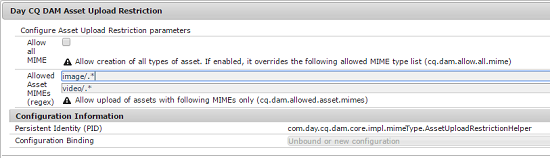

# Beperkingen voor het uploaden van middelen configureren {#configuring-asset-upload-restrictions}

U kunt [!DNL Adobe Experience Manager Assets] zo configureren dat het type elementen dat gebruikers kunnen uploaden, wordt beperkt. Zo voorkomt u ongewenste uploads in de gewenste indeling en schadelijke bestanden. Met de service `Day CQ DAM Asset Upload Restriction` kunt u bepalen welk type bestanden gebruikers kunnen uploaden. In [!DNL Assets] kunnen gebruikers standaard elementen van alle MIME-typen uploaden. U kunt de service echter zo configureren dat gebruikers alleen bestanden van bepaalde MIME-typen kunnen uploaden.

1. Open de Webconsole van de Manager van de Configuratie. Toegang `https://[aem_server]:[port]/system/console/configMgr`.
1. Open de service **[!UICONTROL Day CQ DAM Asset Upload Restriction]** in de modus Bewerken. Door gebrek, **staat al MIME** optie toe wordt geselecteerd, die gebruikers toestaat om dossiers van alle types te uploaden MIME.

   

1. Als u gebruikers wilt beperken zodat zij alleen bestanden van bepaalde MIME-typen kunnen uploaden, schakelt u de optie **[!UICONTROL Allow all MIME]** uit en geeft u toegestane MIME-typen op in de velden **[!UICONTROL Allowed Asset MIMEs (regex)]** met behulp van reguliere expressies.

   

1. Klik op **[!UICONTROL Save]** om de wijzigingen op te slaan. Als u MIME-tekenreeksen opgeeft voor toegestane MIME-typen, mislukt de uploadbewerking voor elke asset met MIME-type dat niet overeenkomt met de geconfigureerde MIME-tekenreeksen in deze velden.
