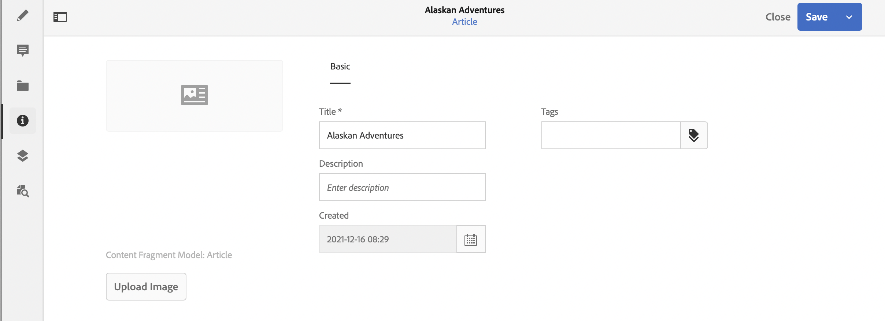

# Metagegevens - Fragmenteigenschappen {#metadata-fragment-properties}

Zie hoe u de editor voor inhoudsfragmenten kunt gebruiken om de eigenschappen van metagegevens voor inhoudsfragmenten in AEM weer te geven en te bewerken om de inhoud zonder kop aan te passen.

## Eigenschappen/metagegevens bewerken {#editing-properties-meta-data}

U kunt de metagegevens (eigenschappen) voor inhoudsfragmenten weergeven en bewerken:

1. In de **Assets** console navigeert aan de plaats van het inhoudsfragment.
2. Ofwel:

   * Selecteer [**Eigenschappen van de Mening** om de dialogen ](/help/assets/manage-assets.md#editing-properties) te openen. Als u de weergave eenmaal hebt geopend, kunt u deze ook bewerken.
   * Open het inhoudsfragment voor het uitgeven, dan uitgezochte **Meta-gegevens** van het zijpaneel.

   

3. Het **Basis** lusje verstrekt opties die u kunt bekijken of uitgeven:

   * De duimnagel, waarvoor u het Beeld **kunt** uploaden
   * **Model van het Fragment van de Inhoud** wijst op het model dat wordt gebruikt om het huidige fragment tot stand te brengen
   * **Titel**
   * **Beschrijving**
   * **Markeringen**
      * [ de Markeringen ](/help/sites-authoring/tags.md) zijn bijzonder krachtig wanneer het organiseren van uw fragmenten aangezien zij voor inhoudsclassificatie en taxonomie kunnen worden gebruikt. Tags kunnen worden gebruikt om inhoud (door tags) te zoeken en om bewerkingen in bulk toe te passen.
U kunt bijvoorbeeld relevante fragmenten labelen als &#39;kerstlancering&#39; om alleen deze fragmenten als een subset te kunnen doorbladeren, of om ze te kopiëren voor gebruik met een andere toekomstige start in een nieuwe map.

     >[!NOTE]
     >
     >**de Markeringen** kunnen ook worden toegevoegd wanneer [ creërend uw inhoud van de Variatie ](/help/assets/content-fragments/content-fragments-variations.md#authoring-your-content) en wanneer [ creërend Variaties ](/help/assets/content-fragments/content-fragments-variations.md#creating-a-variation).

   * **Gemaakt** (vertoning slechts)

   Bijvoorbeeld:
   
