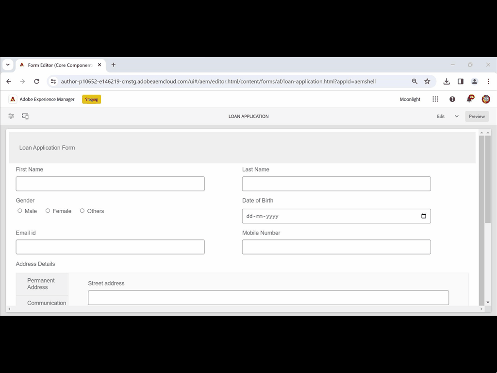

# Adaptieve Forms-fragmenten maken en gebruiken in een adaptief formulier op basis van kerncomponenten {#adaptive-form-fragments}

## Van toepassing op {#applies-to}

Deze documentatie is op **AEM 6.5 LTS Forms** van toepassing.

Voor de documentatie van AEM as a Cloud Service, zie [ AEM Forms op Cloud Service ](https://experienceleague.adobe.com/docs/experience-manager-cloud-service/content/forms/adaptive-forms-authoring/authoring-adaptive-forms-core-components/create-an-adaptive-form-on-forms-cs/adaptive-form-fragments-core-components.html).

Hoewel elk formulier voor een bepaald doel is ontworpen, zijn er in de meeste vormen enkele gangbare segmenten, zoals het verstrekken van persoonlijke gegevens zoals naam en adres, familiedetails en inkomstengegevens. Formulierontwikkelaars moeten deze algemene segmenten telkens maken wanneer een nieuw formulier wordt gemaakt.

Adaptive Forms biedt een handig mechanisme om slechts eenmaal een formuliersegment als een deelvenster of een groep velden te maken en deze opnieuw te gebruiken in Adaptive Forms. Deze herbruikbare en standalone segmenten worden Adaptieve formulierfragmenten genoemd.

Formulierfragmenten worden naadloos geïntegreerd in meerdere formulieren, waardoor het maken van consistente en professioneel ogende formulieren wordt gestroomlijnd. Formulierfragmenten zorgen voor herbruikbaarheid, standaardisering en consistentie van merken via de functie &#39;Eenmaal wijzigen en overal weerspiegelen&#39;. Ervaar meer onderhoudsgemak en efficiëntie, aangezien updates die op één plaats worden gemaakt, automatisch worden verspreid over alle vormen die deze fragmenten gebruiken.

U kunt een fragment meerdere keren aan een document toevoegen en eigenschappen voor gegevensbinding van de componenten gebruiken om het aan verschillende gegevensbronnen of schema te koppelen. U kunt bijvoorbeeld hetzelfde adresfragment gebruiken voor een vast adres, communicatie en factureringsadres en dit koppelen aan verschillende velden van een gegevensbron of schema.

>[!NOTE]
>
> U kunt uw fragmentervaring voor gebruikers met [ gemakkelijk aanpassen vormt dialoog en de dialoog van het Ontwerp van de component van het Fragment van de Vorm ](https://experienceleague.adobe.com/en/docs/experience-manager-core-components/using/adaptive-forms/adaptive-forms-components/adaptive-form-fragment).

## Een formulierfragment maken {#create-a-fragment}

U kunt een adaptief formulierfragment helemaal zelf maken of een deelvenster in een bestaand adaptief formulier opslaan als fragment. Een formulierfragment maken:

1. Login aan uw instantie van AEM Forms in https:// [*hostname*]:[*haven*] /aem/forms.html.
1. Klik **creëren > het AanpassingsFragment van de Vorm**.
1. Geef een titel, naam, beschrijving en tags voor het fragment op. Zorg ervoor dat u een unieke naam voor het fragment opgeeft. Als een ander fragment met dezelfde naam bestaat, kan het fragment niet worden gemaakt.
1. Selecteer een formuliersjabloon. U kunt een formulierfragment maken voor Core Components (Basiscomponenten) op basis van adaptieve Forms of Foundation Components (Basiscomponenten) op basis van adaptieve Forms.
   * Als u formulierfragment wilt maken voor formulieren op basis van kerncomponenten, selecteert u een sjabloon op basis van kerncomponenten.
   * Als u formulierfragment wilt maken voor op Foundation Components gebaseerde formulieren, selecteert u een sjabloon voor elementcomponenten. Bijvoorbeeld /libs/fd/af/templateForFragment/defaultFragmentTemplate.

   Wanneer u formulierfragment maakt voor formulieren op basis van kerncomponenten, gebruikt u de optie Formulierthema selecteren om een thema op basis van kerncomponenten te selecteren.

1. Klik om het **Model van de Vorm** lusje te openen, en van **Uitgezocht van** drop-down menu, selecteer één van de volgende modellen voor het fragment:

   

   * **niets**: Specificeert om het fragment van kras tot stand te brengen zonder enig vormmodel te gebruiken.

     >[!NOTE]
     >
     > In Adaptive Forms kunt u één formulierfragment (op basis van kerncomponenten) meerdere keren gebruiken. Deze ondersteunt zowel op geen gebaseerde als op schema gebaseerde formulierfragmenten.

   * **Schema**: Specificeert om het fragment tot stand te brengen gebruikend een schema van XML of van JSON dat aan AEM Forms wordt geupload. U kunt vanuit de beschikbare XML- of JSON-schema&#39;s het formuliermodel voor het fragment uploaden of selecteren. Wanneer u een XML-schema selecteert, kunt u ook een adaptief formulierfragment maken door in het keuzemenu **[!UICONTROL XML Schema Complex Type]** een complexType te selecteren dat aanwezig is in het geselecteerde schema. Wanneer u een JSON-schema selecteert, kunt u ook een adaptief formulierfragment maken door in het keuzemenu **[!UICONTROL JSON Schema Definitions]** een schemadefinitie te selecteren die aanwezig is in het geselecteerde schema.
   * **Model van de Gegevens van de Vorm**: Specificeert om het fragment tot stand te brengen gebruikend een model van vormgegevens. U kunt een adaptief formulierfragment maken op basis van slechts één gegevensmodelobject in een formuliergegevensmodel. Vervolgkeuzelijst Formuliergegevensmodeldefinities uitvouwen. Hiermee worden alle gegevensmodelobjecten in het opgegeven formuliergegevensmodel weergegeven. Selecteer een gegevensmodelobject in de lijst.

   

1. Klik **creëren** en klik dan **Open** om het fragment, met een standaardmalplaatje, op uit te geven wijze te openen. In de bewerkingsmodus kunt u elke component Adaptief formulier aan het fragment toevoegen.

<!-- For information about Adaptive Form components, see [Introduction to authoring Adaptive Forms](../../forms/using/introduction-forms-authoring.md). --> Als u bovendien een XML-schema of XDP-formuliersjabloon hebt geselecteerd als het formuliermodel voor uw fragment, wordt een nieuw tabblad met de hiërarchie van het formuliermodel weergegeven in de zoeker naar inhoud. Hiermee kunt u formuliermodelelementen naar het fragment slepen en neerzetten. De toegevoegde formuliermodelelementen worden geconverteerd naar formuliercomponenten, terwijl de oorspronkelijke eigenschappen van de gekoppelde XDP of XSD behouden blijven.

Nadat het adaptieve formulierfragment dat is gebaseerd op een schema- of formuliergegevensmodel is gemaakt, worden het formuliergegevensmodel of de schema-elementen weergegeven op het tabblad Gegevensbronnen van de browser Inhoud in de Adaptieve formuliereditor. U kunt formuliermodelelementen naar het fragment slepen en neerzetten. De toegevoegde formuliermodelelementen worden geconverteerd naar formuliercomponenten terwijl de oorspronkelijke eigenschappen van het gekoppelde schema behouden blijven.

## Een fragment toevoegen aan een adaptief formulier {#insert-a-fragment-in-an-adaptive-form}

Een adaptief formulierfragment toevoegen aan een adaptief formulier:

1. Open het adaptieve formulier in de bewerkingsmodus.
1. Voeg de **Aangepaste component van het Fragment van de Vorm** aan de vorm toe.
1. Klik **Assets** inhoudsbrowser sidebar. In activa browser, onder de wegen, selecteer de **Aangepaste optie van de Fragmenten van de Vorm**. Alle Adaptieve Forms-fragmenten die beschikbaar zijn voor uw formulier, worden weergegeven, afhankelijk van het formuliermodel.

   

1. De belemmering-en-daling een Adaptief fragment van de Vorm op de **Aangepaste component van het Fragment van de Vorm** op uw Aangepaste Vorm.

   >[!NOTE]
   >
   >Het fragment Adaptief formulier is niet ingeschakeld voor ontwerpen vanuit het adaptieve formulier. Bovendien kunt u een XSD-fragment niet gebruiken in een op JSON gebaseerde adaptieve vorm en omgekeerd.

Het fragment Adaptief formulier wordt toegevoegd met verwijzing naar het adaptieve formulier en blijft gesynchroniseerd met het standalone adaptieve formulierfragment. Dit houdt in dat alle wijzigingen die in het adaptieve formulierfragment worden aangebracht, worden weerspiegeld in alle gevallen waarin het fragment is opgenomen in Adaptief Forms.

### Een fragment insluiten in adaptieve vorm {#embed-a-fragment-in-adaptive-form}

U kunt verkiezen om een Adaptief fragment van de Vorm in een Aangepaste Vorm in te bedden door  pictogram de paneeltoolbar van het toegevoegde fragment

Het ingesloten fragment is niet meer gekoppeld aan het zelfstandige fragment. U kunt de componenten in het ingesloten fragment bewerken vanuit het adaptieve formulier.

<!-- 
## Configure fragment appearance {#configure-fragment-appearance}

Any fragment you insert in Adaptive Forms appears as a placeholder image. The placeholder displays titles of up to a maximum of ten child panels in the fragment. You can configure AEM Forms to show the complete fragment instead of the placeholder image.

Perform the following steps to show complete fragments in forms:

1. Go to AEM web console configuration page at https:[*host*]:[*port*]/system/console/configMgr.

1. Search and click **[!UICONTROL Adaptive Form and Interactive Communication Web Channel Configuration]** to open it in edit mode.
1. Disable **[!UICONTROL Enable Placeholder in place of Fragment]** checkbox to show complete fragments rather than the placeholder image.

-->

### Fragmenten in fragmenten gebruiken {#using-fragments-within-fragments}

U kunt geneste adaptieve formulierfragmenten maken, wat betekent dat u een fragment naar een ander fragment kunt slepen en neerzetten en dat u een geneste fragmentstructuur kunt hebben.

### Een formulierfragment meerdere keren gebruiken in een adaptief formulier {#using-form-fragment-mutiple-times-in-af}

U kunt een formulierfragment op basis van geen en schema meerdere keren gebruiken in een adaptief formulier om gegevens uniek op te slaan voor elk veld met formulierfragmenten. U kunt bijvoorbeeld een fragment van een adresformulier gebruiken om adresgegevens te verzamelen voor permanente communicatie en het weergeven van levende adressen in een aanvraagformulier voor een lening.

## Automatische toewijzing van fragmenten voor gegevensbinding {#auto-mapping-of-fragments-for-data-binding}

Wanneer u een adaptief formulierfragment maakt met een XFA-formuliersjabloon of een XSD-complex type en het fragment naar een adaptief formulier sleept, wordt het XFA-fragment of het XSD-complexe type automatisch vervangen door het corresponderende adaptieve formulierfragment waarvan de hoofdmap van het fragmentmodel is toegewezen aan het XFA-fragment of het XSD-complexe type.

U kunt het fragmentelement en de bijbehorende bindingen wijzigen in het dialoogvenster Component bewerken.

U kunt een gebonden adaptief formulierfragment ook slepen en neerzetten vanuit de bibliotheek met adaptief formulierfragment in de zoekfunctie voor AEM-inhoud en de juiste bindingsverwijzing opgeven in het dialoogvenster Component bewerken van het deelvenster Adaptief formulierfragment.

## Fragmenten beheren {#manage-fragments}

U kunt verschillende bewerkingen uitvoeren op Adaptief-formulierfragmenten met de gebruikersinterface van AEM Forms.

1. Ga naar `https://[hostname]/aem/forms.html` .

1. Klik **Uitgezocht** in de toolbar van UI van AEM Forms en selecteer een Adaptief fragment van de Vorm. De werkbalk bevat de volgende bewerkingen die u kunt uitvoeren op het geselecteerde adaptieve formulierfragment.

<table>
 <tbody>
  <tr>
   <td>
<strong>Bewerking</strong>
 </td>
   <td>
<strong>Beschrijving</strong>
 </td>
  </tr>
  <tr>
   <td>
Bewerken
 </td>
   <td>
Hiermee opent u het geselecteerde adaptieve formulierfragment in de bewerkingsmodus.     
 </td>
  </tr>
  <tr>
   <td>
Eigenschappen
 </td>
   <td>
Hiermee opent u het deelvenster Eigenschappen. In het deelvenster Eigenschappen kunt u eigenschappen weergeven en bewerken, een voorvertoning genereren en een miniatuurafbeelding voor het geselecteerde fragment uploaden. Voor meer informatie, zie <a> het Leiden meta-gegevens </a>.    
 </td>
  </tr>
  <tr>
   <td>
Kopiëren
 </td>
   <td>
Hiermee kopieert u het geselecteerde fragment. De knop Plakken wordt weergegeven op de werkbalk.     
 </td>
  </tr>
  <tr>
   <td>
Downloaden
 </td>
   <td>
Hiermee downloadt u het geselecteerde fragment.     
 </td>
  </tr>
  <tr>
   <td>
Voorvertoning
 </td>
   <td>
Hiermee kunt u een voorvertoning van het fragment weergeven als een HTML of een aangepaste voorvertoning door gegevens uit een XML-bestand samen te voegen met het fragment. Voor meer informatie, zie <a> Previewing een vorm </a>.    
 </td>
  </tr>
  <tr>
   <td>
Revisie starten/Revisie beheren
 </td>
   <td>
Hiermee kunt u een revisie van het geselecteerde fragment starten en beheren. Voor meer informatie, zie <a> Creërend en het leiden overzichten </a>.    
 </td>
  </tr>
  <tr>
   <td>
Woordenboek toevoegen
 </td>
   <td>
Genereert een woordenboek voor het lokaliseren van het geselecteerde fragment. Voor meer informatie, zie <a> Localizing Adaptive Forms </a>.    
 </td>
  </tr>
  <tr>
   <td>
Publiceren/Publiceren ongedaan maken
 </td>
   <td>
Hiermee publiceert u het geselecteerde fragment of maakt u de publicatie ervan ongedaan.     
 </td>
  </tr>
  <tr>
   <td>
Verwijderen
 </td>
   <td>
Hiermee verwijdert u het geselecteerde fragment.     
 </td>
  </tr>
 </tbody>
</table>

## Belangrijke punten die u moet onthouden wanneer u werkt met fragmenten {#key-points-to-remember-when-working-with-fragments}

* Zorg ervoor dat de fragmentnaam uniek is. Het fragment kan niet worden gemaakt als er een bestaand fragment met dezelfde naam bestaat.
* Als u in een op XDP gebaseerd adaptief formulier een deelvenster opslaat als fragment dat een ander XDP-fragment bevat, wordt het resulterende fragment automatisch gebonden aan het onderliggende XDP-fragment. Als een adaptief formulier op basis van XSD, wordt het resulterende fragment gebonden aan de hoofdmap van het schema.
* Wanneer u een adaptief formulierfragment maakt, wordt in CRXDE Lite een fragmentknooppunt gemaakt, dat lijkt op het knooppunt guideContainer voor een adaptief formulier.
* Een fragment in een adaptief formulier dat een ander formuliergegevensmodel gebruikt, wordt niet ondersteund. Een XDP-fragment wordt bijvoorbeeld niet ondersteund in een XSD-gebaseerd adaptief formulier en omgekeerd.
* Adaptieve formulierfragmenten zijn beschikbaar voor gebruik via het tabblad Adaptieve formulierfragmenten in de zoekfunctie voor AEM-inhoud.
* Expressies, scripts of stijlen in een zelfstandig adaptief formulierfragment blijven behouden wanneer deze via verwijzing worden ingevoegd of in een adaptief formulier worden ingesloten.
* U kunt een adaptief formulierfragment, dat via verwijzing wordt ingevoegd, niet bewerken vanuit een adaptief formulier. Als u het fragment wilt bewerken, bewerkt u het zelfstandige adaptieve formulierfragment of sluit u het fragment in het adaptieve formulier in.
* Wanneer u een adaptief formulier publiceert, moet u de stand-alone adaptieve formulierfragmenten publiceren die door verwijzing zijn ingevoegd in het adaptieve formulier.
* Wanneer u een bijgewerkt adaptief formulierfragment opnieuw publiceert, worden de wijzigingen doorgevoerd in de gepubliceerde exemplaren van het adaptieve formulier waarin het fragment wordt gebruikt.
* Het adaptieve formulier met de component Verify ondersteunt geen anonieme gebruikers. Het wordt ook niet aangeraden de component Verify te gebruiken in een adaptief formulierfragment.
* (**Mac slechts**) om ervoor te zorgen dat de functionaliteit van vormfragmenten perfect in alle scenario&#39;s werkt, voeg de volgende ingang aan het /private/etc/hosts- dossier toe:
  `127.0.0.1 <Host machine>` **de machine van de Gastheer**: De machine van Apple Mac waarop AEM Forms wordt opgesteld.

## Referentiekaders {#reference-fragments}

Verwijs naar adaptieve formulierfragmenten die u kunt gebruiken om uw formulier te maken.
<!-- For more information, see [Reference Fragments](../../forms/using/reference-adaptive-form-fragments.md). -->

## Zie ook {#see-also}

* [Een adaptief formulier op basis van kerncomponenten maken](create-an-adaptive-form-core-components.md)
* [Regeleditor gebruiken om dynamisch gedrag aan formulier toe te voegen](rule-editor.md)
* [Thema&#39;s maken of aanpassen voor adaptieve Forms op basis van Core Components](create-or-customize-themes-for-adaptive-forms-core-components.md)
* [Een sjabloon maken voor Adaptief Forms op basis van Core Components](template-editor.md)
* [Een adaptief formulier maken of toevoegen aan een AEM Sites-pagina of -ervaringsfragment](create-or-add-an-adaptive-form-to-aem-sites-page.md)
* [ de themasjablonen van de Steekproef en modellen van vormgegevens ](https://experienceleague.adobe.com/docs/experience-manager-core-components/using/adaptive-forms/sample-themes-templates-form-data-models-core-components.html)
