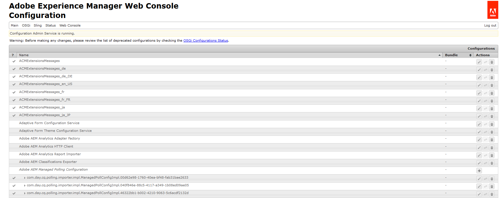
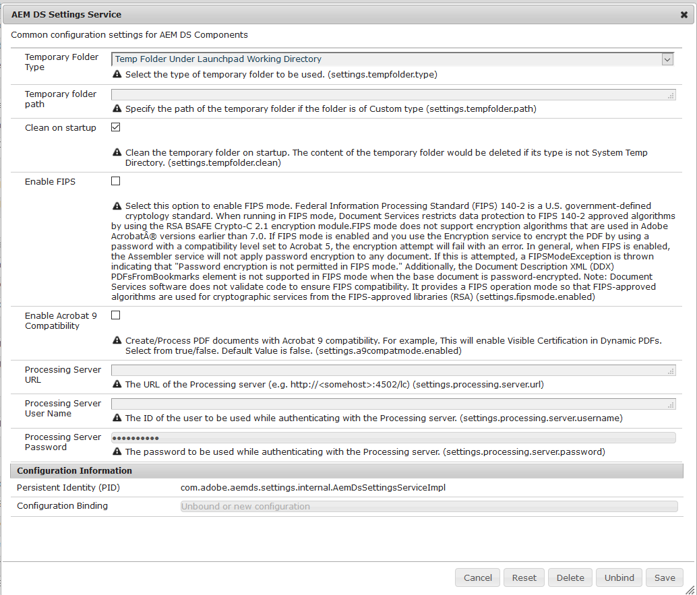

# AEM DS-instellingen configureren{#configuring-aem-ds-settings}

Dit artikel beschrijft hoe te om de **dienst van de Montages van AEM DS** te vormen. Deze instelling kan in meerdere scenario&#39;s worden gebruikt, bijvoorbeeld:

* In het Correspondentenbeheer

   * Voor het configureren van de AEM Forms-workflow
   * Tijdens het gebruik van de Forms Portal voor het op afstand opslaan van concepten/verzendingen

* In adaptieve formulieren, voor gevallen waarin een adaptief formulier wordt ingediend vanuit een publicatie-instantie

Hier volgen de stappen voor het configureren van de **[!UICONTROL AEM DS Settings]** :

1. Open de Manager van de Configuratie op publiceer instantie gebruikend URL:\
   *https://localhost:port/system/console/configMgr*.

   

1. Zoek in het **[!UICONTROL Adobe Experience Manager Web Console Configuration]** -venster de optie **[!UICONTROL AEM DS Settings]** en klik erop.

   

1. In het venster **[!UICONTROL AEM DS Settings Service]** worden de algemene configuratie-instellingen voor AEM DS Components weergegeven.

   

1. Voeg de volgende informatie in de respectieve gebieden toe:

   **[!UICONTROL Processing Server URL]**: De Verwerkingsserver is de server waarop de Forms- of AEM-workflow moet worden geactiveerd. Dit kan hetzelfde zijn als de URL van de AEM-auteurinstantie of de andere Server-URL (https://localhost:port/).

   **[!UICONTROL Processing Server User Name]**: De Naam van de Gebruiker van het werkschema gebruiker [ gebaseerd op de server URL die wordt gebruikt ]

   **[!UICONTROL Processing Server Password]**: Wachtwoord workflowgebruiker

   >[!NOTE]
   >
   >
   >    
   >    
   >    * Voordat u Forms- of AEM-workflows gebruikt, moet u eerst de service voor DS-instellingen configureren, voordat u gegevens van de publicatieserver kunt verzenden. Anders zal de indiening van het formulier mislukken.
   >    
   >
