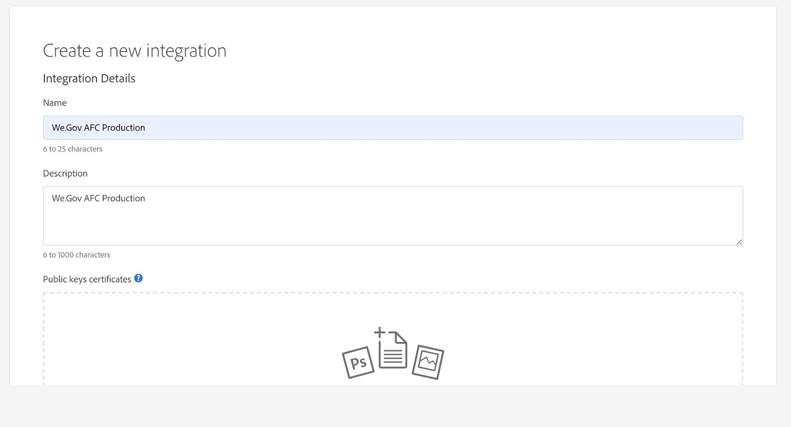
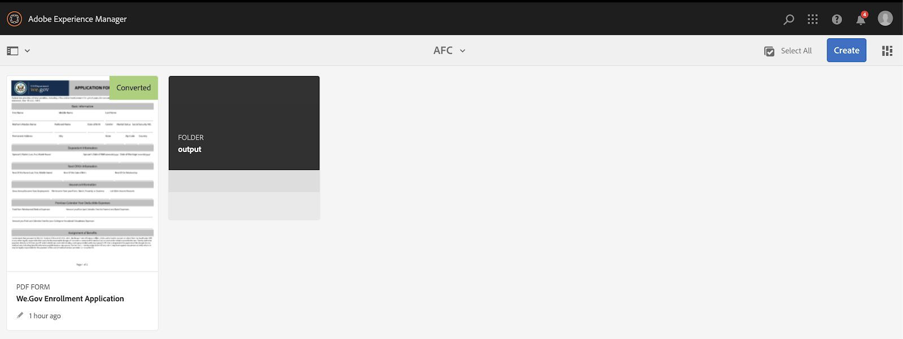

# De referentiesite We.Gov en We-Finance instellen en configureren {#set-up-and-configure-we-gov-reference-site}

## Details demopakket {#demo-package-details}

### Installatievereisten {#installation-prerequisites}

Dit pakket werd gecreeerd voor **AEM Forms 6.4 OSGI Auteur**, is getest, en daarom gesteund op de volgende platformversies:

| AEM VERSION | AEM FORMS PACKAGE VERSION | STATUS |
|---|---|---|
| 6,4 | 5,0,86 | **Gesteund** |
| 6,5 | 6,0,80 | **Gesteund** |
| 6.5.3. | 6,0,122 | **Gesteund** |

Dit pakket bevat een cloudconfiguratie die de volgende platformversies ondersteunt:

| PROVIDER CLOUD | SERVERSIE | STATUS |
|---|---|---|
| Adobe-handtekening | v5-API | **Gesteund** |
| Microsoft® Dynamics 365 | 1710 (9.1.0.3020) | **Gesteund** |
| Adobe Analytics | v1.4 Rest-API | **Gesteund** |

**de installatieoverwegingen van het Pakket:**

* Installeer het pakket op een schone server, zonder andere demopakketten of oudere demopakketversies.
* Installeer het pakket op een OSGI-server, in de modus Auteur.

### Wat bevat dit pakket {#what-does-this-package-include}

Het [ AEM Forms wij.Gov demopakket ](https://experience.adobe.com/#/downloads/content/software-distribution/en/aem.html?package=/content/software-distribution/en/details.html/content/dam/aem/public/adobe/packages/cq650/featurepack/we-gov-forms.pkg.all-2.0.2.zip) (**wij-gov-forms.pkg.all-&lt;version>.zip**) komt als pakket dat verscheidene andere subpakketten en de diensten omvat. Het pakket bevat de volgende modules:

* **wij-gov-forms.pkg.all-&lt;version>.zip** - *Volledige manifestatiepakket*

   * **we-gov-forms.ui.apps-&lt;version>.zip** *- bevat alle componenten, cliëntbibliotheken, steekproeven gebruikers, werkschemamodellen, etc.*

      * **wij-gov-forms.core-&lt;version>.jar** - *bevat alle diensten OSGI, de implementatie van de douanewerkschemastap, etc.*

      * **wij-gov-forms.derby&lt;version>.jar** - *bevat alle diensten OSGI, gegevensbestandschema, etc.*

      * **core.wcm.components.all-2.0.4.zip** - *Inzameling van de componenten van steekproefWCM*

      * **grid-aem.ui.apps-1.0-SNAPSHOT.zip** - *de lay-outpakket van het Net van AEM Sites voor de controle van de de paginakolomkolom van Plaatsen*

   * **we-gov-forms.ui.content-&lt;version>.zip** - *bevat alle inhoud, pagina&#39;s, beelden, vormen, interactieve communicatie activa, etc.*

   * **we-gov-forms.ui.analytics-&lt;version>.zip** - *bevat alle gegevens van de Analytics van Web.Gov Forms die binnen de bewaarplaats moeten worden opgeslagen.*

   * **wij-gov-forms.config.public - &lt;version>.zip** - *bevat alle standaardconfiguratieknooppunten met inbegrip van placeholder wolkenconfiguraties helpen het model van vormgegevens, en de dienst binden kwesties vermijden.*

De elementen die in dit pakket zijn opgenomen, zijn:

* AEM-sitepagina&#39;s met bewerkbare sjablonen
* AEM Forms Adaptive Forms
* Interactieve AEM Forms-communicatie (Afdrukken en Webkanaal)
* AEM Forms XDP-document van record
* AEM Forms MS® Dynamics Forms Data Model
* Adobe Sign Integration
* AEM Workflowmodel
* AEM Assets-voorbeeldafbeeldingen
* Voorbeeld (in geheugen) Apache Derby Database
* Apache Derby Data Source (voor gebruik met formuliergegevensmodel)

## Installatie van demopakket {#demo-package-installation}

Deze sectie bevat informatie over het installeren van het demopakket.

### Van softwaredistributie {#from-software-distribution}

1. Open [ Distributie van de Software ](https://experience.adobe.com/downloads). U hebt een Adobe ID nodig om u aan te melden bij de softwaredistributie.
1. Selecteer **[!UICONTROL Adobe Experience Manager]** beschikbaar in het koptekstmenu.
1. In de sectie **[!UICONTROL Filters]** :
   1. Selecteer **[!UICONTROL Forms]** in de vervolgkeuzelijst **[!UICONTROL Solution]** .
   2. Selecteer de versie en typ voor het pakket. U kunt de optie **[!UICONTROL Search Downloads]** ook gebruiken om de resultaten te filteren.
1. Selecteer **wij-gov-forms.pkg.all-&lt;version>.zip** pakketnaam, selecteer **[!UICONTROL Accept EULA Terms]**, en selecteer **[!UICONTROL Download]**.
1. Open [ Manager van het Pakket ](/help/sites-administering/package-manager.md) en klik **[!UICONTROL Upload Package]** om het pakket te uploaden.
1. Selecteer het pakket en klik op **[!UICONTROL Install]** .

   

1. De installatie kan worden voltooid.
1. Navigeer aan *https://&lt;aemserver>:&lt;port>/content/we-gov/home.html?wcmmode=disabled* om ervoor te zorgen dat de installatie succesvol was.

### Vanuit een lokaal ZIP-bestand {#from-a-local-zip-file}

1. Download en bepaal de plaats van het {**dossier 0} wij-gov-forms.pkg.all-&lt;version>.zip.**
1. Navigeer aan *https://&lt;aemserver>:&lt;port>/crx/packmgr/index.jsp*.
1. Selecteer de optie Pakket uploaden.

   

1. Gebruik de bestandsbrowser om naar het gedownloade ZIP-bestand te navigeren en dit te selecteren.
1. Klik op Openen om te uploaden.
1. Nadat u het pakket hebt geüpload, selecteert u de optie Installeren om het pakket te installeren.

   

1. De installatie kan worden voltooid.
1. Navigeer aan *https://&lt;aemserver>:&lt;port>/content/we-gov/home.html?wcmmode=disabled* om ervoor te zorgen dat de installatie succesvol was.

### Nieuwe pakketversies installeren {#installing-new-package-versions}

Volg de stappen in 4.1 en 4.2 om de nieuwe pakketversie te installeren. U kunt een nieuwere pakketversie installeren zelfs als een oudere versie reeds geïnstalleerd is. Adobe raadt u echter aan eerst de oudere pakketversie te verwijderen. Ga als volgt te werk om dit te doen:

1. Navigeer aan *https://&lt;aemserver>:&lt;port>/crx/packmgr/index.jsp*
1. Bepaal de plaats van het oudere {**dossier 0} wij-gov-forms.pkg.all-&lt;version>.zip.**
1. Selecteer **Meer** optie.
1. Van dropdown, selecteer **desinstalleer** optie.

   

1. Bij bevestiging, uitgezochte **desinstalleert** opnieuw, en staat het desinstallatieproces toe om te voltooien.

## Configuratie demopakket {#demo-package-configuration}

Deze sectie bevat details en instructies over de configuratie na implementatie van het demopakket vóór de presentatie.

### Facultatieve gebruikersconfiguratie {#fictional-user-configuration}

1. Navigeer aan *https://&lt;aemserver>:&lt;port>/libs/granite/security/content/groupadmin.html*
1. Meld u aan als beheerder om de onderstaande taken uit te voeren.
1. Schuif omlaag naar het einde van de pagina om alle gebruikersgroepen te laden.
1. Onderzoek naar **werkschema**.
1. Selecteer de **werkschema-gebruikers** groep en klik **Eigenschappen**.
1. Navigeer naar het tabblad Leden.
1. Op het **Uitgezochte Gebruiker of 1} gebied van de Groep, type**.`wegov`
1. Selecteer van drop-down **Wij.Gov de Gebruikers van Forms**.

   

1. Klik **sparen &amp; sluit** in de menubar.
1. Herhaal stappen 2-7 door naar **analytische** te zoeken, die de **Beheerders van Analytics** groep selecteren, en het toevoegen van **Wij.Gov Forms** groep als lid.
1. Herhaal stappen 2-7 door naar **te zoeken vormen gebruikers**, die de **vormen-macht-gebruikers** groep selecteren, en **toe te voegen Wij.Gov Forms** groep als lid.
1. Herhaal stappen 2-7 door naar **te zoeken vorm-gebruikers**, die de **vormen-gebruikers** groep selecteren, en dit keer toevoegend de **Wij.Gov gebruikersgroep** als lid.

### Configuratie van e-mailserver {#email-server-configuration}

1. De opstellingsdocumentatie van het overzicht [ Vormend E-mailbericht ](/help/sites-administering/notification.md)
1. Meld u aan als beheerder voor deze taak.
1. Navigeer aan *https://&lt;aemserver>:&lt;port>/system/console/configMgr*
1. Bepaal en klik de **dienst van de Post van 0} Dag CQ {om te vormen.**

   

1. Vorm de dienst om met de server SMTP van uw keus te verbinden:

   1. **SMTP Server hostname**: bijvoorbeeld (smtp.gmail.com)
   1. **Haven van de Server**: bijvoorbeeld (465) voor post gebruikend SSL
   1. **Gebruiker SMTP:** demo@ &lt;company name> .com
   1. **van Adres**: aemformsdemo@adobe.com

   

1. Klik **sparen** om de configuratie te bewaren.

### (Optioneel) AEM SSL-configuratie {#aemsslconfig}

Deze sectie bevat informatie over het configureren van SSL op het AEM-exemplaar om de configuratie van Adobe Sign Cloud te kunnen configureren.

**Verwijzingen:**

1. [Standaard SSL](/help/sites-administering/ssl-by-default.md)

**Nota&#39;s:**

1. Navigeer naar https://&lt;aemserver>:&lt;port>/aem/inbox waar u het proces kunt voltooien dat wordt uitgelegd in de bovenstaande koppeling naar de referentiedocumentatie.
1. Het pakket `we-gov-forms.pkg.all-[version].zip` bevat een voorbeeld-SSL-sleutel en -certificaat dat kan worden benaderd door de `we-gov-forms.pkg.all-[version].zip/ssl` -map uit te pakken die deel uitmaakt van het pakket.

1. SSL-certificaat en sleutelgegevens:

   1. uitgegeven aan &quot;CN=localhost&quot;
   1. 10 jaar geldig
   1. password value of &quot;password&quot;

1. De privé sleutel is *localhostprivate.der*.
1. Het certificaat is *localhost.crt*.
1. Klik op **Next**.
1. Plaats HTTPS Hostname aan *localhost*.
1. Plaats Haven aan een haven die het systeem heeft blootgesteld.

### (Optioneel) Adobe Sign cloud configuration {#adobe-sign-cloud-configuration}

Deze sectie bevat details en instructies over de configuratie van Adobe Sign Cloud.

**Verwijzingen:**

1. [Adobe Sign with AEM Forms integreren](adobe-sign-integration-adaptive-forms.md)

#### Cloud-configuratie {#cloud-configuration}

1. Controleer de voorwaarden. Zie [ SSL van AEM Configuratie ](../../forms/using/forms-install-configure-gov-reference-site.md#aemsslconfig) voor vereiste SSL configuratie.
1. Navigeren naar:

   *https://&lt;aemserver>:&lt;port>/libs/adobesign/cloudservices/adobesign.html/conf/we-gov*

   >[!NOTE]
   >
   >U voorkomt configuratieproblemen door ervoor te zorgen dat de URL waarmee de AEM-server wordt geopend, overeenkomt met de URL die is geconfigureerd in de Adobe Sign OAuth Redirect URI.
   >Bijvoorbeeld, *https://&lt;aemserver>:&lt;port>/mnt/overlay/adobesign/cloudservices/adobesign/properties.html*

1. Selecteer de **We.gov** configuratie van het Teken van Adobe.
1. Klik **Eigenschappen**.
1. Navigeer naar het tabblad &quot;Instellingen&quot;.
1. Voer de URL Auth in. Bijvoorbeeld `https://secure.na1.echosign.com/public/oauth` (alleen ter illustratie).
1. Geef de geconfigureerde client-id en clientgeheim op in de geconfigureerde Adobe Sign-instantie.
1. Klik **verbinden met het Teken van Adobe**.
1. Na succesvolle verbinding, klik **sparen &amp; sluit** om de integratie te voltooien.

### (Optioneel) MS® Dynamics cloud configuration {#ms-dynamics-cloud-configuration}

Deze sectie bevat details en instructies over de Configuratie van de Dynamica Cloud MS®.

**Verwijzingen:**

1. [Microsoft](/help/forms/using/ms-dynamics-odata-configuration.md)
1. [ het Vormen Dynamica Microsoft® voor AEM Forms ](https://experienceleague.adobe.com/en/docs/experience-manager-learn/forms/adaptive-forms/using-ms-dynamics-with-aem-forms#)

#### MS® Dynamics OData cloudservice {#ms-dynamics-odata-cloud-service}

1. Navigeren naar:

   https://<aemserver>:<port>/libs/fd/fdm/gui/components/admin/fdmcloudservice/fdm.html/conf/we-gov

   1. Zorg ervoor dat u de server opent met dezelfde omleidings-URL als die is geconfigureerd in de registratie van de MS® Dynamics-toepassing.

1. Selecteer de configuratie &quot;Microsoft® Dynamics OData Cloud Service&quot;.
1. Klik **Eigenschappen**.

   

1. Navigeer naar het tabblad &#39;Verificatie-instellingen&#39;.
1. Voer de volgende gegevens in:

   1. **Wortel van de Dienst:** bijvoorbeeld, `https://msdynamicsserver.api.crm3.dynamics.com/api/data/v9.1/`
   1. **Type van Authentificatie:** OAuth 2.0
   1. **de Montages van de Authentificatie** (zie [ MS® de montages van de de wolkenconfiguratie van de Dynamica ](../../forms/using/forms-install-configure-gov-reference-site.md#dynamicsconfig) om deze informatie te verzamelen):

      1. Client-id - ook wel toepassings-id genoemd
      1. Clientgeheim
      1. OAuth URL - bijvoorbeeld, [ https://login.microsoftonline.com/common/oauth2/authorize ](https://login.microsoftonline.com/common/oauth2/authorize)
      1. Vernieuw Symbolische URL - bijvoorbeeld, [ https://login.windows.net/common/oauth2/token ](https://login.windows.net/common/oauth2/token)
      1. Toegang symbolische URL - bijvoorbeeld, [ https://login.windows.net/common/oauth2/token ](https://login.windows.net/common/oauth2/token)
      1. Het Toepassingsgebied van de vergunning - **openid**
      1. De Kopbal van de authentificatie - **Drager van de Vergunning**
      1. Resource - bijvoorbeeld `https://msdynamicsserver.api.crm3.dynamics.com`

   1. Klik C **verbinden met OAuth**.

1. Na succesvolle authentificatie, klik **sparen &amp; dicht** om de integratie te voltooien.

#### Configuratie-instellingen voor de cloud MS® Dynamics {#dynamicsconfig}

De stappen die in dit gedeelte worden beschreven, zijn inbegrepen om u te helpen bij het zoeken naar de client-id, het clientgeheim en details van uw MS® Dynamics Cloud-instantie.

1. Navigeer aan [ https://portal.azure.com/ ](https://portal.azure.com/) en login.
1. Van het linkermenu, uitgezochte **Alle Diensten**.
1. Zoek of navigeer aan **Registratie van de Toepassing**.
1. Maak of selecteer een bestaande toepassingsregistratie.
1. Kopieer **identiteitskaart van de Toepassing** om als OAuth **Identiteitskaart van de Cliënt** in de de wolkenconfiguratie van AEM worden gebruikt
1. Klik **Montages** of **Manifest** om **Reactie URLs te vormen.**

   1. Deze URL moet overeenkomen met de URL die wordt gebruikt om toegang te krijgen tot uw AEM-server wanneer de OData-service wordt geconfigureerd.

1. Van de het Plaatsen mening, klik **Sleutels** om een nieuwe sleutel (die als Geheim van de Cliënt in AEM wordt gebruikt) te bekijken.

   1. Zorg ervoor dat u een kopie van de sleutel bewaart. U kunt de sleutel later niet bekijken in Azure of AEM.

1. Navigeer naar het dashboard voor de instantie MS® Dynamics om de URL van de hoofdmap van de bron/service te zoeken.
1. In de hoogste navigatiebar, klik **Verkoop** of uw eigen instantietype, dan **Uitgezochte Montages**.
1. Bij het bodemrecht, klik **Aanpassingen** en **de Middelen van de Ontwikkelaar**.
1. Zoek de URL van de hoofdmap van de service. Bijvoorbeeld:

   `https://msdynamicsserver.api.crm3.dynamics.com/api/data/v9.1/`

1. De details over Refresh en Access Token URL zijn beschikbaar bij:

   [ https://learn.microsoft.com/en-us/rest/api/datacatalog/authenticate-a-client-app](https://learn.microsoft.com/en-us/rest/api/datacatalog/authenticate-a-client-app)

#### Het Forms-gegevensmodel testen (Dynamics) {#testing-the-form-data-model}

Nadat de cloudconfiguratie is voltooid, wilt u mogelijk het formuliergegevensmodel testen.

1. Navigeren naar

   *https://&lt;aemserver>:&lt;port>/aem/forms.html/content/dam/formsanddocuments-fdm/we-gov*

1. Selecteer **We.gov Microsoft® Dynamics CRM FDM** en selecteer **Eigenschappen**.

   

1. Navigeer aan de **Update Source** tabel.
1. Zorg ervoor dat de **Context-Aware Configuratie** aan `/conf/we-gov` wordt geplaatst en dat de gevormde gegevensbron `ms-dynamics-odata-cloud-service` is.

   

1. Bewerk het formuliergegevensmodel.

1. Test de diensten om ervoor te zorgen zij met succes met de gevormde gegevensbron verbinden.

   >[!NOTE]
   >
   >Na het testen van de diensten, annuleert de klik **** om ervoor te zorgen dat de onvrijwillige veranderingen niet aan het Model van de Gegevens van de Vorm worden verspreid.

   >[!NOTE]
   >
   >Er is gemeld dat een AEM Server-herstart vereist was voor de gegevensbron om een verbinding met FDM tot stand te brengen.

   >[!NOTE]
   >
   >Adobe raadt u aan de opdracht `Ctrl + C` te gebruiken om de SDK opnieuw te starten. De AEM SDK opnieuw starten met alternatieve methoden. Het stoppen van Java-processen kan bijvoorbeeld leiden tot inconsistenties in de AEM-ontwikkelomgeving.

#### Het Forms-gegevensmodel testen (Derby) {#test-fdm-derby}

Als de cloudconfiguratie is voltooid, wilt u mogelijk het Forms-gegevensmodel testen.

1. Navigeer aan *https://&lt;aemserver>:&lt;port>/aem/forms.html/content/dam/formsanddocuments-fdm/we-gov*

1. Selecteer de **We.gov Inschrijving FDM** en selecteer **Eigenschappen**.

   

1. Navigeer aan de **Update Source** tabel.

1. Zorg ervoor dat de **context-bewuste Configuratie** aan `/conf/we-gov` wordt geplaatst en dat de gevormde gegevensbron **Wij.Gov Derby DS** is.

   

1. Klik **sparen en Sluiten**.

1. [ Test de diensten ](work-with-form-data-model.md#test-data-model-objects-and-services) om ervoor te zorgen zij met succes met de gevormde Gegevens Source verbinden

   * Om de verbinding te testen, selecteer **HOMEMORTGAGEACCOUNT** en geef het de dienst krijgen. Test de dienst en de systeembeheerders kunnen de gegevens zien die worden teruggewonnen.

### Adobe Analytics (optioneel) {#adobe-analytics-configuration}

Deze sectie bevat details en instructies over de Configuratie van Adobe Analytics Cloud.

**Verwijzingen:**

* [Integreren met Adobe Analytics](../../sites-administering/adobeanalytics.md)

* [Verbinding maken met Adobe Analytics en frameworks maken](../../sites-administering/adobeanalytics-connect.md)

* [Gegevens van paginaanalyse bekijken](../../sites-authoring/pa-using.md)

* [Analyses en rapporten configureren](configure-analytics-forms-documents.md)

* [AEM Forms-analyserapporten weergeven en begrijpen](view-understand-aem-forms-analytics-reports.md)

### Adobe Analytics Cloud-serviceconfiguratie {#adobe-analytics-cloud-service-configuration}

Dit pakket wordt vooraf geconfigureerd voor verbinding met Adobe Analytics. De stappen hieronder worden verstrekt om deze configuratie toe te staan om worden bijgewerkt.

1. Navigeer aan *https://&lt;aemserver>:&lt;port>/libs/cq/core/content/tools/cloudservices.html*
1. Zoek de sectie Adobe Analytics en selecteer de koppeling &quot;Configuraties tonen&quot;.
1. Selecteer de configuratie &quot;We.Gov Adobe Analytics (Analytics Configuration)&quot;.

   

1. Klik op de knop Bewerken om de Adobe Analytics-configuratie bij te werken (u moet het Gedeelde geheim opgeven). Klik op &quot;Verbinden met Analytics&quot; om verbinding te maken en op &quot;OK&quot; om de verbinding te voltooien.

   

1. Van de zelfde pagina, klik &quot;wij.Gov Adobe Analytics Kader (het Kader van Analytics)&quot;als u de kaderconfiguraties wilt bijwerken (zie [ het auteursrecht van AEM ](../../forms/using/forms-install-configure-gov-reference-site.md#enableauthoring) toelaten om Authoring toe te laten).

#### Adobe Analytics Locating User Credentials {#analytics-locating-user-credentials}

Zoek de gebruikersgegevens voor een Adobe Analytics-account die de accountbeheerder moet uitvoeren.

1. Navigeer naar de Adobe Experience Cloud-portal.
Aanmelden met uw beheerdersreferenties
1. Selecteer het Adobe Analytics-pictogram in het hoofddashboard.
   
1. Navigeer naar het tabblad Beheer en selecteer de optie Gebruikersbeheer (Verouderd)
   
1. Selecteer de **Gebruikers** tabel.
   
1. Selecteer de gewenste gebruiker in de lijst met gebruikers.
1. Blader naar de onderkant van de pagina en de gebruikersverificatiegegevens worden onder aan de pagina weergegeven.
   
1. De gebruikersbenaming en de Gedeelde Geheime informatie verschijnen op de rechterkant van de toestemmingendoos.
1. De gebruikersnaam heeft een dubbele punt binnen de naam. Alle informatie links van de dubbele punt is de gebruikersnaam, en alle informatie rechts van de dubbele punt is de bedrijfsnaam, zoals in het volgende voorbeeld:

   *gebruikersbenaming: bedrijfsnaam*

#### Gebruikersverificatie instellen in Adobe Analytics {#setup-user-authentication}

Beheerders kunnen gebruikers de AEM-analysebevoegdheden verlenen door de volgende handelingen uit te voeren.

1. Navigeer naar de Adobe Admin Console.

1. Klik op de instantie Analytics die beschikbaar wordt gemaakt voor de Admin Console.

   Deze bevindt zich op de hoofdpagina van de beheerpagina.

1. Selecteer Analytics voor volledige beheerdersrechten.

1. Voeg een gebruiker aan het Profiel toe.

   

1. Klik op het tabblad Machtigingen als de gebruikers-id is toegewezen aan het profiel.

1. Controleer of alle machtigingen zijn toegewezen aan het profiel.

   

1. Nadat de machtigingen zijn toegewezen over de mogelijkheid dat een gebruiker zich aanmeldt, kan dit enkele uren duren.

### Adobe Analytics-rapportage {#adobe-analytics-reporting}

#### Adobe Analytics-sites weergeven {#view-adobe-analytics-sites-reporting}

>[!NOTE]
>
>Als u het `we-gov-forms.ui.analytics-<version>.zip` -pakket installeert, zijn AEM Forms Analytics-gegevens offline of zonder Adobe Analytics Cloud-configuratie beschikbaar. Voor AEM Sites-gegevens is een actieve cloudconfiguratie vereist.

1. Navigeer aan *https://&lt;aemserver>:&lt;port>/sites.html/content*
1. Selecteer de {**plaats 0} van AEM Forms Wij.Gov om de plaatspagina&#39;s te bekijken.**
1. Selecteer één van de plaatspagina&#39;s (bijvoorbeeld, Huis), en kies **Analytics &amp; Aanbevelingen**.

   

1. Op deze pagina wordt opgehaalde informatie van Adobe Analytics weergegeven. De informatie heeft betrekking op de AEM Sites-pagina. Deze informatie wordt door het ontwerp periodiek vernieuwd vanuit Adobe Analytics en wordt niet in real-time weergegeven.

   

1. Terug op de pagina van de paginamening (die in stap 3 wordt betreden.), kunt u de informatie van de paginamening ook bekijken door de vertoning te veranderen die aan meningspunten in de **Mening van de Lijst** plaatst.
1. Bepaal de plaats van het drop-down menu van de &quot;Mening&quot;en selecteer **Mening van de Lijst**.

   

1. Van het zelfde menu, selecteert de uitgezochte **Vestiging van de Mening** en selecteert de kolommen u van de **Analytics** sectie wilt tonen.

   

1. Klik **Update** om de nieuwe kolommen beschikbaar te maken.

   

#### Rapporten van Adobe Analytics-formulieren weergeven {#view-adobe-analytics-forms-reporting}

>[!NOTE]
>
>AEM Forms Analytics-gegevens zijn offline of zonder Adobe Analytics Cloud-configuratie beschikbaar. Dit is waar als het `we-gov-forms.ui.analytics-<version>.zip` -pakket is geïnstalleerd. Voor AEM Sites-gegevens is echter een actieve cloudconfiguratie vereist.

1. Navigeren naar

   *https://&lt;aemserver>:&lt;port>/aem/forms.html/content/dam/formsanddocuments/adobe-gov-forms*

1. Selecteer het adaptieve formulier &quot;Inschrijvingsaanvraag voor gezondheidsvoordelen&quot; en selecteer de optie &quot;Analyserapport&quot;.

   

1. Wacht tot de pagina is geladen en bekijk de gegevens in het Analysapport.

   

### Adobe Automated Forms Configuration Enablement {#automated-forms-enablement}

Gebruikers van het gereedschap Conversie moeten het volgende hebben om AEM Forms met Adobe Forms te installeren en te configureren:

1. Toegang tot Adobe Developer.

1. Toestemming voor het maken van integratie met de Adobe Forms Conversion-service.

1. Adobe AEM 6.5 nieuwste service pack die als auteur wordt uitgevoerd.

Lees het volgende voordat u verdere instructies leest:

* [ vorm de Geautomatiseerde Dienst van de Omzetting van Vormen ](https://experienceleague.adobe.com/en/docs/aem-forms-automated-conversion-service/using/configure-service#)

#### Een IMS-configuratie maken - Deel 1 {#creating-ims-config}

Configureer de service zodat gebruikers correct kunnen communiceren met het hulpprogramma voor het converteren van formulieren. Gebruikers moeten de service Identity Management System (IMS) configureren om zich bij Adobe I/O te kunnen registreren.

1. Ga naar https://&lt;aemserver>:&lt;port> > Click Adobe Experience
Manager linksboven > Gereedschappen > Beveiliging > Adobe IMS-configuratie.

1. Klik op Maken.

1. Voer de handelingen uit in de onderstaande afbeelding.

   

1. Download het certificaat.

1. Ga niet met de rest van de configuratie te werk - herzie sectie [ Creërend Integratie in Adobe I/O ](#create-integration-adobeio)

>[!NOTE]
>
>Het in deze sectie gemaakte certificaat wordt gebruikt om de integratieservice in Adobe I/O te maken. Wanneer de gebruikers de integratieservice hebben gecreeerd, kunnen de gebruikers die informatie van Adobe I/O gebruiken om de configuratie te beëindigen.

#### Integratie in Adobe I/O maken {#create-integration-adobeio}

Zorg ervoor dat u de mogelijkheid hebt om een integratie in uw Adobe-domein te maken als u hiervoor geen contact opneemt met de systeembeheerder.

1. Navigeer aan [ Adobe Developer Console ](https://developer.adobe.com/console/).

1. Klik **creeer Integratie**.

1. Selecteer **Toegang API**.

1. Zorg ervoor dat u zich in de juiste groep bevindt (vervolgkeuzelijst rechtsboven).

1. Selecteer in de sectie Experience Cloud het gereedschap voor Forms-conversie.

1. Klik **verdergaan**.

1. Voer de naam en beschrijving van uw integratie in.

1. Als u de openbare sleutel uit paragraaf 2.1 gebruikt, plaatst u deze in de integratie van de sleutel.

1. Selecteer een profiel voor de automatische conversie van formulieren.

   

#### IMS-configuratiedeel 2 maken {#create-ims-config-part-next}

Nu u een integratie hebt gecreeerd laten ons de installatie van de configuratie voltooien IMS.

1. Klik op uw integratie in Adobe I/O om de verbindingsgegevens beschikbaar te maken.

1. Ga aan uw configuratie IMS binnen AEM (**Hulpmiddelen** > **Veiligheid** > **IMS**)

1. Klik **daarna** op het IMS configuratiescherm.

1. Voer de verificatieserver in (de waarde die in de schermafbeelding wordt weergegeven).

1. Voer de API-sleutel in.

1. Ga het Geheim van de Cliënt in (klik **blootstellen** op de Integratie in Adobe I/O om het te openbaren).

1. Klik op het tabblad JWT in Adobe I/O om de JWT-payload op te halen en plak deze in de payload van de IMS-configuratie.

   

1. Nadat u de IMS-configuratie hebt gemaakt, klikt u op de IMS-configuratie en selecteert u Health Check. Gebruikers zien dan het volgende resultaat.

   

#### Cloud Configuration (Wij.Gov AFC-productie) configureren {#configure-cloud-configuration}

Nadat de IMS-configuratie is voltooid, kunt u doorgaan met het controleren van de cloudconfiguratie in AEM. Als de configuratie niet bestaat, gebruikt u de volgende stappen om de cloudconfiguratie in AEM te maken:

1. Open uw browser en navigeer naar de URL van het systeem https://&lt;domain_name>:&lt;system_port>

1. Klik op Adobe Experience Manager in de linkerbovenhoek van het scherm > Gereedschappen > Cloud Services > Automated Forms Conversation Configuration.

1. Selecteer de configuratiemap waarin u de configuratie wilt plaatsen.

1. Klik op Maken.

1. Voer de gegevens in de onderstaande schermafbeelding in.

   

1. Geef de configuratie een titel en een naam.

1. De service-URL voor het systeem is ingesteld op `https://aemformsconversion.adobe.io/` .

1. Sjabloon-URL */conf/we-gov/settings/wcm/templates/we-gov-flamingo-template* .

1. Thema-URL: */content/dam/formsanddocuments-themes/adobe-gov-forms-themes/we-gov-theme*

1. Klik op Volgende.

1. Voor deze configuratie, werden de twee checkbox waarden verlaten leeg.

   Meer over deze opties leren, zie [ de wolkendienst ](https://experienceleague.adobe.com/en/docs/aem-forms-automated-conversion-service/using/configure-service#configure-the-cloud-service) vormen.

#### Cloudconfiguratie configureren (`We.Finance` AFC-productie) {#configure-cloud-configuration-wefinance}

Nadat de IMS-configuratie is voltooid, kunt u doorgaan met het maken van de cloudconfiguratie in AEM.

1. Open uw browser en navigeer naar de URL van het systeem https://&lt;domain_name>:&lt;system_port>

1. Klik op Adobe Experience Manager in de linkerbovenhoek van het scherm > Gereedschappen > Cloud Services > Automated Forms Conversation Configuration.

1. Selecteer de configuratiemap waarin u de configuratie wilt plaatsen.

1. Klik **creëren**.

1. Voer de gegevens in de onderstaande schermafbeelding in.

   

1. Geef de configuratie een titel en een naam.

1. De service-URL voor het systeem is ingesteld op `https://aemformsconversion.adobe.io/`

1. Sjabloon-URL: */conf/we-finance/settings/wcm/templates/we-finance-adaptive-form*

1. Thema-URL: */content/dam/formsanddocuments-themes/adobe-finance-forms-themes/we-finance-theme*

1. Klik op **Next**.

1. Voor deze configuratie, werden de twee checkbox waarden verlaten leeg.

   * Om meer over deze opties te begrijpen, zie [ de wolkendienst ](https://experienceleague.adobe.com/en/docs/aem-forms-automated-conversion-service/using/configure-service#configure-the-cloud-service) vormen.

#### De formulierconversie testen (Web.Gov-inschrijvingstoepassing) {#test-forms-conversion}

Zodra de configuratie is ingesteld, kunnen gebruikers deze testen door een PDF-document te uploaden.

1. Ga naar AEM system https://&lt;domain_name>:&lt;system_port>

1. Klik **Forms** > **Forms &amp; Documenten** > **AEM Forms We.gov Forms** > **AFC**.

1. Selecteer de Web.Gov toepassing PDF van de Inschrijving.

1. Klik **Beginnen Geautomatiseerde Omzetting** in de hoger-juiste hoek.

1. Gebruikers kunnen de optie zien zoals hieronder wordt weergegeven.

   

1. Wanneer de knop is geselecteerd, krijgen gebruikers de volgende opties te zien:

   * Zorg ervoor dat de gebruikers de {*configuratie 1} van de Productie 0} Web.Gov selecteren*

   

   

1. Selecteer de beginomzetting nadat u alle opties hebt gevormd die u wilt gebruiken.

1. Wanneer het conversieproces begint, zien gebruikers het volgende:

   

1. Wanneer de conversie is voltooid, zien gebruikers het volgende:

   

   Klik de **omslag van de Output** om de geproduceerde adaptieve vorm te bekijken.

#### Bekende problemen en opmerkingen {#known-issues-notes}

De Geautomatiseerde dienst van de Omzetting van Vormen omvat bepaalde [ beste praktijken, bekende complexe patronen ](https://experienceleague.adobe.com/en/docs/aem-forms-automated-conversion-service/using/styles-and-pattern-considerations-and-best-practices#), en [ bekende kwesties ](https://experienceleague.adobe.com/en/docs/aem-forms-automated-conversion-service/using/known-issues#). Controleer deze gegevens voordat u de service AEM Forms Automated Forms Conversion gaat gebruiken.

1. Maak het formulier met Aangepaste formulieren genereren zonder gegevensbindingen ingeschakeld als u het formulier na conversie aan een FDM wilt binden.

1. Zorg ervoor dat de sjabloonmap `jcr:read` voor iedereen toegangsrechten heeft ingeschakeld. Als de toestemming niet wordt geplaatst, kan de de dienstgebruiker het malplaatje van de bewaarplaats niet lezen, en de omzetting ontbreekt.

## Aanpassing van demopakket {#demo-package-customizations}

Deze sectie bevat instructies voor het aanpassen van de demo.

### Aanpassing sjablonen {#templates-customization}

Bewerkbare sjablonen vindt u op de volgende locatie:

*https://&lt;aemserver>:&lt;port>/libs/wcm/core/content/sites/templates.html/conf/we-gov*

Deze sjablonen bevatten de sjablonen AEM Site, Adaptief formulier en Interactieve communicatie, die zijn gemaakt en samengesteld met componenten die u kunt vinden op:

*https://&lt;aemserver>:&lt;port>/crx/de/index.jsp#/apps/we-gov/components*

#### Stijlsysteem {#customizetemplates}

Deze plaats kenmerkt ook cliënt-bibliotheken, één waarvan Bootstrap 4 ( [ https://getbootstrap.com/ ](https://getbootstrap.com/)) invoert. Deze clientbibliotheek is beschikbaar op

*https://&lt;aemserver>:&lt;port>/crx/de/index.jsp#/apps/we-gov/clientlibs/client-lib-base/css/bootstrap*

De bewerkbare sjablonen in dit pakket zijn ook vooraf geconfigureerd met sjabloon-/paginabeleid dat de Bootstrap 4 CSS-klassen gebruikt voor paginering, opmaak enzovoort. Niet alle klassen zijn toegevoegd aan het sjabloonbeleid, maar elke klasse die door Bootstrap 4 wordt ondersteund, kan aan het beleid worden toegevoegd. Raadpleeg de volgende secties voor een lijst met beschikbare klassen:

[ https://getbootstrap.com/docs/4.1/getting-started/introduction/](https://getbootstrap.com/docs/4.1/getting-started/introduction/)

Sjablonen in dit pakket ondersteunen ook het stijlsysteem:

[Stijlsysteem](../../sites-authoring/style-system.md)

#### Sjabloonlogo&#39;s {#template-logos}

Project DAM Assets bevat ook Wij.Gov-logo&#39;s en -afbeeldingen. Deze activa zijn beschikbaar op:

*https://&lt;aemserver>:&lt;port>/assets.html/content/dam/we-gov*

Wanneer u de pagina- en formuliersjablonen bewerkt, kunt u de logo&#39;s van een merk bijwerken door de navigatie- en voettekstcomponenten te bewerken. Deze componenten bieden een configureerbaar merk- en logodialoogvenster dat kan worden gebruikt om logo&#39;s bij te werken:

Zie Pagina-inhoud bewerken voor meer informatie:

[Pagina-inhoud bewerken](../../sites-authoring/editing-content.md)

### Aanpassing sitepagina&#39;s {#sites-pages-customization}

Alle plaatspagina&#39;s zijn beschikbaar bij: *https://&lt;aemserver>:&lt;port>/sites.html/content/we-gov*

Deze sitepagina&#39;s gebruiken ook het AEM Grid-pakket om de lay-out van een paar componenten te bepalen.

#### Stijlsysteem {#style-system}

Pagina&#39;s die in dit pakket zijn opgenomen, ondersteunen ook het stijlsysteem:

[Stijlsysteem](../../sites-authoring/style-system.md)

Zie ook [ de stijlsysteem van de aanpassing van Malplaatjes ](../../forms/using/forms-install-configure-gov-reference-site.md#customizetemplates) voor informatie over gesteunde stijlen.

### Aanpassing van adaptieve formulieren {#adaptive-forms-customization}

Alle adaptieve formulieren zijn beschikbaar op:

*https://&lt;aemserver>:&lt;port>/aem/forms.html/content/dam/formsanddocuments/adobe-gov-forms*

U kunt deze formulieren aanpassen aan bepaalde gebruiksgevallen. Bewerk bepaalde velden en verzendlogica niet om ervoor te zorgen dat het formulier correct blijft functioneren, zoals in het volgende voorbeeld:

**inschrijvingstoepassing voor gezondheidsvoordelen:**

* contact_id - Verborgen veld dat wordt gebruikt om de contact-id van MS® Dynamics tijdens verzending te ontvangen
* Verzenden - Voor het verzenden van knoplogica is aanpassing vereist ter ondersteuning van callbacks. In de documentatie wordt de aanpassing beschreven. U moet echter een groot script schrijven om het formulier te verzenden en zowel `POST` - als `GET` -bewerkingen op MS® Dynamics uit te voeren via het Forms-gegevensmodel.
* Hoofdvenster - De gebeurtenis Initialize wordt gebruikt om een knop MS® Dynamics op de minst indringende manier aan de AEM Inbox toe te voegen, aangezien alle AEM Inbox Granite UI-componenten niet kunnen worden gewijzigd.

#### Adaptieve formulieropmaak {#adaptive-form-styling}

Adaptieve formulieren kunnen ook worden opgemaakt met de Stijleditor of de Thema-editor:

* [Inline styling van adaptieve formuliercomponenten](inline-style-adaptive-forms.md)
* [Thema&#39;s maken en gebruiken](themes.md)

### Workflowaanpassing {#workflow-customization}

De Forms Inschrijving Adaptive wordt voor verwerking naar een OSGI-workflow verzonden. Dit werkschema wordt gevonden in *https://&lt;aemserver>:&lt;port>/conf/we-gov/settings/models/we-gov-process.html*.

Vanwege bepaalde beperkingen bevat deze workflow diverse scripts en aangepaste stappen voor het proces van de OSGI-workflow. Deze workflowstappen zijn gemaakt als algemene stappen en zijn niet gemaakt met configuratievensters. Momenteel is de configuratie van de workflowstappen afhankelijk van procesargumenten.

Alle werkschemastap Java™ code is bevat in **wij-gov-forms.core-&lt;version>.jar** bundel.

## Demomogelijkheden en bekende problemen {#demo-considerations-and-known-issues}

Deze sectie bevat informatie over demo-functies en ontwerpbeslissingen die tijdens het demonstratieproces speciale aandacht behoeven.

### Demooverwegingen {#demo-considerations}

* Conform AGRS-159, zorg ervoor dat de naam (eerste, midden, en laatste) van het contact in de Aangepaste Vorm van de Inschrijving wordt gebruikt uniek is.
* Met het Aangepast formulier voor inschrijving wordt het e-mailbericht voor ondertekening van Adobe verzonden naar de e-mail die is opgegeven in het veld E-mail van het formulier. Dit e-mailadres mag niet hetzelfde e-mailadres zijn als het e-mailadres dat wordt gebruikt om de configuratie van Adobe Sign Cloud te configureren.

### Bekende problemen {#known-issues}

* (AGRS-120) De component van de Navigatie van de Plaats steunt momenteel geen genestelde kindpagina&#39;s die meer dan twee niveaus diep zijn.
* (AGRS-159) De huidige FDM van de Dynamiek MS® moet twee handelingen eerst uitvoeren, POST de Adaptieve gegevens van de Vorm van de Inschrijving aan Dynamiek, en haalt dan het gebruikersverslag om identiteitskaart van het Contact terug te winnen. In zijn huidige staat, ontbreekt het halen van identiteitskaart van het Contact als meer dan twee gebruikers met de zelfde naam in Dynamiek aanwezig zijn, die niet de Aangepaste Vorm van de Inschrijving toelaat om voor te leggen.

## Toegankelijkheidstests configureren {#configure-accessibility-testing}

### Chrome Add-on inschakelen voor toegankelijkheidscontrole {#enable-chrome-add-on}

Installeer de Chrome-plug-in die u hier vindt op `https://chrome.google.com/webstore/detail/accessibility-developer-t/fpkknkljclfencbdbgkenhalefipecmb?hl=en` om toegankelijkheidstests uit te voeren. <!-- This URL is a 404. As such, fix and update this entire topic. We ought not to be writing about third-party software that we have no control over to avoid these 404s. Consider making this topic entirely generic and leaving it up to the user to choose their own Accessibility Testing add-on. -->

Nadat deze is geïnstalleerd, laadt u de pagina die u wilt testen in de Chrome-browser. Het openen van meerdere tabbladen kan van invloed zijn op de score. Daarom is het beter slechts één tab open te hebben. Zodra de pagina wordt geladen, **klik** op de pagina met de rechtermuisknop aan en selecteer **Audits** tabel. Hier selecteren ontwikkelaars het audittype dat de insteekmodule Toegankelijkheid uitvoert. Nadat de gewenste opties worden geselecteerd, klikt de gebruiker **Rapport** produceren om een document van PDF tot stand te brengen. De PDF toont de algemene toegankelijkheidsscore en wat kan worden gebruikt om de toegankelijkheidsbeoordeling in het algemeen te verhogen.

Nadat het rapport in werking wordt gesteld, kunnen de gebruikers het volgende verwachten te zien:

Het nummer dat voor gebruikers wordt weergegeven, is de algemene toegankelijkheidsscore die ze hebben behaald. Er is ook een beschrijving van hoe dit na de score werd berekend.

Als u deze gegevens wilt exporteren, klikt u op de drie knoppen aan de rechterkant van het scherm en selecteert u een van de beschikbare opties.

### Ultramarijnthema {#ultramarine-theme}

Het algemeen beschikbare Ultramarinesthema dat door Adobe wordt onderhouden, is opgenomen in het
`we-gov-forms.pkg.all-<version>.zip` installeerbaar ZIP-bestand. Dit pakket wordt geïnstalleerd met CRX.

De gebruikers van de Manager van het pakket kunnen tot het Ultramarine thema in AEM Forms toegang hebben door aan **Forms** te navigeren > **Thema&#39;s** > **Thema&#39;s van de Verwijzing** > **Ultramarine-Toegankelijk**.

## Configuratieopties {#configuration-options}

Gebruikers kunnen verschillende workflowserviceopties configureren, waaronder:

1. Microsoft® Dynamics Entry
1. Adobe-handtekening
1. AEM - Aangepast communicatiebeheer
1. Adobe Analytics

Om hen te vormen om binnen het Werkschema worden toegelaten, moeten de gebruikers de volgende taken uitvoeren.

1. Navigeer aan https://&#39;[ server ]:[ haven ]&#39;/system/console/configMgr.

1. Zoek de *Configuraties WebGov*.

1. Open de de dienstdefinitie en laat de geselecteerde diensten toe om binnen het werkschema worden aangehaald.

   >[!NOTE]
   >
   >Enkel omdat een gebruiker de dienst binnen de pagina van de Manager van de Configuratie toelaat, worden de gebruikers nog vereist aan opstelling een de dienstconfiguratie om met de externe gevraagde diensten te communiceren.

   

1. Klik op Opslaan als u klaar bent om de instellingen op te slaan.

## Volgende stappen {#next-steps}

U gaat de website met de Web.Gov-referentie verkennen. Voor meer informatie over het werkschema en de stappen van de verwijzingsplaats Web.Gov, zie [ Web.Gov de analyse van de verwijzingsplaats ](../../forms/using/forms-gov-reference-site-user-demo.md).
