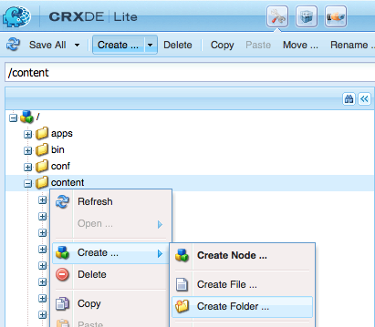

# Afbeeldingen van handtekeningen van agent beheren{#manage-agent-signature-images}

## Overzicht {#overview}

In het Beheer van de Correspondentie, kunt u een beeld gebruiken om agentenhandtekening in brieven terug te geven. Nadat u opstelling het beeld van de agentenhandtekening, terwijl het creëren van een brief, kunt u het beeld van de agentenhandtekening in de brief als handtekening van de afzenderagent teruggeven.

De agentSignatureImage DDE is een berekende DDE die het de handtekeningbeeld van de agent vertegenwoordigt. De uitdrukking voor dit gegevens verwerkte DDE gebruikt een nieuwe douanefunctie die door de bouwsteen van de Manager van de Uitdrukking wordt blootgesteld. Deze douanefunctie neemt agentID en agentFolder als inputparameters en haalt de beeldinhoud die op deze parameters wordt gebaseerd. Het SystemContext systeemgegevenswoordenboek geeft brieven in het Beheer van de Correspondentie toegang tot informatie in de huidige systeemcontext. De systeemcontext omvat informatie over de momenteel het programma geopende gebruiker en actieve configuratieparameters.

U kunt afbeeldingen toevoegen in de hoofdmap van de hoofdmap. In [ Eigenschappen van de Configuratie van het Beheer van de Correspondentie ](/help/forms/using/cm-configuration-properties.md), gebruikend het bezit van de Wortel van de Gebruiker van cm kunt u de omslag veranderen van waar het beeld van de agentenhandtekening wordt opgepikt.

De waarde van agentFolder DDE wordt genomen van de configuratieparameter CMUserRoot voor de de configuratieeigenschappen van het Beheer van de Correspondentie. Deze configuratieparameter wijst standaard naar de map/content/cmUserRoot in de CRX-opslagplaats. U kunt de waarde van de configuratie CMUserRoot in de Eigenschappen van de Configuratie veranderen.
U kunt ook de aangepaste standaardfunctie negeren om uw eigen logica te definiëren voor het ophalen van de afbeelding van de gebruikershandtekening.

## Handtekeningafbeelding voor agent toevoegen {#adding-agent-signature-image}

1. Zorg ervoor dat de afbeelding met de handtekening van de agent dezelfde naam heeft als de AEM-gebruikersnaam van de gebruiker. (Extensie is niet nodig voor de bestandsnaam van de afbeelding.)
1. Maak in CRX een map met de naam `cmUserRoot` in de inhoudsmap.

   1. Ga naar `https://'[server]:[port]'/crx/de` . Meld u indien nodig aan als beheerder.

   1. Klik met de rechtermuisknop op de **inhoud** omslag en selecteer **creeer** > **creeer Omslag**.

      

   1. Voer in het dialoogvenster Map maken de naam van de map in als `cmUserRoot` . Klik **sparen allen**.

      >[!NOTE]
      >
      >cmUserRoot is de standaardlocatie waar AEM zoekt naar de afbeelding van de agentenhandtekening. U kunt, echter, het veranderen door het bezit van de Wortel van de Gebruiker van cm in de [ de configuratieeigenschappen van het Beheer van de Correspondentie ](/help/forms/using/cm-configuration-properties.md) uit te geven.

1. In de Ontdekkingsreiziger van de Inhoud, navigeer aan de omslag cmUserRoot en voeg het beeld van de agentenhandtekening in het toe.

   1. Ga naar `https://'[server]:[port]'/crx/explorer/index.jsp` . Meld u indien nodig aan als beheerder.
   1. Klik **Ontdekkingsreiziger van de Inhoud**. De Inhoudsverkenner wordt in een nieuw venster geopend.
   1. Navigeer in Content Explorer naar de map cmUserRoot en selecteer deze. Klik met de rechtermuisknop op de **omslag 0} cmUserRoot en selecteer** Nieuwe Knoop **.**

      

      Maak de volgende ingangen in de rij voor nieuwe knoop en klik dan het groene vinkje.

      **Naam:** JohnDoe (of de naam van uw dossier van de agentenhandtekening)

      **Type:** niet:dossier

      Onder de map `cmUserRoot` wordt een nieuwe map gemaakt met de naam `JohnDoe` (of de naam die u in de vorige stap hebt opgegeven).

   1. Klik op de nieuwe map die u hebt gemaakt (hier `JohnDoe` ). In de Inhoudsverkenner wordt de inhoud van de map grijs weergegeven.

   1. Dubbelklik **jcr:content** bezit, plaats zijn type als **niet:middel**, en klik dan het groene vinkje om de ingang te bewaren.

      Als de eigenschap niet aanwezig is, maakt u eerst een eigenschap met de naam jcr:content.

      

      Een van de subeigenschappen van jcr:content is jcr:data, die grijs wordt weergegeven. Dubbelklik op jcr:data. De eigenschap wordt bewerkbaar en de knop Bestand kiezen wordt weergegeven in de vermelding. Klik **kiezen Dossier** en selecteer het beelddossier u als embleem wilt gebruiken. Het afbeeldingsbestand hoeft geen extensie te hebben.

      

   Klik **sparen allen**.

1. Zorg ervoor dat de XDP\layout die u in de letter gebruikt, een afbeeldingsveld linksonder heeft (of een andere geschikte plaats in de layout waar u de handtekening wilt weergeven) om de afbeelding van de handtekening te renderen.
1. Selecteer tijdens het maken van de correspondentie op het tabblad Gegevens een afbeeldingsveld voor de handtekeningafbeelding met de volgende stappen:

   1. Selecteer Systeem in het pop-upmenu Koppelingstype in het rechterdeelvenster.

   1. Selecteer agentSignatureImage DDE van de lijst in het paneel van het Element van Gegevens voor SystemContext DD.

   1. Sla de brief op.

1. Wanneer de letter wordt gerenderd, ziet u uw handtekening in de lettervoorvertoning in het afbeeldingsveld, afhankelijk van de layout.

   
