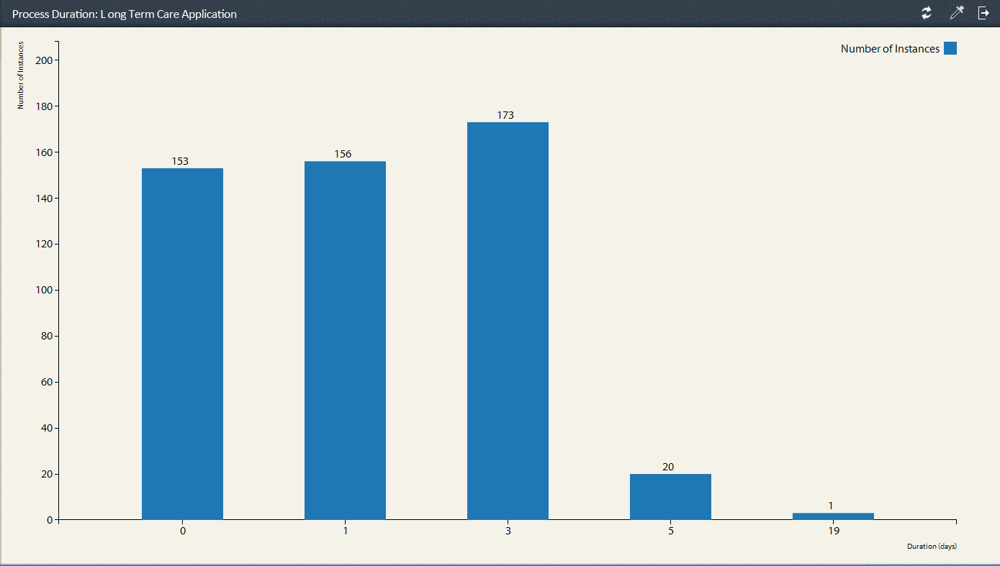

# Vooraf gedefinieerde rapporten in procesrapportage {#pre-defined-reports-in-process-reporting}

## Vooraf gedefinieerde rapporten in procesrapportage {#pre-defined-reports-in-process-reporting-1}

Het Proces van AEM Forms meldend schepen met de volgende *uit-van-de-doos* rapporten:

* **[Lange Lange Lopende Processen](#long-running-processes)**: Een rapport van alle processen van AEM Forms die meer dan een gespecificeerde tijd namen om te voltooien
* **[Grafiek van de Duur van het Proces](#process-duration-report)**: Een rapport van een gespecificeerd proces van AEM Forms door duur
* **[Volume van het Werkschema](#workflow-volume-report)**: Een rapport van de lopende en voltooide instanties van gespecificeerd proces door datum

## Lange processen {#long-running-processes}

Het rapport Lange actieve processen geeft de AEM Forms-processen weer die meer dan een opgegeven tijd in beslag hebben genomen.

### Een lang lopend procesrapport uitvoeren {#to-execute-a-long-running-process-report}

1. Om de lijst van vooraf bepaalde rapporten in Proces Meldend te bekijken, op het **Proces Meldend** boommening, klik de **3} knoop van Rapporten {.**
1. Klik de **Lange Lange Lange Lopende knoop van Processen** rapport.

   

   Wanneer u een rapport selecteert, wordt het **paneel van de Parameters van het Rapport** getoond rechts van de boommening.

   

   Parameters:

   * **Duur** (*verplicht*): Specificeer een duur en een eenheid van tijd. Alle AEM Forms-processen weergeven die langer dan de opgegeven duur zijn uitgevoerd.
   * **begonnen na** (*facultatief*): Selecteer een datum. Filter het rapport om procesinstanties weer te geven die na de opgegeven datum zijn gestart.
   * **begonnen vóór** (*facultatief*): Selecteer een datum. Filter het rapport om procesinstanties weer te geven die vóór de opgegeven datum zijn gestart.

1. Klik **gaan** om het rapport uit te voeren.

   Het rapport toont in het **paneel van het Rapport** op het recht van het **Proces Meldend** venster.

   

   Gebruik de opties in de hogere juiste hoek van het **paneel van het Rapport** om de volgende verrichtingen op het rapport uit te voeren.

   * **verfrist zich**: Verfrist het rapport met recentste gegevens die in de opslag liggen
   * **legendekleur van de Verandering**: Selecteer en verander de kleur van de rapportlegenda
   * **Uitvoer aan CSV**: De uitvoer en downloadt de gegevens van het rapport aan een komma-gescheiden dossier

## Rapport Procesduur  {#process-duration-report}

In het rapport Procesduur wordt het aantal instanties van een Forms-proces weergegeven op basis van het aantal dagen dat elke instantie is uitgevoerd.

### Een rapport over de procesduur uitvoeren {#to-execute-a-process-duration-report}

1. Om de vooraf bepaalde rapporten in Proces Meldend te bekijken, over het **Proces Meldend** boommening, klik de **3} knoop van Rapporten {.**
1. Klik de **rapportknoop van de Duur van 0} Processen {.**

   

   Wanneer u een rapport selecteert, wordt het **paneel van de Parameters van het Rapport** getoond rechts van de boommening.

   

   Parameters:

   * **Uitgezochte Proces** (*verplicht*): Selecteer een proces van AEM Forms.

1. Klik **gaan** om het rapport uit te voeren.

   Het rapportvertoningen in het **paneel van het Rapport** op het recht van het Proces Meldend venster.

   

   Gebruik de opties in de hogere juiste hoek van het **paneel van het Rapport** om de volgende verrichtingen op het rapport uit te voeren.

   * **verfrist zich**: Verfrist het rapport met recentste gegevens die in de opslag liggen
   * **legendekleur van de Verandering**: Selecteer en verander de kleur van de rapportlegenda
   * **Uitvoer aan CSV**: De uitvoer en downloadt de gegevens van het rapport aan een komma-gescheiden dossier

## Workflow Volume-rapport {#workflow-volume-report}

Het workflowvolutrapport geeft het aantal exemplaren van een AEM Forms-proces dat momenteel wordt uitgevoerd en voltooid, per kalenderdag weer.

### Een workflowvolutrapport uitvoeren {#to-execute-a-workflow-volume-report}

1. Om de vooraf bepaalde rapporten in Proces Meldend te bekijken, over het **Proces Meldend** boommening, klik de **3} knoop van Rapporten {.**
1. Klik de **rapportknoop van het Volume van het 0} Werkschema {.**

   

   Wanneer u een rapport selecteert, wordt het **paneel van de Parameters van het Rapport** getoond rechts van de boommening.

   

   Parameters:

   * **Uitgezochte Proces** (*verplicht*): Selecteer een proces van AEM Forms.

   * **begonnen na** (*facultatief*): Selecteer een datum. Filtert het rapport om procesinstanties te tonen die na de gespecificeerde datum begonnen zijn.

   * **begonnen vóór** (*facultatief*): Selecteer een datum. Filtert het rapport om procesinstanties te tonen die vóór de gespecificeerde datum begonnen.

1. Klik **gaan** om het rapport uit te voeren.

   Het rapport toont in het **paneel van het Rapport** op het recht van het **Proces Meldend** venster.

   

   Gebruik de opties in de hogere juiste hoek van het **paneel van het Rapport** om de volgende verrichtingen op het rapport uit te voeren.

   * **verfrist zich**: Verfrist het rapport met recentste gegevens die in de opslag liggen
   * **legendekleur van de Verandering**: Selecteer en verander de kleur van de rapportlegenda
   * **Uitvoer aan CSV**: De uitvoer en downloadt de gegevens van het rapport aan een komma-gescheiden dossier
