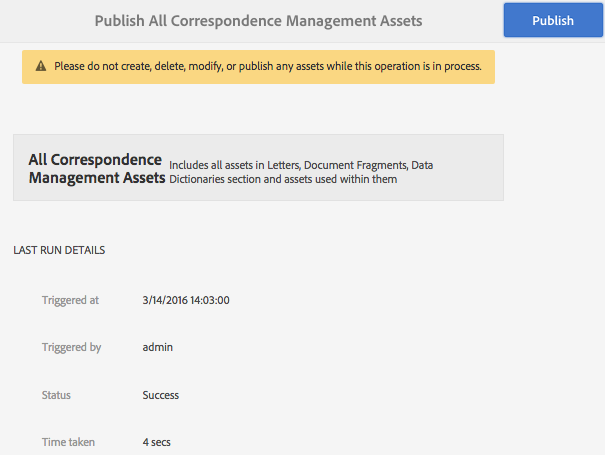

# Formulieren en documenten publiceren en de publicatie ervan opheffen{#publishing-and-unpublishing-forms-and-documents}

Met AEM Forms kunt u gemakkelijk formulieren maken, publiceren en verwijderen. Voor meer informatie over AEM Forms, zie [ Inleiding aan het beheren van vormen ](../../forms/using/introduction-managing-forms.md).

De AEM Forms-server biedt twee instanties: Auteur en Publiceren. De instantie Auteur is bedoeld voor het maken en beheren van formulierelementen en -bronnen. Publicatie-instantie is bedoeld om elementen en gerelateerde bronnen die beschikbaar zijn voor eindgebruikers, te behouden. U kunt XDP en PDF forms importeren in de modus Auteur. Voor meer informatie, zie [ Krijgend documenten XDP en PDF in AEM Forms ](../../forms/using/get-xdp-pdf-documents-aem.md).

## Ondersteunde elementen   {#supported-assets-nbsp}

AEM Forms ondersteunt de volgende typen elementen:

* Aangepaste formulieren
* Aangepaste documenten
* Adaptieve formulierfragmenten
* Thema&#39;s
* Formuliersjablonen (XFA-formulieren)
* PDF forms
* Document (vlakke PDF-documenten)
* Formuliersets
* Bron (Afbeeldingen, Schema&#39;s, en Stylesheets)

In eerste instantie zijn alle elementen alleen beschikbaar in de instantie Auteur. Een beheerder of auteur van een formulier kan alle elementen publiceren, behalve bronnen.

Wanneer u een formulier selecteert en publiceert, worden de gerelateerde elementen en bronnen ook gepubliceerd. Afhankelijke activa worden echter niet gepubliceerd. In dit verband zijn gerelateerde activa en middelen activa die een gepubliceerd actief gebruikt of waarnaar wordt verwezen. Afhankelijke elementen zijn elementen die verwijzen naar een gepubliceerd element.

Het is mogelijk dat uw Adaptieve Forms gebruik maakt van bepaalde configuraties, instellingen en aanpassingen die niet automatisch worden gepubliceerd. U wordt aangeraden deze bronnen te publiceren of te activeren voordat u een adaptief formulier publiceert.

* Bewerkbare adaptieve formuliersjablonen
* Cloud Service-configuraties voor Adobe-modellen voor ondertekenen, Typekit, reCAPTCHA en formuliergegevens
* Configuraties met andere cloudservices worden alleen geactiveerd als de gebruiker beheerdersmachtigingen heeft.
* Aanpassingen Het gaat hierbij onder meer om:

   * Aangepaste indelingen
   * Aangepaste weergaven
   * CSS-bestand - wordt gebruikt als invoer in dialoogvenster Eigenschappen van container van adaptieve formulieren
   * Clientbibliotheekcategorie - Wordt gebruikt als invoer in het dialoogvenster Eigenschappen van container van adaptieve formulieren
   * Een andere clientbibliotheek die mogelijk is opgenomen als onderdeel van de sjabloon Adaptief formulier.
   * Ontwerppaden

## Elementstatussen {#asset-states}

Middelen kunnen de volgende statussen hebben:

* **Niet gepubliceerd:** een activa die nooit is gepubliceerd (de niet gepubliceerde staat is slechts op de activa van Forms van toepassing. De activa van het Beheer van de correspondentie hebben geen Unpublished staat.)
* **Gepubliceerd**: Een middel dat is gepubliceerd en op de Publish instantie beschikbaar is
* **Gewijzigd**: An activa die na wordt gepubliceerd worden gewijzigd

## Middelen publiceren {#publish-an-asset}

1. Log in bij de AEM Forms-server.
1. Gebruik een van de volgende opties om een element te selecteren en te publiceren.

   1. Beweeg de wijzer over een activa en selecteer **[!UICONTROL Publish]** .
   1. Voer een van de volgende handelingen uit en selecteer vervolgens Publiceren:

      * Als u in de kaartmening bent, selecteer **[!UICONTROL Enter Selection]** , en selecteer de activa. Het element is geselecteerd.
      * Als u zich in de lijstweergave bevindt, schakelt u het selectievakje van een element in. Het element is geselecteerd.
      * Selecteer een element om de details ervan weer te geven.
      * De eigenschappen van de vertoning van activa door de Eigenschappen van de Mening  te tikken.

      >[!NOTE]
      >
      >Selecteer geen meerdere elementen. Het tegelijkertijd publiceren van meerdere elementen wordt niet ondersteund.

1. Wanneer het publicatieproces wordt gestart, wordt een bevestigingsvenster weergegeven met alle gerelateerde elementen en bronnen. Selecteer **[!UICONTROL Publish]** in het dialoogvenster dat gerelateerde elementen bevat. Het element wordt gepubliceerd en het dialoogvenster Assets publiceren wordt weergegeven.

   >[!NOTE]
   >
   >Voor de adaptieve formulieren wordt naast de gerelateerde elementen ook de paginanaam Adaptief formulier weergegeven.

   

   Een bevestigingsdialoogvenster met alle gerelateerde middelen en middelen.

   >[!NOTE]
   >
   >Als Forms Manager de gebruiker geen toestemming geeft om de vermelde elementen te publiceren, is de handeling Publiceren uitgeschakeld. Middelen waarvoor extra machtigingen vereist zijn, worden rood weergegeven.

   Nadat een element is gepubliceerd, worden de metagegevenseigenschappen van het element gekopieerd naar de instantie Publiceren en wordt de status van het element gewijzigd in Gepubliceerd. De status van de afhankelijke elementen die worden gepubliceerd, wordt ook gewijzigd in Gepubliceerd.

   Nadat u middelen hebt gepubliceerd, kunt u de Forms Portal gebruiken om alle elementen op een webpagina weer te geven. Voor meer informatie, zie [ Inleiding aan het publiceren van vormen op een portaal ](../../forms/using/introduction-publishing-forms.md).

## Alle Correspondence Management Assets publiceren {#publish-all-the-correspondence-management-assets}

Met AEM Forms kunt u alle Correspondence Management-elementen op een server in één keer publiceren. De gepubliceerde activa omvatten alle activa van het Beheer van de Correspondentie en verwante gebiedsdelen.

Voer de volgende stappen uit om alle Correspondence Management-elementen op een server te publiceren:

1. Log in bij de AEM Forms-server.
1. Selecteer **Adobe Experience Manager** in de globale navigatiebar.
1. Selecteer , en selecteer dan **Forms**.
1. Selecteer **publiceren Correspondence Management Assets**.

   

   De pagina Publish All Correspondence Management Assets wordt weergegeven en geeft de informatie weer over de laatste keer dat het Assets-proces Publish Correspondence Management werd geprobeerd.

   

1. Selecteer **publiceren** en, in het bevestig bericht, uitgezocht **O.K.**.

   Nadat een batchproces is voltooid, kunt u de details van de laatste uitvoering weergeven. Dit omvat informatie zoals de login van de Beheerder en als de partij met succes of ontbrak.

   >[!NOTE]
   >
   >Het publicatieproces kan niet worden geannuleerd nadat het is gestart. Zorg er tijdens het proces Publiceren bovendien voor dat u geen elementen maakt, verwijdert, wijzigt of publiceert, en dat u de bewerking Assets van het beheer van alle correspondentie exporteren niet start.

## Publiceren en verwijderen voor Forms en documenten automatiseren {#automate-publishing-and-unpublishing-for-forms-amp-documents}

Met AEM Forms kunt u de publicatie van middelen en het ongedaan maken van publicaties voor Forms en Documenten plannen. U kunt het schema opgeven in de Metagegevenseditor. Voor meer informatie over het beheren van vormmeta-gegevens, zie [ het Leiden vormmeta-gegevens.](../../forms/using/manage-form-metadata.md)

Voer de volgende stappen uit om de datum en het tijdstip van publicatie en het verwijderen van de publicatie van Forms &amp; Documents-elementen te plannen:

1. Selecteer een element en selecteer **[!UICONTROL View Properties]** . De pagina Eigenschappen van metagegevens wordt geopend.
1. In de pagina van de Eigenschappen van Meta-gegevens, selecteer **[!UICONTROL Advanced]**, en selecteer dan **[!UICONTROL Edit]** .
1. Selecteer in de velden **[!UICONTROL Publish On Time]** en **[!UICONTROL Publish Off Time]** de datum en tijd.\
   Selecteer **[!UICONTROL Done]** .

## Een element verwijderen {#unpublish-an-asset}

1. Selecteer een activa die wordt gepubliceerd en **[!UICONTROL Unpublish]** .
1. Gebruik een van de volgende opties om elementen te selecteren en de publicatie ervan ongedaan te maken.

   1. Verplaats de wijzer over een activa en selecteer **[!UICONTROL Unpublish]** .
   1. Voer een van de volgende handelingen uit en selecteer vervolgens Publiceren ongedaan maken:

      * Als u in de kaartmening bent, selecteer **[!UICONTROL Enter Selection]** , en selecteer de activa. Het element is geselecteerd.

      * Als u in de lijstmening bent, houd over een activa en selecteer . Het element is geselecteerd.

      * Selecteer een element om de details ervan weer te geven.
      * De eigenschappen van de vertoning van activa door de Eigenschappen van de Mening  te tikken.

1. Wanneer het Unpublish-proces wordt gestart, wordt een bevestigingsvenster weergegeven. Selecteer **[!UICONTROL Unpublish]** .

   >[!NOTE]
   >
   >Alleen het geselecteerde element is ongepubliceerd en de onderliggende elementen en de bijbehorende elementen waarnaar wordt verwezen, zijn niet gepubliceerd.

## Een element of letter terugzetten naar de vorige gepubliceerde versie {#revert-an-asset-or-letter-to-the-previously-published-version}

Elke keer dat u een element of brief publiceert nadat u deze hebt bewerkt, wordt een versie van het element of de letter gemaakt. U kunt een element of een letter terugzetten naar een eerder gepubliceerde versie. Dit kan nodig zijn als er iets mis gaat met de huidige versie van het element of document.

>[!NOTE]
>
>Keer geen brief aan een laatst gepubliceerde staat terug als om het even welk afhankelijk element dat in die gepubliceerde brief wordt gebruikt van het systeem wordt geschrapt.

1. Selecteer een activa en selecteer **[!UICONTROL Revert to Previously Published Version]** .
1. Voordat het element wordt teruggedraaid, verschijnt er een bevestigingsvenster. Selecteer **[!UICONTROL Revert]** .

   Het element of de letter wordt teruggedraaid naar de eerder gepubliceerde versie.

## Een element verwijderen {#delete-an-asset}

>[!NOTE]
>
>Als u een element verwijdert, wordt dit verwijderd uit de publicatie-instantie. Wanneer u elementen verwijdert, verwijdert u ook de versiehistorie, met uitzondering van de basisversie.

1. Selecteer een activa en selecteer **[!UICONTROL Delete]** .

   >[!NOTE]
   >
   >De optie van de Schrapping is ook beschikbaar wanneer u activa details door activa te tikken of u toont de eigenschappen van een activa door de viewproperties van de Mening .

1. Voordat het element wordt verwijderd, verschijnt er een bevestigingsvenster. Selecteer **[!UICONTROL Delete]** .

   >[!NOTE]
   >
   >Alleen het geselecteerde element wordt verwijderd en de afhankelijke elementen worden niet verwijderd. Om verwijzingen van een activa te controleren, selecteer  en selecteer dan een activa.
   >
   >
   >Als het element dat u wilt verwijderen, een onderliggend element van een ander element is, wordt het niet verwijderd. Als u een dergelijk element wilt verwijderen, verwijdert u verwijzingen van dit element uit andere elementen en probeert u het vervolgens opnieuw.

## Beschermde adaptieve formulieren {#protected-adaptive-forms}

U kunt verificatie inschakelen voor formulieren waartoe geselecteerde gebruikers toegang moeten hebben. Wanneer u verificatie voor uw formulieren inschakelt, zien gebruikers een aanmeldingsscherm voordat ze deze openen. Alleen gebruikers met referenties die zijn geautoriseerd, hebben toegang tot de formulieren.

Om verificatie voor uw formulieren in te schakelen:

1. Open configMgr in de publicatieinstantie in uw browser.\
   URL: `https://<hostname>:<PublishPort>/system/console/configMgr`

1. In de Configuratie van de Console van Adobe Experience Manager, klik **Apache die de Dienst van de Authentificatie van de Verkoop** om het te vormen.
1. In het dialoogvenster Apache Sling Authentication Service dat wordt weergegeven, gebruikt u de knop **+** om paden toe te voegen.\
   Wanneer u een pad toevoegt, wordt de verificatieservice ingeschakeld voor formulieren in dat pad.
