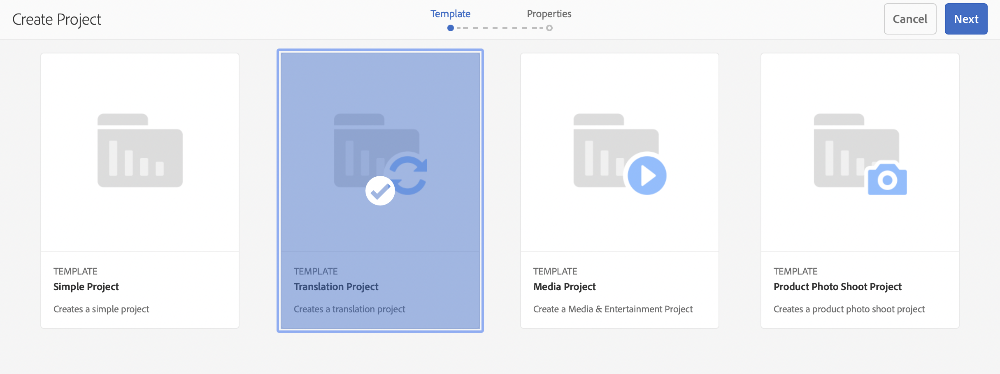
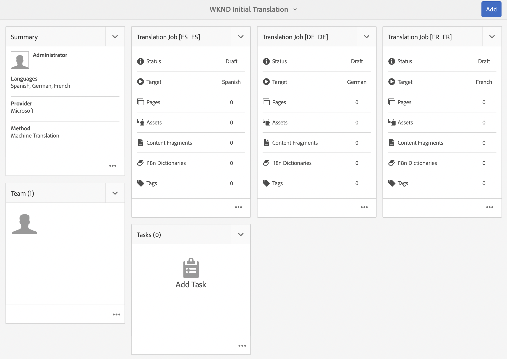
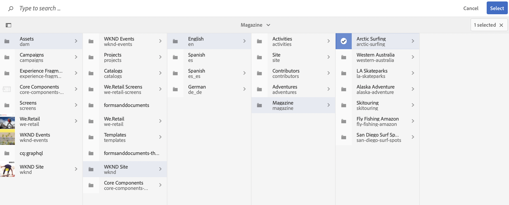
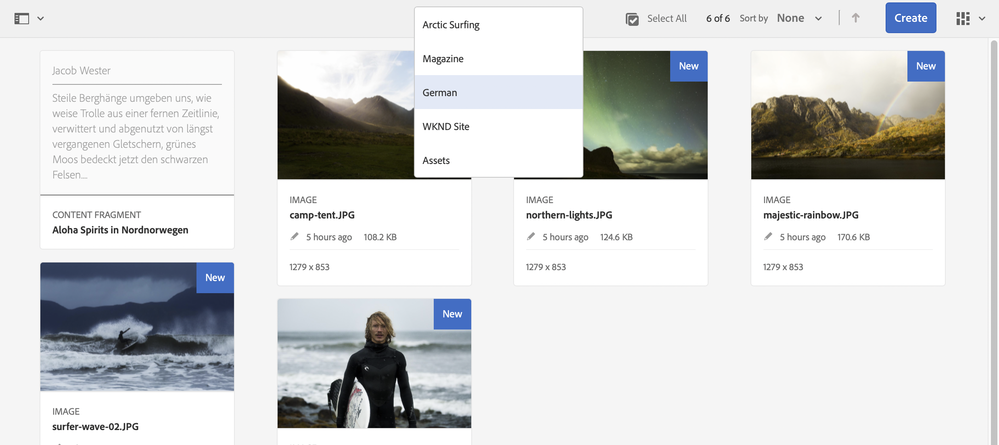

# Inhoud vertalen {#translate-content}

Gebruik de vertaalintegratie en de regels om uw inhoud zonder kop te vertalen.

## Het verhaal tot nu toe {#story-so-far}

In het vorige document van de hoofdloze vertaalreis van AEM, [ vorm Vertaal Regels ](translation-rules.md) u leerde hoe te om de vertaalregels van AEM te gebruiken om uw vertaalinhoud te identificeren. Nu moet u:

* Begrijp wat de vertaalregels doen.
* U kunt uw eigen vertaalregels definiëren.

Nu uw schakelaar en vertaalregels opstelling zijn, neemt dit artikel u door de volgende stap van het vertalen van uw inhoud zonder kop.

## Doelstelling {#objective}

Dit document helpt u begrijpen hoe u AEM-vertaalprojecten samen met de aansluiting en uw vertaalregels kunt gebruiken om inhoud te vertalen. Nadat u dit document hebt gelezen, moet u het volgende doen:

* Begrijp wat een vertaalproject is.
* Vertaalprojecten maken.
* Gebruik vertaalprojecten om uw inhoud zonder kop te vertalen.

## Een vertaalproject maken {#creating-translation-project}

Met vertaalprojecten kunt u de vertaling van AEM-inhoud zonder kop beheren. In een vertaalproject wordt de inhoud verzameld die op één locatie in andere talen moet worden vertaald voor een centrale weergave van de vertaalwerkzaamheden.

Wanneer inhoud aan een vertaalproject wordt toegevoegd, wordt een vertaalbaan gecreeerd voor het. Taken bieden opdrachten en statusinformatie die u gebruikt om de workflows voor het vertalen van mensen en computers die op de bronnen worden uitgevoerd, te beheren.

Vertaalprojecten kunnen op twee manieren worden gemaakt:

1. Selecteer de taalbasis van de inhoud en zorg dat AEM automatisch het vertaalproject maakt op basis van het inhoudspad.
1. Maak een leeg project en selecteer handmatig de inhoud die u aan het vertaalproject wilt toevoegen

Beide zijn geldige benaderingen die alleen verschillen op basis van de persoon die de vertaling uitvoert:

* De TPM (vertaalprojectmanager) heeft vaak de flexibiliteit nodig om de inhoud handmatig te selecteren voor het vertaalproject.
* Als de eigenaar van de inhoud ook verantwoordelijk is voor vertaling, is het vaak gemakkelijker om AEM het project automatisch te laten maken op basis van het geselecteerde inhoudspad.

Beide benaderingen worden in de volgende secties verkend.

### Automatisch een vertaalproject maken op basis van het inhoudspad {#automatically-creating}

Voor eigenaars van inhoud die ook verantwoordelijk zijn voor vertaling, is het vaak gemakkelijker om het vertaalproject automatisch door AEM te laten maken. Als u wilt dat AEM automatisch een vertaalproject maakt op basis van het inhoudspad:

1. Navigeer aan **Navigatie** > **Assets** > **Dossiers**. Houd er rekening mee dat inhoud zonder kop in AEM wordt opgeslagen als elementen die Content Fragments worden genoemd.
1. Selecteer de taalwortel van uw project. In dit geval is `/content/dam/wknd/en` geselecteerd.
1. Klik de spoorselecteur en toon het **paneel van Verwijzingen**.
1. Klik **Exemplaren van de Taal**.
1. Controleer het **checkbox van de Kopieën van de Taal 0}.**
1. Breid de sectie **Exemplaren van de Taal van de Update** bij de bodem van het verwijzingenpaneel uit.
1. In het **drop-down van het Project**, uitgezochte **creeer Omzettingsproject(en)**.
1. Geef een geschikte titel op voor uw vertaalproject.
1. Klik **Begin**.


U ontvangt een bericht dat het project werd gecreeerd.

>[!NOTE]
>
>Men veronderstelt dat de noodzakelijke taalstructuur voor de vertalingstalen reeds als deel van de [ definitie van uw inhoudsstructuur is gecreeerd.](getting-started.md#content-structure) Dit moet gebeuren in samenwerking met de inhoudarchitect.
>
>Als de taalmappen niet van tevoren worden gemaakt, kunt u geen taalkopieën maken zoals beschreven in de vorige stappen.

### Handmatig een vertaalproject maken door uw inhoud te selecteren {#manually-creating}

Voor managers van vertaalprojecten, is het vaak noodzakelijk om specifieke inhoud manueel te selecteren om in een vertaalproject te omvatten. Als u een dergelijk handmatig vertaalproject wilt maken, moet u eerst een leeg project maken en vervolgens de inhoud selecteren die u aan het project wilt toevoegen.

1. Navigeer aan **Navigatie** > **Projecten**.
1. Klik **creëren** > **Omslag** om een omslag voor uw projecten tot stand te brengen.
   * Dit is optioneel, maar handig om uw vertaalwerkzaamheden te organiseren.
1. In **creeer het venster van de Omslag**, voeg a **Titel** voor de omslag toe, en klik dan **creeer**.

   

1. Klik op de map om de map te openen.
1. In uw nieuwe projectomslag, creeer **** > **Project**.
1. Projecten zijn gebaseerd op sjablonen. Klik het **malplaatje van het Project van de Vertaling** om het te selecteren en dan **daarna** te klikken.

   

1. Op het **Basis** lusje, ga een naam voor uw nieuw project in.

   

1. Op het **Geavanceerde** lusje, gebruik **drop-down Taal van het Doel** om de talen te selecteren waarin uw inhoud zou moeten worden vertaald. Klik **creëren**.

   

1. Klik **Open** in de bevestigingsdialoog.

   

Het project is gemaakt, maar bevat geen inhoud om te vertalen. In de volgende sectie wordt beschreven hoe het project is gestructureerd en hoe u inhoud kunt toevoegen.

## Een vertaalproject gebruiken {#using-translation-project}

Vertaalprojecten zijn ontworpen om alle inhoud en taken in verband met een vertaalinspanning op één plaats te verzamelen, zodat uw vertaling eenvoudig en eenvoudig te beheren is.

Het vertaalproject weergeven:

1. Navigeer aan **Navigatie** > **Projecten**.
1. Klik op het project dat in de vorige sectie is gemaakt.



Het project is verdeeld in meerdere kaarten.

* **Samenvatting** - Deze kaart toont de basiskopbalinformatie van het project met inbegrip van de eigenaar, de taal, en de vertaalleverancier.
* **VertaalBaan** - Deze kaart of deze kaarten tonen een overzicht van de daadwerkelijke vertaalbaan met inbegrip van de status, het aantal activa, etc. Over het algemeen is er één taak per taal, waarbij de ISO-2-taalcode aan de taaknaam wordt toegevoegd.
* **Team** - Deze kaart toont de gebruikers die aan dit vertaalproject samenwerken. Deze reis gaat niet over dit onderwerp.
* **Taken** - de Extra taken verbonden aan het vertalen van de inhoud zoals om punten of werkschemapunten te doen. Deze reis gaat niet over dit onderwerp.

Hoe u een vertaalproject gebruikt, hangt af van de manier waarop het is gemaakt: automatisch door AEM of handmatig.

### Een automatisch gemaakt vertaalproject gebruiken {#using-automatic-project}

Wanneer AEM automatisch het vertaalproject maakt, wordt de inhoud zonder kop onder het pad dat u hebt geselecteerd geëvalueerd op basis van de eerder gedefinieerde vertaalregels. Op basis van die evaluatie extraheert het de inhoud die vertaald moet worden naar een nieuw vertaalproject.

U kunt als volgt de details van de inhoud zonder kop in dit project bekijken:

1. Klik de ellipsis knoop bij de bodem van de **kaart van de Taak van de Vertaling**.
1. Het **venster van de Baan van de Vertaling** maakt een lijst van alle punten in de baan.
   
1. Klik op een regel om de details van die regel weer te geven. Houd er rekening mee dat één regel meerdere inhoudsitems kan vertegenwoordigen om te vertalen.
1. Klik op het selectievak voor een regelitem om andere opties weer te geven, zoals de optie om het item uit de taak te verwijderen of in de consoles van Inhoud of Assets weer te geven.
   

Typisch begint de inhoud voor de vertaalbaan in de **staat van het Ontwerp** zoals die door de **wordt vermeld 3} kolom van de Staat {in het** venster van de Baan van de Vertaling **.**

Om de vertaalbaan te beginnen, terugkeer aan het overzicht van het vertaalproject en klik de knoop van de chevron bij de bovenkant van de **kaart van de Baan van de Vertaling {en selecteer** Begin **.**


AEM communiceert nu met uw vertaalconfiguratie en -aansluiting om de inhoud naar de vertaalservice te verzenden. U kunt de vooruitgang van de vertaling bekijken door aan het **venster van de VertaalBaan** terug te keren en de **3} kolom van de Staat {van de ingangen te bekijken.**


De vertalingen van de machine keren automatisch met een staat van **Goedgekeurd** terug. Menselijke vertaling maakt meer interactie mogelijk, maar valt buiten het bereik van deze reis.

### Een handmatig gemaakt vertaalproject gebruiken {#using-manual-project}

Bij het handmatig maken van een vertaalproject maakt AEM de benodigde taken, maar wordt niet automatisch alle inhoud geselecteerd die u wilt opnemen. Hierdoor kan de projectbeheerder van de vertaling de flexibiliteit kiezen om te kiezen welke inhoud moet worden vertaald.

Inhoud toevoegen aan een vertaaltaak:

1. Klik de ellipsis knoop bij de bodem van één van de **kaarten van de Taak van de Vertaling**.
1. Controleer of de taak geen inhoud bevat. Klik **toevoegen** knoop bij bovenkant van het venster en dan **Assets/Pagina&#39;s** van drop-down.

   

1. Er wordt een padbrowser geopend waarin u specifiek kunt selecteren welke inhoud u wilt toevoegen. Zoek de inhoud en klik om deze te selecteren.

   

1. Klik **Uitgezocht** om de geselecteerde inhoud aan de baan toe te voegen.
1. In de **Vertaal** dialoog, specificeer dat u wenst om **het Exemplaar van de Taal** tot stand te brengen.

   

1. De inhoud wordt nu opgenomen in de taak.

    wordt toegevoegd

1. Klik op het selectievak voor een regelitem om andere opties weer te geven, zoals de optie om het item uit de taak te verwijderen of in de consoles van Inhoud of Assets weer te geven.
   

1. Herhaal deze stappen om alle vereiste inhoud in de taak op te nemen.

>[!TIP]
>
>De padbrowser is een krachtig hulpmiddel waarmee u uw inhoud kunt zoeken, filteren en doorbladeren. Klik de **Inhoud slechts/Filters** knoop om het zijpaneel van een knevel te voorzien en geavanceerde filters zoals **Gewijzigde Datum** of **Vertaalstatus** te openbaren.
>
>U kunt meer over wegbrowser in de [ extra middelensectie leren.](#additional-resources)

U kunt de voorafgaande stappen gebruiken om de noodzakelijke inhoud aan alle talen (banen) voor het project toe te voegen. Nadat u alle inhoud hebt geselecteerd, kunt u de vertaling starten.

Typisch begint de inhoud voor de vertaalbaan in de **staat van het Ontwerp** zoals die door de **wordt vermeld 3} kolom van de Staat {in het** venster van de Baan van de Vertaling **.**

Om de vertaalbaan te beginnen, terugkeer aan het overzicht van het vertaalproject en klik de knoop van de chevron bij de bovenkant van de **kaart van de Baan van de Vertaling {en selecteer** Begin **.**


AEM communiceert nu met uw vertaalconfiguratie en -aansluiting om de inhoud naar de vertaalservice te verzenden. U kunt de vooruitgang van de vertaling bekijken door aan het **venster van de VertaalBaan** terug te keren en de **3} kolom van de Staat {van de ingangen te bekijken.**


De vertalingen van de machine keren automatisch met een staat van **Goedgekeurd** terug. Menselijke vertaling maakt meer interactie mogelijk, maar valt buiten het bereik van deze reis.

## Vertaalde inhoud controleren {#reviewing}

[ zoals eerder gezien, ](#using-translation-project) machine-vertaalde inhoud stroomt terug in AEM met het statuut van **Goedgekeurd** aangezien de veronderstelling is dat omdat de machinevertaling wordt gebruikt, geen menselijke interventie wordt vereist. Het is echter nog steeds mogelijk om de vertaalde inhoud te beoordelen.

Ga eenvoudig naar de voltooide vertaalbaan en selecteer een lijnpunt door te tikken of checkbox te klikken. Het pictogram **openbaart in het Fragment van de Inhoud** wordt getoond in de hulpmiddelbar.


Klik op dat pictogram om het vertaalde inhoudsfragment te openen in de editorconsole om de details van de vertaalde inhoud weer te geven.


U kunt het inhoudsfragment desgewenst verder wijzigen, op voorwaarde dat u de juiste machtigingen hebt, maar dat het bewerken van inhoudsfragmenten buiten het bereik van deze rit valt. Zie de [ Extra sectie van Middelen ](#additional-resources) aan het eind van dit document voor meer informatie over dit onderwerp.

Het doel van het project is om alle middelen in verband met een vertaling op één plaats te verzamelen, zodat u gemakkelijk toegang hebt en een duidelijk overzicht krijgt. Zoals u echter kunt zien door de details van een vertaald item weer te geven, vloeien de vertalingen zelf terug naar de map met middelen van de vertaaltaal. In dit voorbeeld is de map:

```text
/content/dam/wknd/es
```

Als u aan deze omslag via **Navigatie** > **Assets** > **Dossiers** navigeert, ziet u de vertaalde inhoud.



Het vertaalframework van AEM ontvangt de vertalingen van de vertaalconnector en maakt vervolgens automatisch de inhoudsstructuur op basis van de hoofdtaal en met behulp van de vertalingen die door de connector worden geleverd.

Het is belangrijk om te begrijpen dat deze inhoud niet wordt gepubliceerd en daarom niet beschikbaar voor uw headless diensten. U leert over deze auteur-publicatiestructuur en ziet hoe u de vertaalde inhoud kunt publiceren in de volgende stap van de vertaalreis.

## Menselijke vertaling {#human-translation}

Als uw vertaalservice voorziet in menselijke vertaling, biedt het revisieproces meer opties. Bijvoorbeeld, komen de vertalingen terug in het project met het status **Ontwerp** aan en moeten worden herzien en manueel worden goedgekeurd of verworpen.

Menselijke vertaling valt buiten het bereik van deze lokalisatietraject. Zie de [ Extra sectie van Middelen ](#additional-resources) aan het eind van dit document voor meer informatie over dit onderwerp. Naast de aanvullende goedkeuringsopties is het werkschema voor menselijke vertalingen echter hetzelfde als voor machinevertalingen die in deze reis worden beschreven.

## Volgende functies {#what-is-next}

Nu u dit deel van de reis zonder kop hebt voltooid, zou u het volgende moeten kunnen doen:

* Begrijp wat een vertaalproject is.
* Vertaalprojecten maken.
* Gebruik vertaalprojecten om uw inhoud zonder kop te vertalen.

Bouw op deze kennis voort en ga uw onophoudelijke vertaalreis van AEM door het document te herzien [ publiceer vertaalde inhoud ](publish-content.md) waar u leert hoe te om uw vertaalde inhoud te publiceren en hoe te om die vertalingen bij te werken aangezien uw inhoud van de taalwortel verandert.

## Aanvullende bronnen {#additional-resources}

Terwijl het wordt geadviseerd dat u zich op het volgende deel van de hoofdloze vertaalreis door het document te herzien [ creeert vertaalde inhoud, ](publish-content.md) het volgende is sommige extra, facultatieve middelen die een diepere duik op sommige die concepten in dit document worden vermeld doen, maar zij worden niet vereist om op de headless reis verder te gaan.

* [ het Leiden de Projecten van de Vertaling ](/help/sites-administering/tc-manage.md) - leer de details van vertaalprojecten en extra eigenschappen zoals menselijke vertaalwerkschema&#39;s en meertalige projecten.
* [ het Authoring Milieu en Hulpmiddelen ](/help/sites-authoring/author-environment-tools.md#path-selection) - AEM verstrekt diverse mechanismen om uw inhoud met inbegrip van robuuste wegbrowser te organiseren en uit te geven.
