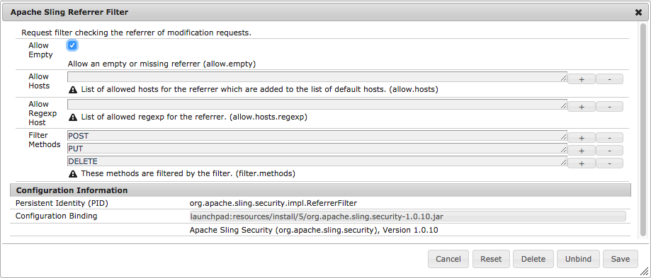

# Configureren voor AEM Apps{#configuring-for-aem-apps}

Met Adobe Experience Manager Apps kunt u de inhoud van de OTA-toepassing (via de lucht) bijwerken. De bijgewerkte inhoud wordt opgeslagen in de publicatieinstantie. Als u de toepassing op uw apparaat wilt toestaan verbinding te maken met de publicatie-instantie en wilt controleren of er updates beschikbaar zijn, moet de publicatie-instantie zo zijn geconfigureerd dat er een lege verwijzingsheader is.

## Leeg verwijzingskoptekst configureren {#configuring-empty-referrer-header}

Om de dienst van het verwijzingsfilter te vormen:

* Open de console van de Felix Apache (**Configuraties**) bij:
* https://&lt;server>:&lt;port_number>/system/console/configMgr
* Aanmelden als beheerder.
* In het **menu van Configuraties**, selecteer: *Apache het Verdelen Filter van de Verwijzing*
* Schakel het veld Lege waarden toestaan in zodat u lege of ontbrekende verwijzingskoppen kunt toestaan.
* Klik **sparen** om uw veranderingen te bewaren.

Zie de [ Montages van de Configuratie OSGI ](/help/sites-deploying/osgi-configuration-settings.md) en [ Controlelijst van de Veiligheid - Kwesties met de Versmeder van het Verzoek van de Verschuiving van de Intersite ](/help/sites-administering/security-checklist.md#protect-against-cross-site-request-forgery) voor verdere details.
