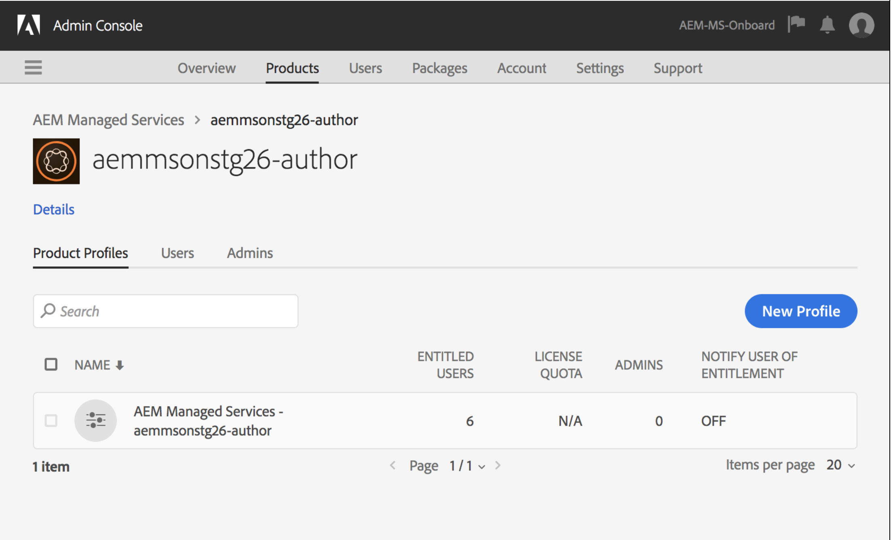
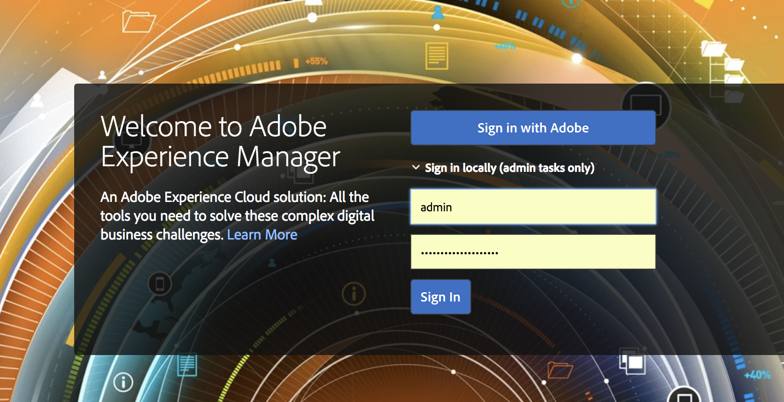

# Adobe IMS-verificatie en [!DNL Admin Console] Ondersteuning voor AEM Managed Services {#adobe-ims-authentication-and-admin-console-support-for-aem-managed-services}

>[!NOTE]
>
>Deze functie is alleen beschikbaar voor Adobe Managed Services-klanten.

## Inleiding {#introduction}

AEM 6.4.3.0 introduceert [!DNL Admin Console] steun voor de instanties van AEM en de gebaseerde authentificatie van Adobe IMS (het Systeem van Identity Management) voor **AEM Managed Services** klanten.

AEM die instapt voor [!DNL Admin Console] biedt AEM Managed Services-klanten de mogelijkheid om alle Experience Cloud-gebruikers in één console te beheren. Gebruikers kunnen worden toegewezen aan productprofielen die aan AEM-instanties zijn gekoppeld, zodat ze zich kunnen aanmelden bij een specifieke instantie.

## Belangrijkste hooglichten {#key-highlights}

* AEM IMS-verificatieondersteuning is alleen bedoeld voor AEM-auteurs, -beheerders of -ontwikkelaars, niet voor externe eindgebruikers van de site, zoals sitebezoekers
* De [!DNL Admin Console] vertegenwoordigt AEM Managed Services-klanten als IMS-organisaties en hun instanties als productcontexten. Systeem- en productbeheerders van klanten kunnen de toegang tot instanties beheren
* AEM Managed Services synchroniseert klanttopologieën met de [!DNL Admin Console] . De [!DNL Admin Console] bevat één instantie van AEM Managed Services Product Context per Instance.
* Productprofielen in [!DNL Admin Console] bepalen welke instanties een gebruiker kan openen
* Federatieve verificatie met behulp van de eigen SAML 2-compatibele identiteitsproviders van klanten wordt ondersteund
* Alleen Enterprise- of federatieve id&#39;s (voor Single Sign-On van klant) worden ondersteund, niet persoonlijke Adobe-id&#39;s.
* [!DNL User Management] (in Adobe [!DNL Admin Console] ) blijft eigendom van de beheerders van de klant.

## Architectuur {#architecture}

IMS-verificatie werkt met het OAuth-protocol tussen AEM en het Adobe IMS-eindpunt. Zodra een gebruiker aan IMS is toegevoegd en een Adobe ID heeft, kan deze zich aanmelden bij AEM Managed Services-instanties met IMS-referenties.

De gebruikerslogin stroom wordt hieronder getoond, zal de gebruiker aan IMS en facultatief aan klant IDP voor bevestiging van SSO worden opnieuw gericht en dan terug naar AEM.

## Instellen {#how-to-set-up}

### Organisaties aan boord nemen [!DNL Admin Console] {#onboarding-organizations-to-admin-console}

De klant die aan [!DNL Admin Console] is gekoppeld, is een vereiste voor het gebruik van Adobe IMS voor AEM-verificatie.

Als eerste stap moeten klanten beschikken over een organisatie die is ingericht in Adobe IMS. De klanten van de Onderneming van Adobe worden vertegenwoordigd als organisaties IMS in [ Adobe  [!DNL Admin Console] ](https://helpx.adobe.com/nl/enterprise/using/admin-console.html).

AEM Managed Services-klanten moeten al over een organisatie beschikken en als onderdeel van de IMS-provisioning worden de exemplaren van de klant in de [!DNL Admin Console] beschikbaar gesteld voor het beheer van gebruikersrechten en toegang.

De overgang naar IMS voor gebruikersverificatie is een gezamenlijke inspanning van AMS en klanten, waarbij elk van hen zijn werkschema&#39;s moet voltooien.

Zodra een klant als IMS Organisatie bestaat en AMS met levering van de klant voor IMS wordt gedaan, is dit de samenvatting van de vereiste configuratiewerkschema&#39;s:

1. De aangewezen systeembeheerder ontvangt een uitnodiging om u aan te melden bij de [!DNL Admin Console]
1. System Admin claimt Domain om de eigendom van het domein te bevestigen (in dit voorbeeld acme.com)
1. Systeembeheer stelt gebruikersmappen in
1. System Admin configureert de Identiteitsprovider (IDP) in [!DNL Admin Console] voor SSO-installatie.
1. De AEM Admin beheert de lokale groepen, de toestemmingen, en de voorrechten zoals gebruikelijk. Zie Synchronisatie van gebruikers en groepen

>[!NOTE]
>
>Voor meer informatie over de Basisbeginselen van Adobe Identity Management, met inbegrip van configuratie IDP zie het artikel over [ identiteit van de Opstelling en Enige Sign-On ](https://helpx.adobe.com/nl/enterprise/using/set-up-identity.html).
>
>Voor meer informatie over het Beleid van de Onderneming en [!DNL Admin Console] zie het [ Onthaal aan de onderneming en de gids van teamadmin ](https://helpx.adobe.com/nl/enterprise/managing/user-guide.html).

### Gebruikers aan boord nemen van [!DNL Admin Console] {#onboarding-users-to-the-admin-console}

Er zijn drie manieren aan boord van gebruikers afhankelijk van de grootte van de klant en hun voorkeur:

1. Handmatig gebruikers en groepen maken in [!DNL Admin Console]
1. Een CSV-bestand met gebruikers uploaden
1. Synchroniseer gebruikers en groepen van de bedrijfs Actieve Folder van de klant.

#### Handmatige toevoeging via [!DNL Admin Console] UI {#manual-addition-through-admin-console-ui}

Gebruikers en groepen kunnen handmatig worden gemaakt in de gebruikersinterface van [!DNL Admin Console] . Deze methode kan worden gebruikt als zij niet veel te beheren gebruikers hebben. Minder dan 50 AEM-gebruikers.

Gebruikers kunnen ook handmatig worden gemaakt als de klant deze methode al gebruikt voor het beheer van andere Adobe-producten, zoals Adobe Analytics-, Adobe Target- of Adobe Creative Cloud-toepassingen.

#### Bestand uploaden in de gebruikersinterface van [!DNL Admin Console] {#file-upload-in-the-admin-console-ui}

Voor een eenvoudige afhandeling van het maken van gebruikers kan een CSV-bestand worden geüpload om gebruikers in bulk toe te voegen:

#### Gereedschap Gebruikerssynchronisatie {#user-sync-tool}

Met het Hulpprogramma voor gebruikerssynchronisatie (UST in het kort) kunnen zakelijke klanten Adobe-gebruikers maken of beheren die Active Directory of andere geteste OpenLDAP-directoryservices gebruiken. De doelgebruikers zijn de Beheerders van de Identiteit van IT (de Folder van de Onderneming en de Beheerders van het Systeem) die het hulpmiddel zullen kunnen installeren en vormen. Het opensource-hulpprogramma kan worden aangepast, zodat klanten het kunnen aanpassen aan hun eigen specifieke vereisten.

Wanneer de looppas van de Synchronisatie van de Gebruiker, het een lijst van gebruikers van de Actieve Folder van de organisatie (of een andere compatibele gegevensbron) haalt en het met de lijst van gebruikers binnen [!DNL Admin Console] vergelijkt. Vervolgens wordt de Adobe [!DNL User Management] API aangeroepen, zodat de [!DNL Admin Console] wordt gesynchroniseerd met de directory van de organisatie. De wijzigingsstroom verloopt in één richting. Bewerkingen die in [!DNL Admin Console] worden aangebracht, worden niet naar de map uitgeduwd.

Met dit hulpprogramma kan de systeembeheerder gebruikersgroepen in de directory van de klant toewijzen aan productconfiguratie en gebruikersgroepen in de [!DNL Admin Console] . Met de nieuwe UST-versie kunnen ook gebruikersgroepen dynamisch worden gemaakt in de [!DNL Admin Console] .

Aan de Synchronisatie van de opstellingsGebruiker, moet de organisatie een reeks geloofsbrieven op de zelfde manier tot stand brengen zij [[!DNL User Management]  API ](https://www.adobe.io/apis/cloudplatform/usermanagement/docs/setup.html) zouden gebruiken.

Gebruikerssynchronisatie wordt gedistribueerd via de Adobe Github-opslagplaats op deze locatie:

[ https://github.com/adobe-apiplatform/user-sync.py/releases/latest](https://github.com/adobe-apiplatform/user-sync.py/releases/latest)

Merk op dat een pre-versieversie 2.4RC1 met de dynamische steun van de groepsverwezenlijking beschikbaar is en hier kan worden gevonden: [ https://github.com/adobe-apiplatform/user-sync.py/releases/tag/v2.4rc1 ](https://github.com/adobe-apiplatform/user-sync.py/releases/tag/v2.4rc1)

De belangrijkste functies voor deze release zijn de mogelijkheid om nieuwe LDAP-groepen dynamisch toe te wijzen voor gebruikerslidmaatschap in de [!DNL Admin Console] en het dynamisch maken van gebruikersgroepen.

Meer informatie over de nieuwe groepsfuncties vindt u hier:

[ https://adobe-apiplatform.github.io/user-sync.py/en/user-manual/advanced_configuration.html#additional-group-options](https://adobe-apiplatform.github.io/user-sync.py/en/user-manual/advanced_configuration.html#additional-group-options)

>[!NOTE]
>
>Zie voor meer informatie:
>
>* het [ Hulpmiddel van de Synchronisatie van de Gebruiker - de Synchronisatie van de Gebruiker van Adobe ](https://adobe-apiplatform.github.io/user-sync.py/en/)
>
>* Het hulpmiddel van de Synchronisatie van de Gebruiker moet als cliëntUMAPI van Adobe I/O registreren gebruikend de procedure die onder [ Authentificatie voor API Toegang wordt beschreven ](https://adobe-apiplatform.github.io/umapi-documentation/en/UM_Authentication.html)
>
>* de [ Documentatie van Adobe Developer Console ](https://developer.adobe.com/developer-console/docs/guides/).
>
>* de [ Documentatie van API van het Beheer van de Gebruiker ](https://adobe-apiplatform.github.io/umapi-documentation/en/).
>

>[!NOTE]
>
>De AEM IMS-configuratie wordt afgehandeld door het Adobe Managed Services-team. Nochtans, kan de klantenbeheerder het volgens hun vereisten wijzigen (bijvoorbeeld, AutoLidmaatschap van de Groep of de Afbeelding van de Groep). De IMS-client wordt ook geregistreerd door uw Managed Services-team.

## Hoe wordt het gebruikt {#how-to-use}

### Producten en gebruikerstoegang beheren in [!DNL Admin Console] {#managing-products-and-user-access-in-admin-console}

Wanneer de productbeheerder van de klant zich aanmeldt bij [!DNL Admin Console] , worden meerdere exemplaren van de AEM Managed Services-productcontext weergegeven, zoals hieronder wordt getoond:

In dit voorbeeld, heeft de org *AEM-MS-Onboard* 32 instanties die verschillende topologieën en milieu&#39;s zoals Stadium, Prod, etc. overspannen.

De instantiedetails kunnen worden gecontroleerd om de instantie te identificeren:

Onder elke instantie van de Context van het Product, zal er een bijbehorende Profiel van het Product zijn. Dit productprofiel wordt gebruikt voor het toewijzen van toegang aan gebruikers.

Gebruikers die onder dit productprofiel zijn toegevoegd, kunnen zich aanmelden bij die instantie, zoals in het onderstaande voorbeeld wordt getoond:

### Aanmelden bij AEM {#logging-into-aem}

#### Aanmelden bij lokale beheerder {#local-admin-login}

AEM kan lokale aanmeldingen voor Admin-gebruikers blijven ondersteunen, aangezien het aanmeldingsscherm een optie heeft om zich lokaal aan te melden:

#### Op IMS gebaseerde aanmelding {#ims-based-login}

Voor andere gebruikers kan de op IMS gebaseerde aanmelding worden gebruikt zodra IMS in de instantie is geconfigureerd. De gebruiker klikt eerst **binnen Teken met Adobe** zoals hieronder getoond:

Vervolgens worden ze omgeleid naar het IMS-aanmeldingsscherm en voeren ze hun referenties in:

Als een gefedereerde IDP tijdens aanvankelijke [!DNL Admin Console] opstelling wordt gevormd, dan zal de gebruiker aan klant IDP voor SSO worden opnieuw gericht.

IDP is Okta in het volgende voorbeeld:

Nadat de verificatie is voltooid, wordt de gebruiker teruggeleid naar AEM en aangemeld:

### Bestaande gebruikers migreren {#migrating-existing-users}

Voor bestaande AEM-instanties die een andere verificatiemethode gebruiken en die nu naar IMS worden gemigreerd, moet er een migratiestap worden uitgevoerd.

Bestaande gebruikers in de AEM-opslagplaats (lokaal, via LDAP of SAML) kunnen worden gemigreerd om naar IMS te verwijzen als de IDP met behulp van het User Migration Utility.

Dit hulpprogramma wordt door uw AMS-team uitgevoerd als onderdeel van IMS-provisioning.

### Bevoegdheden en ACL&#39;s beheren in AEM {#managing-permissions-and-acls-in-aem}

Toegangsbeheer en toegangsrechten blijven in AEM worden beheerd, dit kan worden bereikt door scheiding van Gebruikersgroepen die afkomstig zijn van IMS (bijvoorbeeld AEM-GRP-008 in het onderstaande voorbeeld) en lokale groepen waarin de machtigingen en toegangsbeheer zijn gedefinieerd. De gebruikersgroepen die van IMS worden gesynchroniseerd kunnen aan lokale groepen worden toegewezen en de toestemmingen erven.

In het onderstaande voorbeeld voegen we gesynchroniseerde groepen toe aan de lokale *Dam_Users*-groep.

Hier is een gebruiker ook toegewezen aan een paar groepen in de [!DNL Admin Console] . (Gebruikers en groepen kunnen via LDAP worden gesynchroniseerd met het gereedschap voor gebruikerssynchronisatie of ze kunnen lokaal worden gemaakt. Zie **Aan boord van Gebruikers aan[!DNL Admin Console]** vroeger).

>[!NOTE]
>
>Gebruikersgroepen worden alleen gesynchroniseerd wanneer de gebruikers zich aanmelden bij de instantie.

De gebruiker maakt deel uit van de volgende groepen in IMS:

Wanneer de gebruiker zich aanmeldt, worden diens groepslidmaatschappen gesynchroniseerd zoals hieronder weergegeven:

In AEM kunnen de gebruikersgroepen die via IMS zijn gesynchroniseerd, als leden worden toegevoegd aan bestaande lokale groepen, bijvoorbeeld DAM-gebruikers.

Zoals hieronder getoond, erft de groep *AEM-GRP_008* de Toestemmingen en de Bevoegdheden van Gebruikers DAM. Dit is een efficiënte manier om toestemmingen voor gesynchroniseerde groepen te beheren en wordt algemeen gebruikt in op LDAP-Gebaseerde Methodes van de Authentificatie eveneens.

