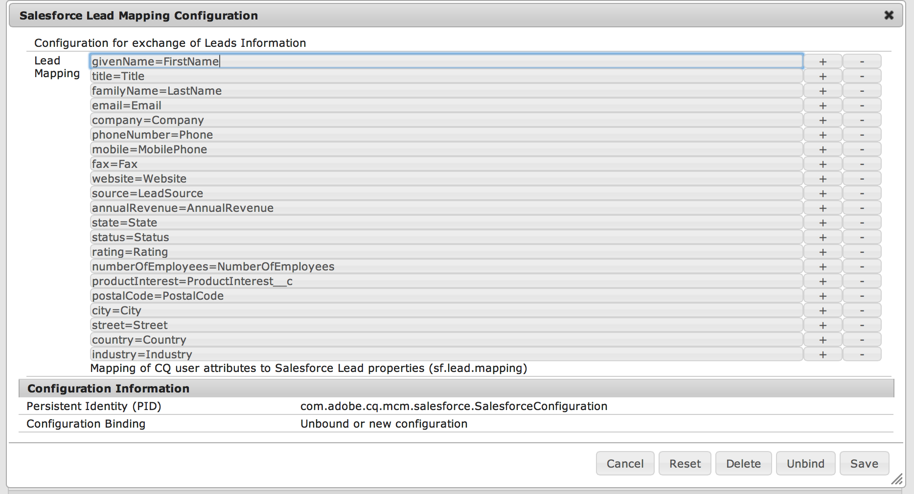
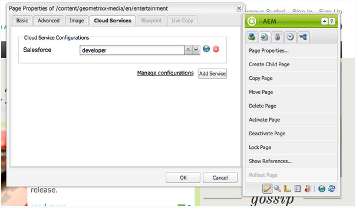

# Integreren met Salesforce {#integrating-with-salesforce}

De integratie van Salesforce met Adobe Experience Manager (AEM) biedt beheermogelijkheden voor leads en gebruikt de bestaande mogelijkheden die Salesforce uit de verpakking biedt. U kunt AEM zo configureren dat leads naar Salesforce worden gepost en componenten maken die rechtstreeks vanuit Salesforce toegang hebben tot gegevens.

Dankzij de bidirectionele en uitbreidbare integratie tussen AEM en Salesforce kunnen:

* Organisaties die volledig gebruikmaken van gegevens en deze aanpassen om de ervaring van klanten te verbeteren.
* Betrokkenheid van marketing tot verkoopactiviteiten.
* Organisaties die automatisch gegevens verzenden en ontvangen van een Salesforce-datastore.

In dit document wordt het volgende beschreven:

* Salesforce Cloud Services configureren (AEM configureren voor integratie met Salesforce).
* hoe u Salesforce Lead/Contact-informatie kunt gebruiken in Client Context en voor Personalization.
* hoe u het Salesforce-workflowmodel kunt gebruiken om AEM-gebruikers te posten als leads voor Salesforce.
* hoe u een component maakt die gegevens uit Salesforce weergeeft.

## AEM configureren voor integratie met Salesforce {#configuring-aem-to-integrate-with-salesforce}

Als u AEM wilt configureren voor integratie met Salesforce, moet u eerst een toepassing voor externe toegang configureren in Salesforce. Vervolgens configureert u de Salesforce-cloudservice zodanig dat deze naar deze toepassing voor externe toegang wijst.

>[!NOTE]
>
>U kunt een gratis ontwikkelaarsaccount maken in Salesforce.

AEM configureren voor integratie met Salesforce:

>[!CAUTION]
>
>Installeer het [ de integratiepakket van de Kracht API van de Salesforce ](https://experience.adobe.com/#/downloads/content/software-distribution/en/aem.html?fulltext=salesforce*&amp;orderby=%40jcr%3Acontent%2Fjcr%3AlastModified&amp;orderby.sort=desc&amp;layout=list&amp;p.offset=0&amp;p.limit=2&amp;package=%2Fcontent%2Fsoftware-distribution%2Fen%2Fdetails.html%2Fcontent%2Fdam%2Faem%2Fpublic%2Fadobe%2Fpackages%2Fcq650%2Ffeaturepack%2Fcom.adobe.cq.mcm.salesforce.content-1.0.4.zip) alvorens u met de procedure verdergaat. Voor meer details op hoe te met pakketten te werken zie [ hoe te met de pagina van Pakketten ](/help/sites-administering/package-manager.md#package-share) werken.

1. In AEM, navigeer aan **de Diensten van de Wolk**. In de Diensten van de Derde, klik **vormen nu** in **Salesforce**.

   

1. Creeer een configuratie, bijvoorbeeld, **ontwikkelaar**.

   >[!NOTE]
   >
   >De nieuwe configuratie richt aan een nieuwe pagina opnieuw: **http://localhost:4502/etc/cloudservices/salesforce/developer.html**. Dit is precies de zelfde waarde die u in Callback URL moet specificeren terwijl het creëren van de verre toegangstoepassing in Salesforce. Deze waarden moeten overeenkomen.

1. Login aan uw rekening van Salesforce (of als u geen hebt, creeer in [ https://developer.salesforce.com ](https://developer.salesforce.com).)
1. In Salesforce, navigeer aan **creeer** > **Apps** om aan **Verbonden Apps** te krijgen (in vroegere versies van Salesforce, was het werkschema **opstellen** > **Verre Toegang**).
1. Klik **Nieuw** zodat kunt u AEM met Salesforce verbinden.

   

1. Ga de **Verbonden Naam van de App**, **API Naam**, en **E-mail van het Contact** in. Selecteer **toelaten OAuth de controledoos van Montages** en ga **terug URL** in en voeg een OAuth werkingsgebied (bijvoorbeeld, volledige toegang) toe. De callback-URL ziet er ongeveer als volgt uit: `http://localhost:4502/etc/cloudservices/salesforce/developer.html`

   Wijzig de servernaam/het poortnummer en de paginanaam in overeenstemming met uw configuratie.

   

1. Klik **sparen** om de configuratie van Salesforce te bewaren. Salesforce leidt tot a **consument sleutel** en **consumentengeheim**, die u voor de configuratie van AEM nodig hebt.

   

   >[!NOTE]
   >
   >Wacht enkele minuten (tot 15 minuten) voordat de toepassing voor externe toegang in Salesforce wordt geactiveerd.

1. In AEM, navigeer aan **de Diensten van de Wolk** en navigeer aan de configuratie van Salesforce u vroeger (bijvoorbeeld, **ontwikkelaar**) creeerde. Klik **uitgeven** en ga de klantensleutel en het klantengeheim van salesforce.com in.

   

   | URL aanmelding | Dit is het Salesforce Authorization Endpoint. De waarde ervan wordt vooraf ingevuld en is in de meeste gevallen beschikbaar. |
   |---|---|
   | Klantsleutel | Ga de waarde in die van de Verre pagina van de Registratie van de Toepassing van de Toegang in salesforce.com wordt verkregen |
   | Klantgeheim | Ga de waarde in die van de Verre pagina van de Registratie van de Toepassing van de Toegang in salesforce.com wordt verkregen |

1. Klik **verbinden met Salesforce** om te verbinden. Salesforce vraagt dat u uw configuratie toestaat verbinding te maken met Salesforce.

   

   In AEM wordt een bevestigingsdialoogvenster geopend waarin u wordt verteld dat u een verbinding hebt gemaakt.

1. Navigeer aan de wortelpagina van uw website en klik **Eigenschappen van de Pagina**. Dan selecteer de uitgezochte **Diensten van de Wolk** en voeg **Salesforce** toe en selecteer de correcte configuratie (bijvoorbeeld, **ontwikkelaar**).

   

   Nu kunt u het workflowmodel gebruiken om leads naar Salesforce te posten en componenten te maken die toegang hebben tot gegevens van Salesforce.

## AEM-gebruikers exporteren als Salesforce Leads {#exporting-aem-users-as-salesforce-leads}

Als u een AEM-gebruiker wilt exporteren als Salesforce-lead, configureert u de workflow zo dat leads naar Salesforce worden gepost.

AEM-gebruikers exporteren als Salesforce-leads:

1. Navigeer aan het werkschema van Salesforce bij `http://localhost:4502/workflow` door het werkschema **Salesforce.com de Uitvoer** met de rechtermuisknop aan te klikken en **Begin** te klikken.

   

1. Selecteer de gebruiker van AEM die u als lood als **Payload** voor dit werkschema (huis > gebruikers) wilt tot stand brengen. Ben zeker om de profielknoop van de gebruiker te selecteren aangezien het informatie zoals **givenName** bevat, en **familyName**, die aan de gebieden van Voornaam van Salesforce **worden in kaart gebracht FirstName** en **LastName**.

   

   >[!NOTE]
   >
   >Voordat u deze workflow start, moeten er bepaalde verplichte velden zijn voor publicatie op Salesforce door een lead node in AEM. Dit zijn **givenName**, **familyName**, **bedrijf**, en **e-mail**. Om een volledige lijst van afbeeldingen tussen de gebruiker van AEM en de lood van Salesforce te zien, zie [ Configuratie van de Toewijzing tussen de gebruiker van AEM en de lood van Salesforce.](#mapping-configuration-between-aem-user-and-salesforce-lead)

1. Klik **OK**. De gebruikersgegevens worden geëxporteerd naar salesforce.com. U kunt dit controleren op salesforce.com.

   >[!NOTE]
   >
   >In de foutlogboeken ziet u of een lead wordt geïmporteerd. Controleer het foutenlogboek voor meer informatie.

### De Salesforce.com-workflow voor exporteren configureren {#configuring-the-salesforce-com-export-workflow}

Indien nodig, vorm het Salesforce.com werkschema van de Uitvoer om het aan de correcte configuratie Salesforce.com aan te passen, of andere veranderingen aan te brengen.

De Salesforce.com-exportworkflow configureren:

1. Navigeren naar `http://localhost:4502/cf#/etc/workflow/models/salesforce-com-export.html.`

   

1. Open de stap van de Uitvoer Salesforce.com, selecteer de **Argumenten** tabel, en selecteer de correcte configuratie wordt geselecteerd en klikt **O.K.**. Schakel het selectievakje in als u wilt dat de workflow een lead opnieuw maakt die in Salesforce is verwijderd.

   

1. Klik **sparen** om uw veranderingen te bewaren.

   

### Toewijzingsconfiguratie tussen AEM-gebruiker en Salesforce Lead {#mapping-configuration-between-aem-user-and-salesforce-lead}

Om de huidige kaartconfiguratie tussen een gebruiker van AEM en een lood van Salesforce te bekijken of uit te geven, open de Manager van de Configuratie: `https://<hostname>:<port>/system/console/configMgr` en onderzoek naar **de Configuratie van de Afbeelding van Salesforce van de Leiding**.

1. Open de Manager van de Configuratie door **Console van het Web** te klikken of rechtstreeks naar `https://<hostname>:<port>/system/console/configMgr.` te gaan
1. Onderzoek naar **de Configuratie van de Toewijzing van de Lood van Salesforce**.

   

1. Wijzig desgewenst toewijzingen. De standaardafbeelding volgt het patroon **aemUserAttribute=sfLeadAttribute**. Klik **sparen** om uw veranderingen te bewaren.

## Salesforce Client Context Store configureren {#configuring-salesforce-client-context-store}

In de Salesforce client context store wordt aanvullende informatie over de momenteel aangemelde gebruiker weergegeven dan wat al beschikbaar is in AEM. Deze aanvullende informatie wordt door Salesforce opgehaald, afhankelijk van de verbinding van de gebruiker met Salesforce.

Hiertoe configureert u het volgende:

1. Koppel een AEM-gebruiker aan een Salesforce-id via de Salesforce Connect-component.
1. Voeg de gegevens van het Profiel van Salesforce in de pagina van de cliëntcontext toe zodat kunt u vormen welke eigenschappen u wilt zien.
1. (Optioneel) Bouw een segment dat de gegevens uit de Salesforce Client Context Store gebruikt.

### Een AEM-gebruiker koppelen met een Salesforce-id {#linking-an-aem-user-with-a-salesforce-id}

Wijs een AEM-gebruiker toe met een Salesforce-id zodat u deze in de clientcontext kunt laden. In een echt scenario, zou u gebaseerd op bekende gebruikersgegevens met bevestiging verbinden. Voor demonstratiedoeleinden, in deze procedure, gebruikt u **Salesforce Connect** component.

1. Navigeer aan een website in AEM, teken binnen, en sleep en laat vallen **Salesforce Connect** component van sidekick.

   >[!NOTE]
   >
   >Als **Salesforce verbindt** component niet beschikbaar is, ga naar de **mening van het Ontwerp** en selecteer het om het in **beschikbaar te maken geef** mening uit.

   

   Wanneer u de component aan de pagina sleept, toont het **Verbinding aan Salesforce=Off**.

   

   >[!NOTE]
   >
   >Dit onderdeel is uitsluitend bedoeld voor demonstratiedoeleinden. Voor scenario&#39;s in de praktijk, zou er een ander proces zijn om gebruikers met lood te verbinden/aan te passen.

1. Nadat u de component op de pagina hebt gesleept, opent u deze om de component te configureren. Selecteer de configuratie, het type van contact, en de lood of het contact van Salesforce, en klik **O.K.**.

   

   AEM koppelt de gebruiker aan de Salesforce-contactpersoon of -lead.

   

### Salesforce-gegevens toevoegen aan clientcontext {#adding-salesforce-data-to-client-context}

U kunt gebruikersgegevens van Salesforce laden in de context van de Cliënt voor verpersoonlijking te gebruiken:

1. Open de clientcontext die u wilt uitbreiden door daar te navigeren, bijvoorbeeld `http://localhost:4502/etc/clientcontext/default/content.html.`

   

1. Sleep de **component van de Gegevens van het Profiel van Salesforce** aan de cliëntcontext.

   

1. Open de component door erop te dubbelklikken. Selecteer **Punt** toevoegen en een bezit van de drop-down lijst selecteren. Voeg zo vele eigenschappen toe zoals u wilt en selecteer **O.K.**.

   

1. Nu worden Salesforce-specifieke eigenschappen van Salesforce weergegeven in de clientcontext.

   

### Een segment maken met gegevens uit de Salesforce Client Context Store {#building-a-segment-using-data-from-salesforce-client-context-store}

U kunt een segment maken dat gegevens uit de Salesforce Client Context Store gebruikt. Dit doet u als volgt:

1. Navigeer aan segmentatie in AEM of door **Hulpmiddelen** te gaan > **Segmentatie** of naar [ http://localhost:4502/miscadmin#/etc/segmentation ](http://localhost:4502/miscadmin#/etc/segmentation) te gaan.
1. Een segment maken of bijwerken om gegevens van Salesforce op te nemen. Voor meer informatie, zie [ Segmentatie ](/help/sites-administering/campaign-segmentation.md).

## Zoekleads {#searching-leads}

AEM wordt geleverd met een zoekcomponent met voorbeelden waarmee in Salesforce naar leads wordt gezocht volgens de opgegeven criteria. Deze component laat zien hoe u de Salesforce REST API kunt gebruiken om Salesforce-objecten te zoeken. Om een vraag aan salesforce.com teweeg te brengen, verbind een pagina met een configuratie van Salesforce.

>[!NOTE]
>
>Dit is een voorbeeldcomponent die laat zien hoe u de Salesforce REST API kunt gebruiken om Salesforce-objecten te zoeken. Gebruik dit als voorbeeld om complexere componenten te maken op basis van uw behoeften.

Deze component gebruiken:

1. Navigeer naar de pagina waarop u deze configuratie wilt gebruiken. Open de pagina-eigenschappen en selecteer **Cloud Services.** klik **Voeg de Diensten** toe en selecteer **Salesforce** en de aangewezen configuratie en klik **O.K.**.

   

1. Sleep de Salesforce-zoekcomponent naar de pagina (mits deze is ingeschakeld). Ga naar de ontwerpmodus en voeg deze toe aan het desbetreffende gebied om de modus in te schakelen.)

   

1. Open de component van het Onderzoek en specificeer de onderzoeksparameters en klik **O.K.**

   

1. AEM geeft de in de zoekcomponent opgegeven leads weer die aan de opgegeven criteria voldoen.

   
