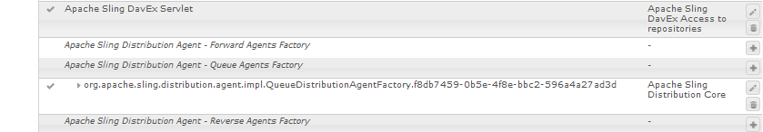

# Gebruikerssynchronisatie{#user-synchronization}

## Inleiding {#introduction}

Wanneer de plaatsing a [ landbouwbedrijf ](/help/sites-deploying/recommended-deploys.md#tarmk-farm) publiceert, moeten de leden login kunnen en hun gegevens op om het even welk publiceren knoop zien.

Gebruikers en gebruikersgroepen (gebruikersgegevens) die in de publicatieomgeving zijn gemaakt, zijn niet nodig in de ontwerpomgeving.

De meeste gebruikersgegevens die in de auteursomgeving worden gemaakt, blijven in de auteursomgeving en worden niet gekopieerd naar de instanties Publish.

Registratie en wijzigingen die worden aangebracht op een instantie Publish moeten worden gesynchroniseerd met andere instanties Publish om toegang te hebben tot dezelfde gebruikersgegevens.

Vanaf AEM 6.1, wanneer gebruikerssynchronisatie wordt toegelaten, worden de gebruikersgegevens automatisch gesynchroniseerd over de Publish instanties in het landbouwbedrijf en niet gecreeerd op auteur.

## Verspreiding {#sling-distribution}

De gebruikersgegevens, samen met hun [ ACLs ](/help/sites-administering/security.md), worden opgeslagen in de [ Kern van Oak ](/help/sites-deploying/platform.md), de laag onder Oak JCR, en worden betreden gebruikend [ Oak API ](https://developer.adobe.com/experience-manager/reference-materials/6-5-lts/javadoc/org/apache/jackrabbit/oak/api/package-summary.html). Met infrequente updates, is het redelijk voor gebruikersgegevens om met andere publiceer instanties te worden gesynchroniseerd gebruikend [ het Verdelen van de Distributie van de Inhoud ](https://github.com/apache/sling-old-svn-mirror/blob/trunk/contrib/extensions/distribution/README.md) (het Verdelen van distributie).

De voordelen van gebruikerssynchronisatie met de verkoopverdeling in vergelijking met traditionele replicatie zijn:

* *gebruikers*, *gebruikersprofielen*, en *gebruikersgroepen* die op publiceren worden gecreeerd worden niet gecreeerd op Auteur

* Bij het splitsen van distributiesets worden eigenschappen in jcr-gebeurtenissen ingesteld, zodat u kunt werken binnen gebeurtenislisteners aan de serverzijde zonder dat u zich zorgen hoeft te maken over oneindige replicatielijnen
* Bij de verkoopdistributie worden alleen gebruikersgegevens naar niet-gegenereerde publicatie-instanties verzonden, waardoor onnodig verkeer wordt voorkomen
* [ ACLs ](/help/sites-administering/security.md) die in de gebruikersknoop wordt geplaatst is inbegrepen in de synchronisatie

>[!NOTE]
>
>Als de zittingen worden vereist, wordt het geadviseerd om of een oplossing te gebruiken SSO of een kleverige zitting te gebruiken en klanten te hebben login als zij aan een andere Publish instantie worden geschakeld.

>[!CAUTION]
>
>De synchronisatie van de **beheerders** groep wordt niet gesteund, zelfs wanneer de gebruikerssynchronisatie wordt toegelaten. In plaats daarvan wordt een fout bij het importeren van de diff in het foutenlogboek geregistreerd.
>
>Daarom wanneer de plaatsing een publiceer landbouwbedrijf is, als een gebruiker aan of verwijderd uit de **beheerders** groep wordt toegevoegd, moet de wijziging manueel op elke Publish instantie worden gemaakt.

## Gebruikerssynchronisatie inschakelen {#enable-user-sync}

>[!NOTE]
>
>Gebruikerssynchronisatie is standaard ingesteld op `disabled` .
>
>Het toelaten van gebruikerssynchronisatie impliceert het wijzigen van *bestaande* configuraties OSGi.
>
>Er mogen geen nieuwe configuraties worden toegevoegd als gevolg van het inschakelen van gebruikerssynchronisatie.

Gebruikerssynchronisatie is afhankelijk van de auteursomgeving voor het beheer van de gegevensdistributies van de gebruiker, ook al worden de gebruikersgegevens niet op de auteur gemaakt. Veel, maar niet alle, van de configuratie vindt plaats in de auteursomgeving en elke stap identificeert duidelijk of het op Auteur of Publish moet worden uitgevoerd.

Na zijn de stappen noodzakelijk om gebruikerssynchronisatie toe te laten, die door a [ wordt gevolgd het Oplossen van problemen ](#troubleshooting) sectie:

### Vereisten {#prerequisites}

1. Als de gebruikers en de gebruikersgroepen reeds op één Publish instantie zijn gecreeerd, wordt het geadviseerd [ manueel te synchroniseren ](#manually-syncing-users-and-user-groups) de gebruikersgegevens aan alle Publish instanties alvorens en gebruikerssynchronisatie te vormen toe te laten.

Zodra gebruikerssynchronisatie is ingeschakeld, worden alleen nieuwe gebruikers en groepen gesynchroniseerd.

1. Controleer of de laatste code is geïnstalleerd:

* [ het platformupdates van AEM ](https://experienceleague.adobe.com/docs/experience-manager-release-information/aem-release-updates/aem-releases-updates.html)

### 1. Apache Sling Distribution Agent - Sync Agents Factory {#apache-sling-distribution-agent-sync-agents-factory}

**laat gebruikerssynchronisatie** toe

* **op auteur**

   * aanmelden met beheerdersrechten
   * toegang tot de [ Console van het Web ](/help/sites-deploying/configuring-osgi.md)

      * bijvoorbeeld, [ https://localhost:4502/system/console/configMgr](https://localhost:4502/system/console/configMgr)

   * locate `Apache Sling Distribution Agent - Sync Agents Factory`

      * Selecteer de bestaande configuratie zodat u deze kunt openen voor bewerking (potloodpictogram)
Verifiëren `name`: **`socialpubsync`**

      * het selectievakje `Enabled` selecteren
      * select `Save`


### &#x200B;2. Gemachtigde gebruiker maken {#createauthuser}

**vorm toestemmingen**

De geautoriseerde gebruiker wordt gebruikt in stap 3 om de verkoopdistributie op Auteur te configureren.

* **op elke Publish instantie**

   * aanmelden met beheerdersrechten
   * toegang tot de [ Console van de Veiligheid ](/help/sites-administering/security.md)

      * bijvoorbeeld, [ https://localhost:4503/useradmin](https://localhost:4503/useradmin)

   * een gebruiker maken

      * bijvoorbeeld, `usersync-admin`

   * deze gebruiker toevoegen aan de gebruikersgroep van **`administrators`**
   * [voeg ACL voor deze gebruiker aan /home toe](#howtoaddacl)

      * `Allow jcr:all` met beperking `rep:glob=*/activities/*`

>[!CAUTION]
>
>Er moet een nieuwe gebruiker worden gemaakt.
>
>* De standaardgebruiker die wordt toegewezen, is **`admin`** .
>

#### Hoe te om ACL toe te voegen {#addacls}

* CRXDE Lite openen

   * bijvoorbeeld, [ https://localhost:4503/crx/de](https://localhost:4503/crx/de)

* select `/home` node
* in het rechterdeelvenster selecteert u de tab `Access Control`
* om een ACL ingang toe te voegen, selecteer de `+` knoop

   * **Belangrijk**: *onderzoek naar gebruiker die voor gebruikerssynchronisatie wordt gecreeerd*
   * **Type**: `Allow`
   * **Bevoegdheden**: `jcr:all`
   * **Beperkingen** `rep:glob`: `*/activities/*`
   * selecteren **O.K.**

* selecteren **sparen allen**

 toe

Zie ook

* [Toegangsbeheer](/help/sites-administering/user-group-ac-admin.md#access-right-management)
* De sectie van het oplossen van problemen [ wijzigt de Uitzondering van de Verrichting tijdens de Verwerking van de Reactie ](#modify-operation-exception-during-response-processing).

### 3. Adobe Granite Distribution - Encrypted Password Transport Secret Provider {#adobegraniteencpasswrd}

**vorm toestemmingen**

Zodra een geautoriseerde gebruiker-lid van de **`administrators`** gebruikersgroep-op alle Publish instanties wordt gecreeerd, moet de geautoriseerde gebruiker op Auteur worden geïdentificeerd als hebbend toestemming om gebruikersgegevens van Auteur te synchroniseren om te publiceren.

* **op Auteur**

   * aanmelden met beheerdersrechten
   * toegang tot de [ Console van het Web ](/help/sites-deploying/configuring-osgi.md)

      * bijvoorbeeld, [ https://localhost:4502/system/console/configMgr](https://localhost:4502/system/console/configMgr)

   * locate `com.adobe.granite.distribution.core.impl.CryptoDistributionTransportSecretProvider.name`
   * om te openen voor bewerken, selecteert u de bestaande configuratie (potloodpictogram)
Verifiëren `property name`: **`socialpubsync-publishUser`**

   * reeks de gebruikersbenaming en het wachtwoord aan de [ erkende gebruiker ](#createauthuser) die bij Publish in stap 2 wordt gecreeerd

      * bijvoorbeeld, `usersync-admin`


### 4. Apache Sling Distribution Agent - Queue Agents Factory {#apache-sling-distribution-agent-queue-agents-factory}

**laat gebruikerssynchronisatie** toe

* **op elke Publish instantie**:

   * aanmelden met beheerdersrechten
   * toegang tot de [ Console van het Web ](/help/sites-deploying/configuring-osgi.md)

      * bijvoorbeeld, [ https://localhost:4503/system/console/configMgr](https://localhost:4503/system/console/configMgr)

   * locate `Apache Sling Distribution Agent - Queue Agents Factory`

      * om te openen voor bewerken, selecteert u de bestaande configuratie (potloodpictogram)
Verifiëren `Name`: `socialpubsync-reverse`

      * het selectievakje `Enabled` selecteren
      * select `Save`

   * **herhaal** voor elke Publish instantie


### 5. Adobe Social Sync - Diff Observer Factory {#diffobserver}

**laat groepssynchronisatie** toe

* **op elke Publish instantie**:

   * aanmelden met beheerdersrechten
   * toegang tot de [ Console van het Web ](/help/sites-deploying/configuring-osgi.md)

      * bijvoorbeeld, [ https://localhost:4503/system/console/configMgr](https://localhost:4503/system/console/configMgr)

   * locate **`Adobe Social Sync - Diff Observer Factory`**

      * om te openen voor bewerken, selecteert u de bestaande configuratie (potloodpictogram)

        Verifiëren `agent name`: `socialpubsync-reverse`

      * het selectievakje `Enabled` selecteren
      * select `Save`


### 6. Apache Sling Distribution Trigger - Scheduled Triggers Factory {#apache-sling-distribution-trigger-scheduled-triggers-factory}

**(Optioneel) Wijzig het opiniepeilingsinterval**

Standaard wordt elke 30 seconden een opiniepeiling gehouden bij Auteur. Dit interval wijzigen:

* **op Auteur**

   * aanmelden met beheerdersrechten
   * toegang tot de [ Console van het Web ](/help/sites-deploying/configuring-osgi.md)

      * bijvoorbeeld, [ https://localhost:4502/system/console/configMgr](https://localhost:4502/system/console/configMgr)

   * locate `Apache Sling Distribution Trigger - Scheduled Triggers Factory`

      * om te openen voor bewerken, selecteert u de bestaande configuratie (potloodpictogram)

         * Verifiëren `Name`: `socialpubsync-scheduled-trigger`

      * Stel de `Interval in Seconds` in op het gewenste interval
      * select `Save`


## Configureren voor meerdere publicatie-instanties {#configure-for-multiple-publish-instances}

De standaardconfiguratie is voor één enkel Publish instantie. Aangezien de reden voor het toelaten van gebruikerssynchronisatie veelvoudige Publish instanties moet synchroniseren, zoals voor een publicatielandbouwbedrijf, moeten de extra Publish instanties aan de Factory van de Agenten van de Synchronisatie worden toegevoegd.

### 7. Apache Sling Distribution Agent - Sync Agents Factory {#apache-sling-distribution-agent-sync-agents-factory-1}

**voeg toe publiceer Instanties:**

* **op Auteur**

   * aanmelden met beheerdersrechten
   * toegang tot de [ Console van het Web ](/help/sites-deploying/configuring-osgi.md)

      * bijvoorbeeld, [ https://localhost:4502/system/console/configMgr](https://localhost:4502/system/console/configMgr)

   * locate `Apache Sling Distribution Agent - Sync Agents Factory`

      * om te openen voor bewerken, selecteert u de bestaande configuratie (potloodpictogram)
Verifiëren `Name`: `socialpubsync`


* **Eindpunten van de Exporteur**
Er zou een exportereindpunt voor elke Publish instantie moeten zijn. Als er bijvoorbeeld 2 instanties Publish zijn, localhost:4503 en 4504, moeten er twee vermeldingen zijn:

   * `https://localhost:4503/libs/sling/distribution/services/exporters/socialpubsync-reverse`
   * `https://localhost:4504/libs/sling/distribution/services/exporters/socialpubsync-reverse`

* **Eindpunten van de Importeur**
Er zou een importereindpunt voor elke Publish instantie moeten zijn. Als er bijvoorbeeld 2 instanties Publish zijn, localhost:4503 en 4504, moeten er twee vermeldingen zijn:

   * `https://localhost:4503/libs/sling/distribution/services/importers/socialpubsync`
   * `https://localhost:4504/libs/sling/distribution/services/importers/socialpubsync`

* select `Save`

### &#x200B;8. Unieke verkoper-id {#unique-sling-id}

>[!CAUTION]
>
>Als de verkoop-id overeenkomt met twee of meer publicatie-instanties, mislukt de synchronisatie van de gebruikersgroep.

Als het Verdelen identiteitskaart het zelfde voor veelvoudige Publish instanties in publiceer landbouwbedrijf is, dan worden de gebruikersgroepen niet gesynchroniseerd.

Om te controleren of alle waarden voor de Verschuivende id verschillen, moet u voor elke instantie Publiceren controleren:

1. bladeren naar `http://<host>:<port>/system/console/status-slingsettings`
1. controleer de waarde van **het Schipen identiteitskaart**


Als de verkoop-id van een instantie Publish overeenkomt met de id Sling van een andere instantie Publish, dan:

1. Stop één van de Publish instanties die een passende Verzamelings identiteitskaart heeft
1. in de map crx-quickstart/launch/felix

   * onderzoek naar en schrap het dossier genoemd *sling.id.file*

      * bijvoorbeeld op een Linux®-systeem:
        `rm -i $(find . -type f -name sling.id.file)`

      * bijvoorbeeld op een Windows-systeem:
        `use windows explorer and search for *sling.id.file*`

1. De instantie Publiceren starten

   * bij het opstarten wordt er een nieuwe verkoop-id toegewezen

1. bevestig dat **het Verdelen identiteitskaart** nu uniek is

Herhaal deze stappen totdat alle instanties Publiceren een unieke id voor verkopers hebben.

## Vault Package Builder-fabriek {#vault-package-builder-factory}

Voor updates die correct worden gesynchroniseerd, is het nodig om de builder van het vault-pakket te wijzigen voor gebruikerssynchronisatie:

* op elke publicatie-instantie van AEM
* toegang tot de [ Console van het Web ](/help/sites-deploying/configuring-osgi.md)

   * bijvoorbeeld, [ https://localhost:4503/system/console/configMgr](https://localhost:4503/system/console/configMgr)

* de locatie van `Apache Sling Distribution Packaging - Vault Package Builder Factory`

   * `Builder name: socialpubsync-vlt`

* het pictogram voor bewerken selecteren
* twee toevoegen `Package Node Filters` :

   * `/home/users|-.*/.tokens`
   * `/home/users|-.*/rep:cache`

* beleidsafhandeling:

   * om bestaande rep:beleidsknopen met nieuwe te overschrijven, voeg een derde Filter van het Pakket toe:

      * `/home/users|+.*/rep:policy`

   * om te voorkomen dat het beleid wordt verspreid,

      * `Acl Handling:` `IGNORE`


## Wat gebeurt er als ... {#what-happens-when}

### Gebruikersnaam of Zelfregistratie- of bewerkingsprofiel bij publiceren {#user-self-registers-or-edits-profile-on-publish}

Gebruikers en profielen die in de publicatieomgeving (zelfregistratie) zijn gemaakt, worden per ontwerp niet weergegeven in de ontwerpomgeving.

Wanneer de topologie a [ landbouwbedrijf ](/help/sites-deploying/recommended-deploys.md#tarmk-farm) publiceert en de gebruikerssynchronisatie correct is gevormd, wordt het *gebruiker* en *gebruikersprofiel* gesynchroniseerd over het publiceerlandbouwbedrijf gebruikend het Schuiven distributie.

### Gebruikers of gebruikersgroepen worden gemaakt met Beveiligingsconsole {#users-or-user-groups-are-created-using-security-console}

Gebruikersgegevens die in de publicatieomgeving zijn gemaakt, worden door het ontwerp niet weergegeven in de auteursomgeving en omgekeerd.

Wanneer de [ console van het Beleid van de Gebruiker en van de Veiligheid ](/help/sites-administering/security.md) wordt gebruikt om nieuwe gebruikers in toe te voegen publiceert milieu, synchroniseert de gebruikerssynchronisatie de nieuwe gebruikers en hun groepslidmaatschap aan andere Publish instanties, indien nodig. Gebruikerssynchronisatie synchroniseert ook gebruikersgroepen die zijn gemaakt via de beveiligingsconsole.

## Problemen oplossen {#troubleshooting}

### Gebruikerssynchronisatie offline uitvoeren {#how-to-take-user-sync-offline}

Om gebruikerssynchronisatie off-line te nemen, om [ te verwijderen publiceer instantie ](#how-to-remove-a-publish-instance) of [ manueel synchroniseer gegevens ](#manually-syncing-users-and-user-groups), moet de distributierij leeg en stil zijn.

Om de staat van de distributierij te controleren:

* op auteur:

   * het gebruiken [ CRXDE Lite ](/help/sites-developing/developing-with-crxde-lite.md)

      * zoeken naar items in `/var/sling/distribution/packages`

         * mapknooppunten met het patroon `distrpackage_*`

   * gebruikend [ Manager van het Pakket ](/help/sites-administering/package-manager.md)

      * zoeken naar hangende pakketten (nog niet geïnstalleerd)

         * benoemd met het patroon `socialpubsync-vlt*`

Schakel gebruikerssynchronisatie uit wanneer de distributiestrijd leeg is:

* op auteur

   * *uncheck *the `Enabled` checkbox voor [ Apache die de Agent van de Distributie - de Factory van de Agenten van de Synchronisatie ](#apache-sling-distribution-agent-sync-agents-factory)

Wanneer de taken worden voltooid, om gebruikerssynchronisatie opnieuw toe te laten:

* op auteur

   * controleer `Enabled` checkbox voor [ Apache die de Agent van de Distributie - de Factory van de Agenten van de Synchronisatie ](#apache-sling-distribution-agent-sync-agents-factory)

### Diagnostiek gebruikerssynchronisatie {#user-sync-diagnostics}

Diagnostiek voor gebruikerssynchronisatie is een programma dat de configuratie controleert en probeert eventuele problemen op te sporen.

Op Auteur, navigeer eenvoudig van de belangrijkste console door **Hulpmiddelen, Verrichtingen, Diagnose, Diagnose van de Synchronisatie van de Gebruiker.**

Als u gewoon de diagnostische console voor gebruikerssynchronisatie invoert, worden de resultaten weergegeven.

Dit is wat wordt getoond wanneer de Synchronisatie van de Gebruiker niet is toegelaten:

 wordt toegelaten

#### Diagnostiek voor publicatie-instanties uitvoeren {#how-to-run-diagnostics-for-publish-instances}

Wanneer het diagnostiek van het auteursmilieu in werking wordt gesteld, omvatten de pas/ontkent resultaten een [ sectie van INFO ] tonend de lijst van gevormde Publish instanties voor bevestiging.

Opgenomen in de lijst is een URL voor elke instantie Publish die de diagnostiek voor die instantie in werking stelt. De url param `syncUser` wordt toegevoegd aan diagnostiek URL met zijn waarde die aan *wordt geplaatst erkende synchronisatiegebruiker* in [ Stap 2 ](#createauthuser) wordt gecreeerd.

**Nota**: alvorens URL te lanceren, moet de *erkende synchronisatiegebruiker* reeds in die Publish instantie worden ondertekend.


### Configuratie onjuist toegevoegd {#configuration-improperly-added}

Wanneer de gebruikerssynchronisatie niet werkt, is het gemeenschappelijkste probleem dat de extra configuraties ** werden toegevoegd. In plaats daarvan, zou de *existing *default configuratie *moeten worden uitgegeven*.

Na zijn meningen van hoe uitgegeven, standaardconfiguraties in de Console van het Web zouden moeten verschijnen. Als er meerdere exemplaren worden weergegeven, moet de toegevoegde configuratie worden verwijderd.

#### (Auteur) Eén Apache Sling Distribution Agent - fabriek van Sync Agents {#author-one-apache-sling-distribution-agent-sync-agents-factory}


#### (Auteur) Eén Apache Sling Distribution Transport Credentials - Gebruikersreferenties gebaseerd DistributionTransportSecretProvider {#author-one-apache-sling-distribution-transport-credentials-user-credentials-based-distributiontransportsecretprovider}


#### (Publiceren) Eén Apache Sling Distribution Agent - Queue Agents Factory {#publish-one-apache-sling-distribution-agent-queue-agents-factory}



#### (Publiceren) Eén Adobe Social Sync - Diff Observer Factory {#publish-one-adobe-social-sync-diff-observer-factory}


#### (Auteur) Eén Apache Sling Distribution Trigger - Geplande Triggers Factory {#author-one-apache-sling-distribution-trigger-scheduled-triggers-factory}


### Uitzondering bewerking wijzigen tijdens reactieverwerking {#modify-operation-exception-during-response-processing}

Als het volgende zichtbaar is in het logboek:

`org.apache.sling.servlets.post.impl.operations.ModifyOperation Exception during response processing.`

`java.lang.IllegalStateException: This tree does not exist`

Dan verifieer dat de sectie [ 2. Creeer Gemachtigde Gebruiker ](#createauthuser) werd behoorlijk gevolgd.

Deze sectie beschrijft het creëren van een erkende gebruiker, die op alle Publish instanties bestaat, en het identificeren van hen in de &quot;Secret Provider&quot;OSGi config op auteur. De gebruiker is standaard `admin` .

De geautoriseerde gebruiker moet lid zijn van de gebruikersgroep van **`administrators`** en de machtigingen voor die groep mogen niet worden gewijzigd.

De geautoriseerde gebruiker moet expliciet de volgende rechten en beperkingen hebben voor alle publicatie-instanties:

| **weg** | **jcr:allen** | **rep:glob** |
|---|---|---|
| /home | X | &#42;/activities/&#42; |
| /home/users | X | &#42;/activities/&#42; |
| /home/groups | X | &#42;/activities/&#42; |

Als lid van de groep `administrators` moet de geautoriseerde gebruiker de volgende rechten hebben voor alle instanties Publish:

| **weg** | **jcr:allen** | **jcr:read** | **rep:write** |
|---|---|---|---|
| /etc/packages/sling/distribution |  |  | X |
| /libs/sling/distribution |  | X |  |
| /var |  |  | X |
| /var/eventing |  | X | X |
| /var/sling/distribution |  | X | X |

### Synchronisatie van gebruikersgroep is mislukt {#user-group-sync-failed}

Als de selectie-id overeenkomt met twee of meer publicatie-instanties, mislukt de synchronisatie van de gebruikersgroep.

Zie sectie [ 9. Unieke verkoop-id ](#unique-sling-id)

### Gebruikers en gebruikersgroepen handmatig synchroniseren {#manually-syncing-users-and-user-groups}

* op Publicatie-instanties waarop gebruikers en gebruikersgroepen aanwezig zijn:

   * [indien ingeschakeld, gebruikerssynchronisatie uitschakelen](#how-to-take-user-sync-offline)
   * [ creeer een pakket ](/help/sites-administering/package-manager.md#creating-a-new-package) van `/home`

      * bij het bewerken van het pakket

         * Tabblad Filters: Filter toevoegen: basispad: `/home`
         * Geavanceerd, tabblad: AC-verwerking: `Overwrite`

   * [het pakket exporteren](/help/sites-administering/package-manager.md#downloading-packages-to-your-file-system)

* in andere publicatiegevallen:

   * [het pakket importeren](/help/sites-administering/package-manager.md#installing-packages)

Om gebruikerssynchronisatie te vormen of toe te laten, ga naar stap 1: [ Apache Sling Distribution Agent - de Factory van de Agenten van de Synchronisatie ](#apache-sling-distribution-agent-sync-agents-factory)

### Wanneer een publicatie-instantie niet meer beschikbaar is {#when-a-publish-instance-becomes-unavailable}

Wanneer een instantie Publish niet beschikbaar wordt, zou het niet moeten worden verwijderd als het in de toekomst online terugkomt. Wijzigingen worden in een wachtrij geplaatst voor de instantie Publiceren en wanneer deze weer online is, worden de wijzigingen verwerkt.

Als de instantie Publish nooit online terugkomt, als het permanent off-line is, dan moet het worden verwijderd omdat de rijbouwstijl in merkbaar schijfruimtegebruik in het milieu van de Auteur resulteert.

Wanneer een instantie Publish neer is, heeft het logboek van de Auteur uitzonderingen gelijkend op het volgende:

```
28.01.2016 15:57:48.475 ERROR
 [pool-12-thread-34-org_apache_sling_distribution_queue_socialpubsync_endpoint1
 (org/apache/sling/distribution/queue/socialpubsync/endpoint1)]
 org.apache.sling.distribution.agent.impl.SimpleDistributionAgent [agent][socialpubsync] could not deliver package distrpackage_1454014575838_a2b45ec8-0400-42f3-bed8-ae09b66381cb
 org.apache.sling.distribution.packaging.DistributionPackageImportException: failed in importing package ...
```

### Een publicatie-instantie verwijderen {#how-to-remove-a-publish-instance}

Om een Publish geval uit de [ Apache Sling Distribution Agent - de Factory van de Agenten van de Synchronisatie ](#apache-sling-distribution-agent-sync-agents-factory) te verwijderen, moet de distributierij leeg en stil zijn.

* op auteur:

   * [Gebruikerssynchronisatie offline uitvoeren](#how-to-take-user-sync-offline)
   * volg [ stap 7 ](#apache-sling-distribution-agent-sync-agents-factory) om de Publish instantie uit beide serverlijsten te verwijderen:

      * `Exporter Endpoints`
      * `Importer Endpoints`

   * gebruikerssynchronisatie opnieuw inschakelen

      * controleer `Enabled` checkbox voor [ Apache die de Agent van de Distributie - de Factory van de Agenten van de Synchronisatie ](#apache-sling-distribution-agent-sync-agents-factory)
