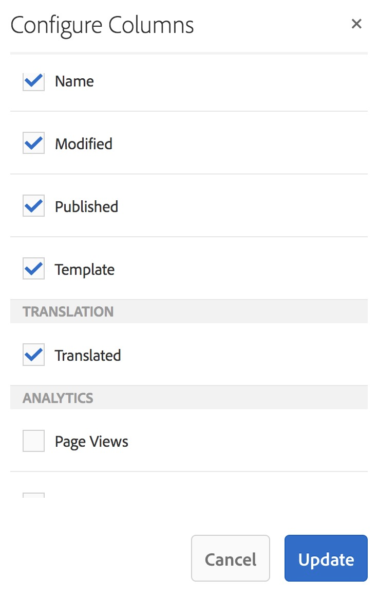

# Verbeteringen op gebied van vertaling{#translation-enhancements}

Deze pagina biedt incrementele verbeteringen en verfijningen van de mogelijkheden voor AEM-vertaalbeheer.

## Automatisering van vertaalprojecten {#translation-project-automation}

Er zijn opties toegevoegd om de productiviteit bij vertaalprojecten te verbeteren, zoals het automatisch promoten en verwijderen van lanceringen van vertalingen en het plannen van de terugkerende uitvoering van een vertaalproject.

1. In uw vertaalproject, klik de ellips bij de bodem van de **Vertaling Summiere** tegel.

   

1. Schakelaar aan **Geavanceerd** tabel. Bij de bodem, kunt u **selecteren bevordert automatisch VertaalLancjes**.

   

1. U kunt desgewenst instellen of het starten van vertalingen na ontvangst van vertaalde inhoud automatisch moet worden bevorderd en verwijderd.

   

1. Om de terugkomende uitvoering van een vertaalproject te selecteren, selecteer de frequentie met dropdown onder **Vertaling van de Herhaal**. Het terugkomen van projectuitvoering zal automatisch vertaalbanen in de gespecificeerde intervallen creëren en uitvoeren.

   

## Meertalige vertaalprojecten {#multilingual-translation-projects}

Het is mogelijk om veelvoudige doeltalen in een vertaalproject te vormen, om het totale aantal gecreeerde vertaalprojecten te verminderen.

1. In uw vertaalproject, klik de punten bij de bodem van de **Vertaling Summiere** tegel.

   

1. Schakelaar aan **Geavanceerd** tabel. U kunt veelvoudige talen onder **Taal van het Doel** toevoegen.

   

1. Alternatief, als u vertaling via de verwijzingenspoorstaaf in Plaatsen in werking stelt, voeg u talen toe en selecteer **creeer het Project van de Vertaling van de Meertaligheid**.

   

1. In het project worden vertaalbanen gecreëerd voor elke doeltaal. Zij kunnen of één voor één binnen het project, of allen in één keer zijn begonnen door het project globaal in Projecten Admin uit te voeren.

   

## Updates van vertaalgeheugen {#translation-memory-updates}

Handmatige bewerkingen van vertaalde inhoud kunnen worden gesynchroniseerd met het TMS (Translation Management System) om het vertaalgeheugen te trainen.

1. Van de console van Plaatsen, na het bijwerken van tekstinhoud in een vertaalde pagina, selecteer **het Geheugen van de Vertaling van de Update**.

   

1. Een lijstmening toont een zij-aan-zij vergelijking van de bron en de vertaling voor elke tekstcomponent die werd uitgegeven. Selecteer welke vertaalupdates aan het Geheugen van de Vertaling zouden moeten worden gesynchroniseerd, en **Geheugen van de Update** selecteren.

   

AEM werkt de vertaling van de bestaande tekenreeksen bij in het vertaalgeheugen van de geconfigureerde TMS.

* De actie werkt de vertaling van bestaande koorden in het vertaalgeheugen van gevormde TMS bij.
* Het creëert geen nieuwe vertaalbanen.
* De vertalingen worden teruggestuurd naar de TMS, via de AEM-API voor vertaling (zie hieronder).

Deze functie gebruiken:

* Een TMS moet zijn geconfigureerd voor gebruik met AEM.
* De schakelaar moet de methode uitvoeren [`storeTranslation` ](https://developer.adobe.com/experience-manager/reference-materials/cloud-service/javadoc/com/adobe/granite/translation/api/TranslationService.html).
   * De code binnen deze methode bepaalt wat met het verzoek van de vertaalgeheugenupdate gebeurt.
   * Het AEM-vertaalframework stuurt de tekenreekswaardeparen (oorspronkelijke en bijgewerkte vertaling) via deze methode-implementatie terug naar het TMS.

De updates van het vertaalgeheugen kunnen worden onderschept en naar een douanebestemming worden verzonden, voor gevallen waar een merkgebonden vertaalgeheugen wordt gebruikt.

## Taalkopieën op meerdere niveaus {#language-copies-on-multiple-levels}

Taalwortels kunnen nu worden gegroepeerd onder knooppunten, bijvoorbeeld per regio, terwijl ze nog steeds worden herkend als wortels van taalkopieën.

>[!CAUTION]
>
>Er is slechts één niveau toegestaan. Met de volgende code kan de pagina &#39;es&#39; bijvoorbeeld niet worden omgezet in een taalkopie:
>
>* `/content/we-retail/language-masters/en`
>* `/content/we-retail/language-masters/americas/central-america/es`
>
>Deze `es` -taalkopie wordt niet gedetecteerd omdat deze zich op twee niveaus (americas/central-america) van het knooppunt `en` bevindt.

>[!NOTE]
>
>Taalwortels kunnen elke paginanaam hebben, in plaats van alleen de ISO-code van de taal. AEM controleert altijd eerst het pad en de naam, maar als de paginanaam geen taal identificeert, controleert AEM de eigenschap cq:language van de pagina voor de taalidentificatie.

## Vertaalstatus rapporteren {#translation-status-reporting}

Een eigenschap kan nu worden geselecteerd in de lijstweergave Sites, die aangeeft of een pagina is vertaald, vertaald is of nog niet is vertaald. Deze weergeven:

1. In Plaatsen, schakelaar aan **Mening van de Lijst.**

   

1. Klik **Montages van de Mening**.

   

1. Controle **Vertaalde** checkbox onder **Vertaling** en klik **Update**.

   

U kunt a **Vertaalde** kolom nu zien die de vertaalstatus van de pagina&#39;s toont.

