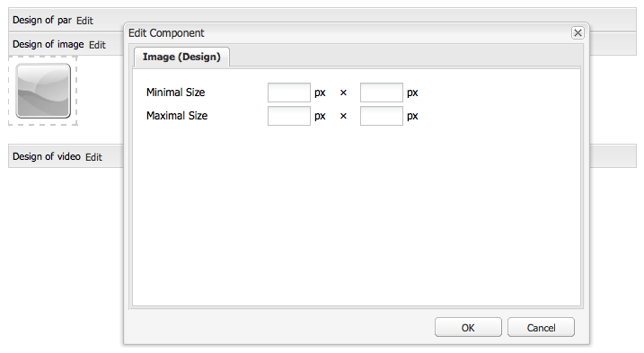

# Componenten configureren in ontwerpmodus{#configuring-components-in-design-mode}

Wanneer een AEM-instantie buiten de box is geïnstalleerd, is er direct een selectie van componenten beschikbaar in het secundaire bureaublad.

Daarnaast zijn er verschillende andere componenten beschikbaar. U kunt de wijze van het Ontwerp gebruiken om [ toe te laten/onbruikbaar te maken dergelijke componenten ](#enabledisablecomponentsusingdesignmode). Wanneer toegelaten en gevestigd op uw pagina kunt u de wijze van het Ontwerp dan gebruiken om [ aspecten van het componentenontwerp ](#configuringcomponentsusingdesignmode) te vormen door de attributenparameters uit te geven.

>[!NOTE]
>
>Bij het bewerken van deze componenten moet de nodige voorzichtigheid worden betracht. De ontwerpinstellingen vormen vaak een integraal onderdeel van het ontwerp van de gehele website en moeten daarom alleen worden gewijzigd door iemand met de juiste bevoegdheden (en ervaring), vaak een beheerder of ontwikkelaar. Zie [ het Ontwikkelen Componenten ](/help/sites-developing/components.md) voor meer informatie.

Hierbij worden in feite de onderdelen toegevoegd of verwijderd die in het alineasysteem voor de pagina zijn toegestaan. Het alineasysteem ( `parsys` ) is een samengestelde component die alle andere alineacomponenten bevat. Met het alineasysteem kunnen auteurs componenten van verschillende typen aan een pagina toevoegen omdat deze alle andere alineacomponenten bevat. Elk alineatype wordt vertegenwoordigd als een component.

De inhoud van een productpagina kan bijvoorbeeld een alineasysteem bevatten dat het volgende bevat:

* Een afbeelding van het product (in de vorm van een afbeeldings- of textielafbeeldingsalinea)
* De productomschrijving (als tekstalinea)
* Een tabel met technische gegevens (als tabelalinea)
* Een formulier dat gebruikers invullen (als een formulier begint, formulierelement en alinea die eindigt met een formulier)

>[!NOTE]
>
>Zie [ het Ontwikkelen van Componenten ](/help/sites-developing/components.md#paragraphsystem) en [ Richtlijnen voor het Gebruiken van Malplaatjes en Componenten ](/help/sites-developing/dev-guidelines-bestpractices.md#guidelines-for-using-templates-and-components) voor meer informatie over `parsys`.

## Componenten in-/uitschakelen {#enable-disable-components}

In de ontwerpmodus wordt het hulpprogramma geminimaliseerd en kunt u de componenten configureren die toegankelijk zijn voor ontwerpen:

1. Als u de ontwerpmodus wilt activeren, opent u een pagina die u wilt bewerken en gebruikt u het Sidekick-pictogram:

   

1. Klik **uitgeven** op het systeem van de Paragraaf (**Ontwerp van paragraaf**).

   

1. Er wordt een dialoogvenster geopend met een lijst van de componentgroepen die in de Sidekick worden weergegeven, samen met de afzonderlijke componenten die ze bevatten.

   Selecteer de gewenste onderdelen om de componenten toe te voegen of te verwijderen die beschikbaar moeten zijn in het zijpaneel.

   

1. De Sidekick minimaliseert in de ontwerpmodus. Klik op de pijl om de Sidekick te maximaliseren en terug te keren naar de bewerkingsmodus:

   

## Het ontwerp van een component configureren {#configuring-the-design-of-a-component}

In de ontwerpmodus kunt u ook kenmerken configureren voor de afzonderlijke componenten. Elke component heeft zijn eigen parameters, toont het volgende voorbeeld de **component van het Beeld**:

1. Als u de ontwerpmodus wilt activeren, opent u een pagina die u wilt bewerken en gebruikt u het Sidekick-pictogram:

   

1. U kunt het ontwerp van componenten configureren.

   Bijvoorbeeld, als u **klikt geef** op de component van het Beeld uit (**Ontwerp van beeld**) u kunt de component specifieke parameters vormen:

   

1. Klik **O.K.** om uw veranderingen te bewaren.

1. De Sidekick minimaliseert in de ontwerpmodus. Klik op de pijl om de Sidekick te maximaliseren en terug te keren naar de bewerkingsmodus:

   
