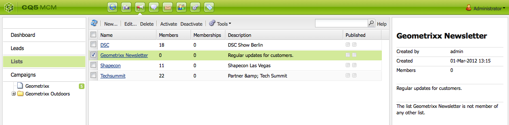

# Een effectieve openingspagina voor nieuwsbrieven maken{#creating-an-effective-newsletter-landing-page}

Met een effectieve bestemmingspagina voor nieuwsbrieven krijgt u zoveel mogelijk personen die zich aanmelden voor uw nieuwsbrief (of andere campagne voor e-mailmarketing). U kunt de informatie die u van uw nieuwsbrief ontvangt gebruiken ondertekent-ups om lood te krijgen.

Als u een effectieve bestemmingspagina voor nieuwsbrieven wilt maken, moet u het volgende doen:

1. Maak een lijst voor de nieuwsbrief zodat mensen zich op de nieuwsbrief kunnen abonneren.
1. Maak het aanmeldingsformulier. Voeg tijdens dit proces een workflowstap toe waarmee de persoon die zich aanmeldt voor de nieuwsbrief automatisch wordt toegevoegd aan de lijst met leads.
1. Maak een bevestigingspagina waarop gebruikers worden bedankt voor hun aanmelding en waarin ze mogelijk een speciale actie kunnen uitvoeren.
1. Voeg theers toe.

>[!NOTE]
>
>Adobe is niet van plan deze mogelijkheid verder te verbeteren (Leads en lijsten beheren).
>De aanbeveling moet [&#x200B; Adobe Campaign en de integratie aan AEM &#x200B;](/help/sites-administering/campaign.md) gebruiken.

## Een lijst maken voor de nieuwsbrief {#creating-a-list-for-the-newsletter}

Creeer een lijst, bijvoorbeeld, **Geometrixx Newsletter**, in MCM voor nieuwsbrief die de mensen zouden moeten intekenen aan. Het creëren van lijsten wordt beschreven in [&#x200B; Creërend lijsten &#x200B;](/help/sites-classic-ui-authoring/classic-personalization-campaigns.md#creatingnewlists).

In het volgende voorbeeld ziet u een voorbeeld van een lijst:

## Een aanmeldingsformulier maken {#create-a-sign-up-form}

Maak een registratieformulier voor nieuwsbrieven waarmee gebruikers zich op tags kunnen abonneren. De voorbeeld-Geometrixx-website bevat een nieuwsbrief op de Geometrixx-werkbalk waarop u het formulier kunt maken.

Om uw eigen nieuwsbrief vorm tot stand te brengen, zie informatie over het creëren van vormen in de [&#x200B; documentatie van Forms &#x200B;](/help/sites-authoring/default-components.md#form). De nieuwsbrief gebruikt de markeringen van de bibliotheek van de Markering. Om extra markeringen toe te voegen, zie [&#x200B; Beleid van de Markering &#x200B;](/help/sites-authoring/tags.md#tagadministration).

De verborgen velden in het volgende voorbeeld bieden de minimale hoeveelheid informatie (e-mail). Daarnaast kunt u later meer velden toevoegen, maar dit heeft invloed op de conversiesnelheid.

Het volgende voorbeeld is een vorm die in https://localhost:4502 wordt gecreeerd/cf#/content/geometrixx/en/toolbar/newsletter.html.

1. Maak het formulier.

   

1. Klik **uitgeven** in de component van de Vorm om de vorm te vormen om naar te gaan Dank u pagina (zie [&#x200B; Creërend Dank u Pagina&#39;s &#x200B;](#creating-a-thank-you-page)).

   

1. Stel de handeling Formulier in (dat is wat er gebeurt wanneer u het formulier verzendt) en configureer de groep zodanig dat geregistreerde gebruikers worden toegewezen aan de lijst die u eerder hebt gemaakt (bijvoorbeeld geometrixx-nieuwsbrief).

   

### Een pagina voor bedankt maken {#creating-a-thank-you-page}

Wanneer de gebruikers **&#x200B;**&#x200B;klikken nu abonneren, wilt u bedankt u pagina om automatisch te openen. Maak de pagina Bedankt op de pagina Geometrixx Newsletter. Nadat u het nieuwsbrief formulier hebt gemaakt, bewerkt u de component Formulier en voegt u het pad toe aan de pagina Hartelijk dank.

Het voorleggen van het verzoek neemt de gebruiker aan a **Dank u** pagina waarna zij een e-mail zullen ontvangen. Deze pagina Bedankt is gemaakt op /content/geometrixx/nl/toolbar/nieuwsbrief/bedankje.

### Teasers toevoegen {#adding-teasers}

Voeg [&#x200B; meetapparaten &#x200B;](/help/sites-classic-ui-authoring/classic-personalization-campaigns.md#teasers) aan doelspecifiek publiek toe. U kunt bijvoorbeeld tellers toevoegen aan de pagina Vriendelijk bedankt en de pagina Nieuwsbrief.

Tasers toevoegen om een effectieve bestemmingspagina voor nieuwsbrieven te maken:

1. Maak een teasalinea voor een cadeau bij aanmelden. Selecteer **eerst** als strategie en omvat tekst die hen informeert welk cadeau zij zullen ontvangen.

   

1. Maak een teasalinea voor de pagina Bedankt. Selecteer **eerst** als strategie en omvat tekst die erop wijst dat het geschenk op zijn manier is.

   

1. Maak een campagne met de twee theaters — neem er een aan met zaken en een zonder tags.

### Inhoud naar abonnees push {#pushing-content-to-subscribers}

Breng wijzigingen in pagina&#39;s aan via de nieuwsbrief-functionaliteit in de MCM. Vervolgens drukt u op bijgewerkte inhoud naar abonnees.

Zie [&#x200B; verzendend Nieuwsbrieven &#x200B;](/help/sites-classic-ui-authoring/classic-personalization-campaigns.md#newsletters).
