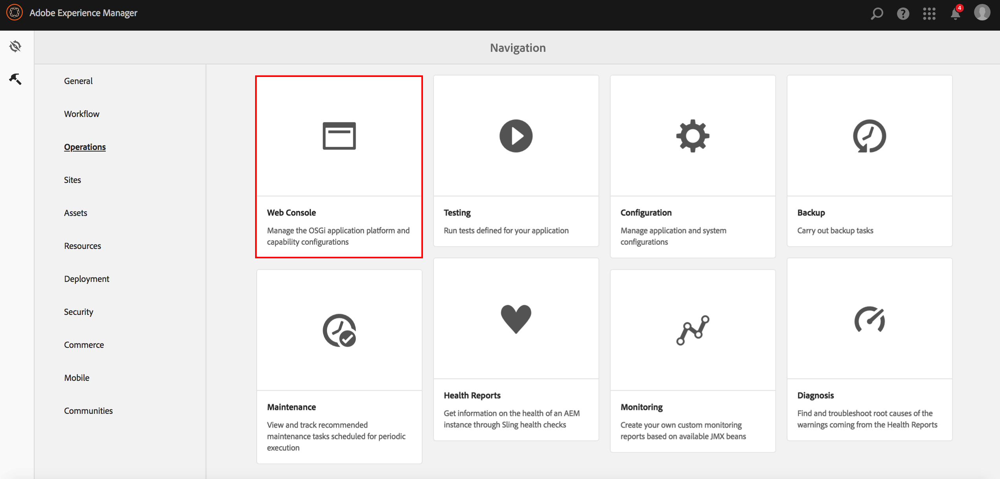

# Opteren in statistische gegevens over geaggregeerd gebruik{#opting-into-aggregated-usage-statistics-collection}

## Inleiding {#introduction}

U kunt Adobe Experience Cloud helpen verbeteren door Adobe-statistieken te verzenden over hoe u met Adobe Experience Manager (AEM) werkt. Deze informatie bevat geen gegevens over de bezoekers van uw bedrijf en wordt alleen gebruikt om Adobe te helpen uw gebruikerservaring te leveren, te ondersteunen en te verbeteren.

U kunt in de inzameling van gebruiksstatistieken door of Touch UI of de Console van het Web te gebruiken kiezen.

>[!NOTE]
>
>Er zijn verschillende regels inzake gegevensbescherming en privacy, waaronder bijvoorbeeld de GDPR en de CCPA. AEM Sites is klaar om klanten te helpen met hun verplichtingen op het gebied van gegevensbescherming en privacy. Deze pagina begeleidt klanten door de procedures om binnen (of uit) van de Geaggregeerde Verzameling van de Statistieken van het Gebruik te kiezen.
>
>Voor verdere informatie, zie ook het [&#x200B; Adobe het Centrum van de Privacy &#x200B;](https://www.adobe.com/privacy.html).

>[!NOTE]
>
>U kunt opteren uit op elk ogenblik door de [ Console van het Web ] te gebruiken (/help/sites-deploying/opt-in-aggregated-usage-statistics.md#opt-in-by-using-web-console, of niet de opt-in optie op het AEM opt-in scherm te selecteren.

## Inschakelen met behulp van de interface voor aanraken {#opt-in-by-using-the-touch-ui}

De eerste keer dat u AEM start, kunt u zich aanmelden via de aanraakinterface:

1. Voor het scherm van de Navigatie van AEM, klik **Inbox** (bel) pictogram.

   

1. Voor de drop-down lijst, klik **laat de Geaggregeerde Verzameling van de Statistieken van het Gebruik** toe.

   

1. Klik op de optie **[!UICONTROL Allow collection of aggregated usage statistics]** in het aanmeldingsscherm.

   

1. Klik **Gedaan**.

## Aanmelden met de webconsole {#opt-in-by-using-the-web-console}

U kunt zich aanmelden (of afmelden) met de webconsole als volgt:

1. Voor het scherm van de Navigatie van AEM, klik **Hulpmiddelen** en toen **Verrichtingen**.

   

1. Voor het venster van Verrichtingen, klik **Console van het Web**.

   

1. Onderzoek naar **samengevoegde de Verzameling van de Statistieken van het Gebruik**.
1. Klik **uitgeven** pictogram.

   

1. Selecteer **Toegelaten** checkbox. U kunt ook het selectievakje uitschakelen als u de verzameling van verbruiksstatistieken wilt uitschakelen.

   

1. Klik **sparen**.
