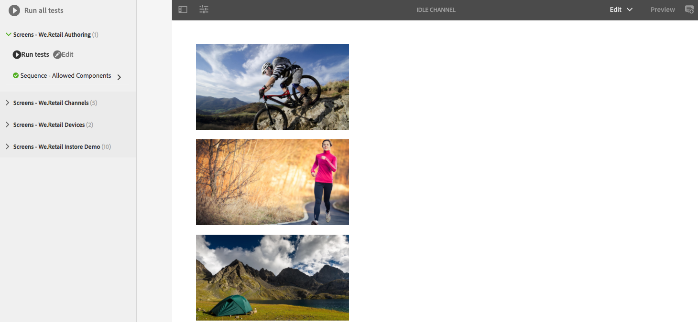
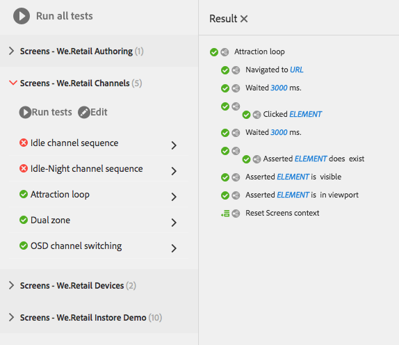

# Uw gebruikersinterface testen{#testing-your-ui}

>[!NOTE]
>
>Vanaf AEM 6.5 is het testframework hobbes.js voor gebruikersinterface verouderd. Adobe is niet van plan haar verder te verbeteren en raadt klanten aan selenium-automatisering te gebruiken.
>

AEM biedt een raamwerk voor het automatiseren van tests voor de gebruikersinterface van AEM. Met behulp van het framework schrijft en voert u tests voor de gebruikersinterface rechtstreeks in een webbrowser uit. Het framework biedt een JavaScript API voor het maken van tests.

Het AEM-testframework gebruikt Hobbes.js, een testbibliotheek die in JavaScript is geschreven. Het Hobbes.js-kader is ontwikkeld voor het testen van AEM als onderdeel van het ontwikkelingsproces. Het framework is nu beschikbaar voor gebruik door het publiek om uw AEM-toepassingen te testen.

>[!NOTE]
>
>Verwijs naar de Hobbes.js [&#x200B; documentatie &#x200B;](https://developer.adobe.com/experience-manager/reference-materials/6-5/test-api/index.html) voor volledige details van API.

## Structuur van de tests {#structure-of-tests}

Bij het gebruik van automatische tests in AEM zijn de volgende termen belangrijk om te begrijpen:

| Handeling | Een **Actie** is een specifieke activiteit op een Web-pagina zoals het klikken van een verbinding of een knoop. |
|---|---|
| Testcase | A **Geval van de Test** is een specifieke situatie die uit één of meerdere **Acties** kan worden samengesteld. |
| Testsuite | A **Reeks van de Test** is een groep verwante **Gevallen van de Test** die samen een specifiek gebruiksgeval testen. |

## Tests uitvoeren {#executing-tests}

### Testuiteinden weergeven {#viewing-test-suites}

Open de testconsole om de geregistreerde testsuites te zien. Het deelvenster Tests bevat een lijst met testreeksen en de bijbehorende testdoosjes.

Navigeer aan de console van Hulpmiddelen via **Globale Navigatie > Hulpmiddelen > Verrichtingen > het Testen**.


Wanneer het openen van de console, zijn de Suites van de Test vermeld aan de linkerzijde samen met een optie om alle hen opeenvolgend in werking te stellen. De ruimte aan het recht die met een gevlokte achtergrond wordt getoond is een placeholder voor het tonen van paginainhoud aangezien de tests in werking stellen.


### Eén testsuite uitvoeren {#running-a-single-test-suite}

Testsets kunnen afzonderlijk worden uitgevoerd. Wanneer u een testsuite uitvoert, verandert de pagina terwijl de testcase wordt uitgevoerd en de bijbehorende handelingen worden uitgevoerd. De resultaten verschijnen na afloop van de test. Pictogrammen geven de resultaten aan.

Een vinkje geeft aan dat een test is geslaagd:


Een X-pictogram geeft aan dat een test is mislukt:


Een testsuite uitvoeren:

1. Klik in het deelvenster Tests op de naam van de testcase die u wilt uitvoeren om de details van de handelingen uit te vouwen.

   

1. Klik **test van de Looppas**.

   

1. De tijdelijke aanduiding wordt tijdens de test vervangen door pagina-inhoud.

   

1. Herzie de resultaten van het Geval van de Test door de beschrijving te tikken of te klikken om het **paneel van het Resultaat** te openen. Tapping of het klikken van de naam van uw Geval van de Test in het **paneel van het Resultaat** toont alle details.

   

### Meerdere tests uitvoeren {#running-multiple-tests}

Testsets worden opeenvolgend uitgevoerd in de volgorde waarin ze in de console worden weergegeven. U kunt naar beneden in een test boren om de gedetailleerde resultaten te zien.


1. Op het paneel van Tests, klik of de **looppas alle tests** knoop of de **test van de Looppas** knoop onder de titel van de Reeks van de Test die u wilt in werking stellen.

   

1. Klik op de titel van de testcase om de resultaten van elke testcase weer te geven. Het klikken van de naam van uw test in het **paneel van het Resultaat** toont alle details.

   

## Een eenvoudige testsuite maken en gebruiken {#creating-and-using-a-simple-test-suite}

De volgende procedurestappen u door de verwezenlijking en de uitvoering van een Reeks van de Test gebruikend [&#x200B; Wij.Retail inhoud &#x200B;](/help/sites-developing/we-retail.md), maar u kunt de test gemakkelijk wijzigen om een verschillende Web-pagina te gebruiken.

Voor volledige details over het creëren van uw eigen Suites van de Test, zie de [&#x200B; Hobbes.js API documentatie &#x200B;](https://developer.adobe.com/experience-manager/reference-materials/6-5/test-api/index.html).

1. Open CRXDE Lite. ([&#x200B; https://localhost:4502/crx/de](https://localhost:4502/crx/de))
1. Klik met de rechtermuisknop op de `/etc/clientlibs` map en klik op **Maken > Map maken** . Het type `myTests` voor de naam en klikt **O.K.**.
1. Klik met de rechtermuisknop op de `/etc/clientlibs/myTests` map en klik op **Maken > Knoop maken** . Gebruik de volgende bezitswaarden en klik dan O.K. **&#x200B;**:

   * Naam: `myFirstTest`
   * Type: `cq:ClientLibraryFolder`

1. Voeg de volgende eigenschappen toe aan het myFirstTest-knooppunt:

   | Naam | Type | Waarde |
   |---|---|---|
   | `categories` | String [] | `granite.testing.hobbes.tests` |
   | `dependencies` | String [] | `granite.testing.hobbes.testrunner` |

   >[!NOTE]
   >
   >**slechts AEM Forms**
   >
   >
   >Als u adaptieve formulieren wilt testen, voegt u de volgende waarden toe aan de categorieën en afhankelijkheden. Bijvoorbeeld:
   >
   >
   >**categorieën**: `granite.testing.hobbes.tests, granite.testing.hobbes.af.commons`
   >
   >
   >**gebiedsdelen**: `granite.testing.hobbes.testrunner, granite.testing.hobbes.af`

1. Klik **sparen allen**.
1. Klik de `myFirstTest` knoop met de rechtermuisknop aan en klik **creëren > Dossier** creëren. Noem het dossier `js.txt` en klik **O.K.**.
1. Voer in het `js.txt` -bestand de volgende tekst in:

   ```
   #base=.
   myTestSuite.js
   ```

1. Klik **sparen allen** en sluit dan het `js.txt` dossier.
1. Klik de `myFirstTest` knoop met de rechtermuisknop aan en klik **creëren > Dossier** creëren. Noem het dossier `myTestSuite.js` en klik **O.K.**.
1. Kopieer de volgende code naar het `myTestSuite.js` -bestand en sla het bestand op:

   ```
   new hobs.TestSuite("Experience Content Test Suite", {path:"/etc/clientlibs/myTests/myFirstTest/myTestSuite.js"})
      .addTestCase(new hobs.TestCase("Navigate to Experience Content")
         .navigateTo("/content/we-retail/us/en/experience/arctic-surfing-in-lofoten.html")
      )
      .addTestCase(new hobs.TestCase("Hover Over Topnav")
         .mouseover("li.visible-xs")
      )
      .addTestCase(new hobs.TestCase("Click Topnav Link")
         .click("li.active a")
   );
   ```

1. Navigeer aan de **Testende** console om uw testreeks te proberen.
