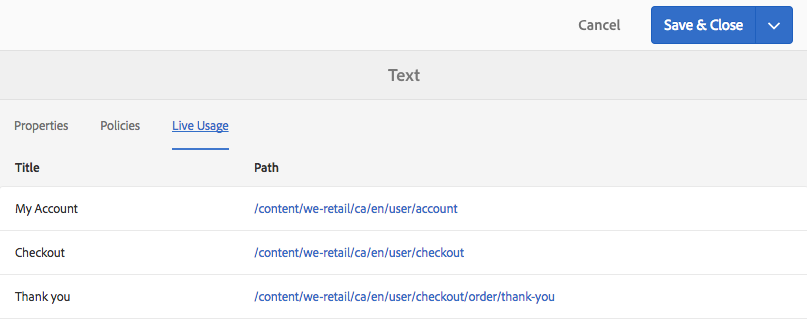
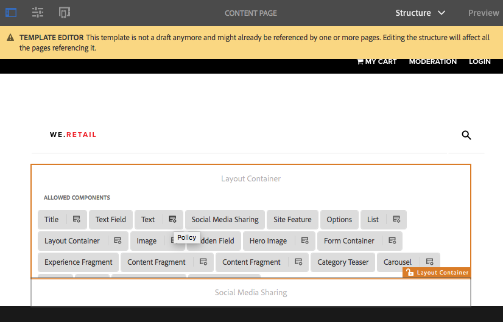

# Probeer uit de kerncomponenten in Wij.Retail{#trying-out-core-components-in-we-retail}

De kerncomponenten zijn moderne, flexibele componenten die eenvoudig uitbreidbaar zijn en eenvoudige integratie in uw projecten mogelijk maken. De kerncomponenten zijn gebouwd rond verscheidene belangrijke ontwerpprincipes zoals HTML, bruikbaarheid out-of-the-box, configureerbaarheid, versioning, en rekbaarheid. De `We.Retail` -site is gebaseerd op kerncomponenten.

## Uitproberen {#trying-it-out}

1. Adobe Experience Manager van het begin (AEM) met de `We.Retail` steekproefinhoud en open de [ Console van Componenten ](/help/sites-authoring/default-components-console.md).

   **Globale Navigatie > Hulpmiddelen > Componenten**

1. Wanneer u de rail opent in de componentenconsole, kunt u filteren voor een bepaalde componentgroep. De kerncomponenten vindt u in

   * `.core-wcm`: De standaard kerncomponenten
   * `.core-wcm-form`: De kerncomponenten voor het verzenden van formulieren

   Kies `.core-wcm` .

   

1. Alle kerncomponenten gebruiken de **v1** naam om op de eerste versie van elke component te wijzen. Regelmatige versies zijn gepland voor de release in de toekomst. Deze versies zijn compatibel met AEM en maken een eenvoudige upgrade mogelijk, zodat u kunt profiteren van de nieuwste functies.
1. Klik **Tekst (v1)**.

   Zie dat het **Type van Middel** van de component `/apps/core/wcm/components/text/v1/text` is. De componenten van de kern worden gevonden onder `/apps/core/wcm/components` en zijn versioned per component.

   

1. Klik het **Documentatie** lusje om de ontwikkelaardocumentatie voor de component te zien.

   

1. Ga terug naar de componentconsole. Filter voor de groep **`We.Retail`** en selecteer de **2} component van de Tekst {.**
1. Zie dat het **Type van Middel** aan een component zoals verwacht onder `/apps/weretail` maar het **Type van Super van het Middel** wijst terug naar de kerncomponent `/apps/core/wcm/components/text/v1/text`.

   

1. Klik het **Levende lusje van het Gebruik** om te zien op welke pagina&#39;s deze component wordt gebruikt. Klik eerste **Dank u** pagina om de pagina uit te geven.

   

1. Selecteer op de pagina Hartelijk dank de tekstcomponent en klik in het bewerkingsmenu van de component op het pictogram Overerving annuleren.

   [`We.Retail` heeft een geglobaliseerde plaatsstructuur ](/help/sites-developing/we-retail-globalized-site-structure.md) waar de inhoud van de primaire taalplaats aan [ levende exemplaren door een mechanisme genoemd erfenis ](/help/sites-administering/msm.md) wordt geduwd. Daarom moet overerving worden geannuleerd, zodat een gebruiker tekst handmatig kan bewerken.

   

1. Klik **ja** om de annulering te bevestigen.

   

1. Nadat de overerving is geannuleerd en u de tekstcomponenten selecteert, zijn er veel meer opties beschikbaar. Klik **uitgeven**.

   

1. U kunt nu zien welke bewerkingsopties beschikbaar zijn voor de tekstcomponent.

   

1. Van het **menu van de Informatie van de Pagina**, uitgezocht **geef Malplaatje** uit.
1. In de Redacteur van het Malplaatje van de pagina, klik het **pictogram van het Beleid** van de component van de Tekst in de **Container van de Lay-out** van de pagina.

   

1. Met de kerncomponenten kan een sjabloonauteur configureren welke eigenschappen beschikbaar zijn voor de auteurs van de pagina. Deze eigenschappen zijn onder andere eigenschappen zoals toegestane bronnen voor plakken, opmaakopties en beschikbare alineastijlen.

   Dergelijke ontwerpdialoogvensters zijn beschikbaar voor vele kerncomponenten en werken samen met de Redacteur van het Malplaatje. Zodra toegelaten, zijn zij beschikbaar aan de auteur door de componentenredacteurs.

   

## Zie ook {#further-information}

Voor details over kerncomponenten, zie de auteursgids [ Componenten van de Kern ](https://experienceleague.adobe.com/en/docs/experience-manager-core-components/using/introduction) voor een overzicht van mogelijkheden. Zie de gids [ het Ontwikkelen van de Componenten van de Kern ](https://experienceleague.adobe.com/en/docs/experience-manager-core-components/using/developing/overview) voor een technisch overzicht.

Voor meer informatie over de kerncomponenten, zie het auteursdocument [ Componenten van de Kern ](https://experienceleague.adobe.com/en/docs/experience-manager-core-components/using/introduction) voor een overzicht van kerncomponentenmogelijkheden, en het ontwikkelaarsdocument [ het Ontwikkelen van de Componenten van de Kern ](https://experienceleague.adobe.com/en/docs/experience-manager-core-components/using/developing/overview) voor technische details.

U kunt ook [ editable malplaatjes ](/help/sites-developing/we-retail-editable-templates.md) willen onderzoeken. Zie het auteursdocument [ Creërend de Malplaatjes van de Pagina ](/help/sites-authoring/templates.md) of de Pagina van het ontwikkelaarsdocument [ Malplaatjes - editable ](/help/sites-developing/page-templates-editable.md) voor volledige details op editable malplaatjes.
