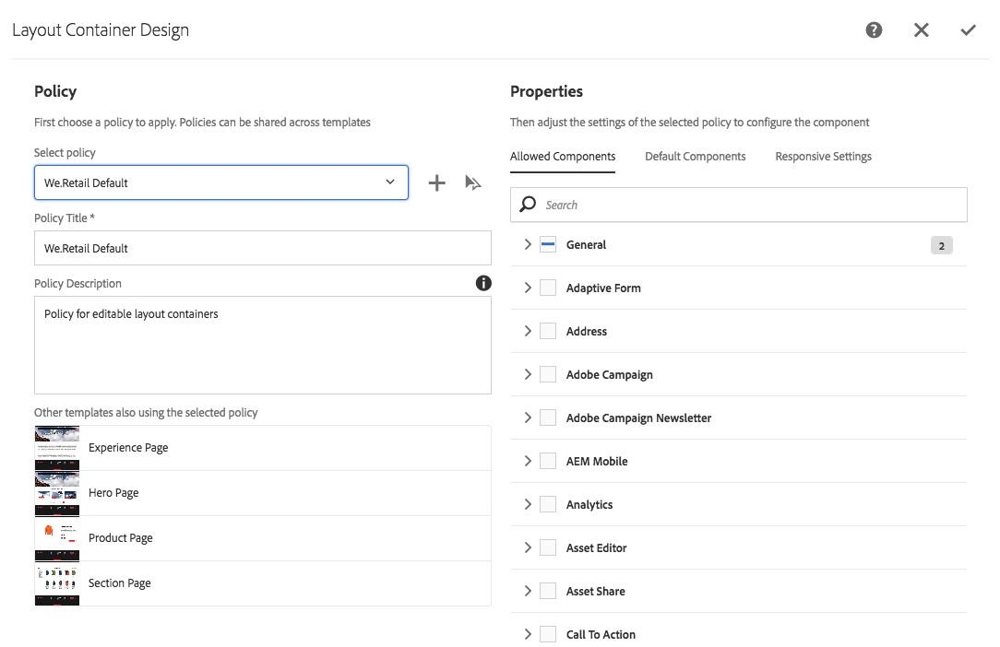

# Bewerkbare sjablonen uitproberen in We.Detailhandel{#trying-out-editable-templates-in-we-retail}

Met de bewerkbare sjablonen is het maken en onderhouden van sjablonen niet langer alleen een taak voor ontwikkelaars. Een type van macht-gebruiker, die een malplaatjeauteur wordt genoemd, kan malplaatjes nu tot stand brengen. Ontwikkelaars moeten de omgeving nog steeds instellen, clientbibliotheken maken en de componenten maken die moeten worden gebruikt, maar als deze basisbeginselen eenmaal zijn ingesteld, beschikt de sjabloonauteur over de flexibiliteit om sjablonen zonder ontwikkelingsproject te maken en te configureren.

Alle pagina&#39;s in We.Retail zijn gebaseerd op bewerkbare sjablonen, waardoor niet-ontwikkelaars de sjablonen kunnen aanpassen en aanpassen.

## Uitproberen {#trying-it-out}

1. Bewerk de pagina Apparatuur van de taalstramienvertakking.

   http://localhost:4502/editor.html/content/we-retail/language-masters/en/equipment.html

1. De moduskiezer beschikt niet meer over een ontwerpmodus. Alle pagina&#39;s voor We.Retail zijn gebaseerd op bewerkbare sjablonen en om het ontwerp van bewerkbare sjablonen te wijzigen, moeten deze worden bewerkt in de sjablooneditor.
1. Van het **informatie van de Pagina** menu uitgezocht **geef Malplaatje** uit.
1. U bewerkt nu de sjabloon voor de hoofdpagina.

   In de structuurmodus van de pagina kunt u de structuur van de sjabloon wijzigen. Dit geldt bijvoorbeeld voor de componenten die zijn toegestaan in de lay-outcontainer.

   

1. Configureer het beleid voor de container van de layout om te definiëren welke componenten zijn toegestaan in de container.

   Het beleid is het equivalent van ontwerpconfiguraties.

   

1. In het dialoogvenster Ontwerp van de container voor lay-outs kunt u

   * Een bestaand beleid selecteren of een beleid voor de container maken
   * Selecteer welke componenten zijn toegestaan in de container
   * De standaardcomponenten definiëren die moeten worden geplaatst wanneer een element naar de container wordt gesleept

   

1. In de sjablooneditor kunt u het beleid van de tekstcomponent in de lay-outcontainer bewerken.

   Hiermee kunt u:

   * Een bestaand beleid selecteren of een beleid voor de container maken
   * Definieer de functies die beschikbaar zijn voor de auteur van de pagina wanneer u deze component gebruikt, zoals

      * Toegestane bronnen voor plakken
      * Opmaakopties
      * Alineastijlen toegestaan
      * Speciale tekens toegestaan

   Vele componenten die op de kerncomponenten worden gebaseerd staan de configuratie van opties op componentenniveau door de editable malplaatjes toe, die de behoefte aan aanpassing door ontwikkelaars verwijderen.

   

1. Terug in de malplaatjeredacteur, kunt u de wijzeselecteur gebruiken om in **Aanvankelijke wijze van de Inhoud** te veranderen om te bepalen welke inhoud op de pagina wordt vereist.

   **de wijze van de Lay-out** kan worden gebruikt aangezien het op een normale pagina is om de lay-out voor het malplaatje te bepalen.

## Meer informatie {#more-information}

Voor verdere informatie zie het auteursdocument [ Creërend de Malplaatjes van de Pagina ](/help/sites-authoring/templates.md) of de Malplaatjes van het ontwikkelaarsdocument van de Pagina [ - editable ](/help/sites-developing/page-templates-editable.md) voor volledige technische details op editable malplaatjes.

U kunt ook wensen om [ kerncomponenten ](/help/sites-developing/we-retail-core-components.md) te onderzoeken. Zie het auteursdocument [ Componenten van de Kern ](https://experienceleague.adobe.com/docs/experience-manager-core-components/using/introduction.html?lang=nl-NL) voor een overzicht van de mogelijkheden van de kerncomponenten en het ontwikkelaarsdocument [ het Ontwikkelen van de Componenten van de Kern ](https://helpx.adobe.com/nl/experience-manager/core-components/using/developing.html) voor een technisch overzicht.
